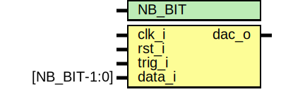

# Entity: deltaSigma

## Diagram

## Generics

| Generic name | Type | Value | Description |
| ------------ | ---- | ----- | ----------- |
| NB_BIT       |      | 32    |             |
## Ports

| Port name | Direction | Type         | Description |
| --------- | --------- | ------------ | ----------- |
| clk_i     | input     |              |             |
| rst_i     | input     |              |             |
| trig_i    | input     |              |             |
| data_i    | input     | [NB_BIT-1:0] |             |
| dac_o     | output    |              |             |
## Signals

| Name       | Type               | Description |
| ---------- | ------------------ | ----------- |
| data_in_s  | wire [BIT_INT-1:0] |             |
| deltaB     | wire [BIT_INT-1:0] |             |
| deltaAdder | wire [BIT_INT-1:0] |             |
| sigmaLatch | reg [BIT_INT-1:0]  |             |
| sigmaAdder | wire [BIT_INT-1:0] |             |
| out_bit_s  | wire               |             |
| dac_out_s  | reg                |             |
## Constants

| Name    | Type | Value    | Description |
| ------- | ---- | -------- | ----------- |
| BIT_INT |      | NB_BIT+2 |             |
## Processes
- unnamed: ( @(posedge clk_i) )
- unnamed: ( @(posedge clk_i) )
