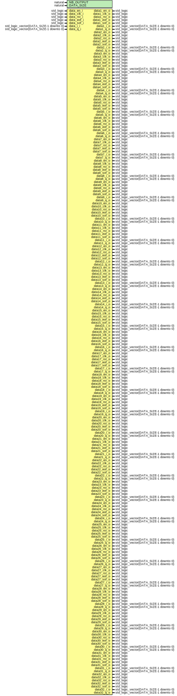

# Entity: dupplComplex

- **File**: dupplComplex.vhd
## Diagram

## Description

-------------------------------------------------------------------------
 (c) Copyright: OscillatorIMP Digital
 Author : Gwenhael Goavec-Merou<gwenhael.goavec-merou@trabucayre.com>
 Creation date : 2014/10/14
-------------------------------------------------------------------------
## Generics

| Generic name | Type    | Value | Description |
| ------------ | ------- | ----- | ----------- |
| NB_OUTPUT    | natural | 32    |             |
| DATA_SIZE    | natural | 8     |             |
## Ports

| Port name    | Direction | Type                                   | Description |
| ------------ | --------- | -------------------------------------- | ----------- |
| data_en_i    | in        | std_logic                              | DATA in     |
| data_clk_i   | in        | std_logic                              |             |
| data_rst_i   | in        | std_logic                              |             |
| data_eof_i   | in        | std_logic                              |             |
| data_sof_i   | in        | std_logic                              |             |
| data_i_i     | in        | std_logic_vector(DATA_SIZE-1 downto 0) |             |
| data_q_i     | in        | std_logic_vector(DATA_SIZE-1 downto 0) |             |
| data1_en_o   | out       | std_logic                              | ext         |
| data1_clk_o  | out       | std_logic                              |             |
| data1_rst_o  | out       | std_logic                              |             |
| data1_eof_o  | out       | std_logic                              |             |
| data1_sof_o  | out       | std_logic                              |             |
| data1_i_o    | out       | std_logic_vector(DATA_SIZE-1 downto 0) |             |
| data1_q_o    | out       | std_logic_vector(DATA_SIZE-1 downto 0) |             |
| data2_en_o   | out       | std_logic                              |             |
| data2_clk_o  | out       | std_logic                              |             |
| data2_rst_o  | out       | std_logic                              |             |
| data2_eof_o  | out       | std_logic                              |             |
| data2_sof_o  | out       | std_logic                              |             |
| data2_i_o    | out       | std_logic_vector(DATA_SIZE-1 downto 0) |             |
| data2_q_o    | out       | std_logic_vector(DATA_SIZE-1 downto 0) |             |
| data3_en_o   | out       | std_logic                              |             |
| data3_clk_o  | out       | std_logic                              |             |
| data3_rst_o  | out       | std_logic                              |             |
| data3_eof_o  | out       | std_logic                              |             |
| data3_sof_o  | out       | std_logic                              |             |
| data3_i_o    | out       | std_logic_vector(DATA_SIZE-1 downto 0) |             |
| data3_q_o    | out       | std_logic_vector(DATA_SIZE-1 downto 0) |             |
| data4_en_o   | out       | std_logic                              |             |
| data4_clk_o  | out       | std_logic                              |             |
| data4_rst_o  | out       | std_logic                              |             |
| data4_eof_o  | out       | std_logic                              |             |
| data4_sof_o  | out       | std_logic                              |             |
| data4_i_o    | out       | std_logic_vector(DATA_SIZE-1 downto 0) |             |
| data4_q_o    | out       | std_logic_vector(DATA_SIZE-1 downto 0) |             |
| data5_en_o   | out       | std_logic                              |             |
| data5_clk_o  | out       | std_logic                              |             |
| data5_rst_o  | out       | std_logic                              |             |
| data5_eof_o  | out       | std_logic                              |             |
| data5_sof_o  | out       | std_logic                              |             |
| data5_i_o    | out       | std_logic_vector(DATA_SIZE-1 downto 0) |             |
| data5_q_o    | out       | std_logic_vector(DATA_SIZE-1 downto 0) |             |
| data6_en_o   | out       | std_logic                              |             |
| data6_clk_o  | out       | std_logic                              |             |
| data6_rst_o  | out       | std_logic                              |             |
| data6_eof_o  | out       | std_logic                              |             |
| data6_sof_o  | out       | std_logic                              |             |
| data6_i_o    | out       | std_logic_vector(DATA_SIZE-1 downto 0) |             |
| data6_q_o    | out       | std_logic_vector(DATA_SIZE-1 downto 0) |             |
| data7_en_o   | out       | std_logic                              |             |
| data7_clk_o  | out       | std_logic                              |             |
| data7_rst_o  | out       | std_logic                              |             |
| data7_eof_o  | out       | std_logic                              |             |
| data7_sof_o  | out       | std_logic                              |             |
| data7_i_o    | out       | std_logic_vector(DATA_SIZE-1 downto 0) |             |
| data7_q_o    | out       | std_logic_vector(DATA_SIZE-1 downto 0) |             |
| data8_en_o   | out       | std_logic                              |             |
| data8_clk_o  | out       | std_logic                              |             |
| data8_rst_o  | out       | std_logic                              |             |
| data8_eof_o  | out       | std_logic                              |             |
| data8_sof_o  | out       | std_logic                              |             |
| data8_i_o    | out       | std_logic_vector(DATA_SIZE-1 downto 0) |             |
| data8_q_o    | out       | std_logic_vector(DATA_SIZE-1 downto 0) |             |
| data9_en_o   | out       | std_logic                              |             |
| data9_clk_o  | out       | std_logic                              |             |
| data9_rst_o  | out       | std_logic                              |             |
| data9_eof_o  | out       | std_logic                              |             |
| data9_sof_o  | out       | std_logic                              |             |
| data9_i_o    | out       | std_logic_vector(DATA_SIZE-1 downto 0) |             |
| data9_q_o    | out       | std_logic_vector(DATA_SIZE-1 downto 0) |             |
| data10_en_o  | out       | std_logic                              |             |
| data10_clk_o | out       | std_logic                              |             |
| data10_rst_o | out       | std_logic                              |             |
| data10_eof_o | out       | std_logic                              |             |
| data10_sof_o | out       | std_logic                              |             |
| data10_i_o   | out       | std_logic_vector(DATA_SIZE-1 downto 0) |             |
| data10_q_o   | out       | std_logic_vector(DATA_SIZE-1 downto 0) |             |
| data11_en_o  | out       | std_logic                              |             |
| data11_clk_o | out       | std_logic                              |             |
| data11_rst_o | out       | std_logic                              |             |
| data11_eof_o | out       | std_logic                              |             |
| data11_sof_o | out       | std_logic                              |             |
| data11_i_o   | out       | std_logic_vector(DATA_SIZE-1 downto 0) |             |
| data11_q_o   | out       | std_logic_vector(DATA_SIZE-1 downto 0) |             |
| data12_en_o  | out       | std_logic                              |             |
| data12_clk_o | out       | std_logic                              |             |
| data12_rst_o | out       | std_logic                              |             |
| data12_eof_o | out       | std_logic                              |             |
| data12_sof_o | out       | std_logic                              |             |
| data12_i_o   | out       | std_logic_vector(DATA_SIZE-1 downto 0) |             |
| data12_q_o   | out       | std_logic_vector(DATA_SIZE-1 downto 0) |             |
| data13_en_o  | out       | std_logic                              |             |
| data13_clk_o | out       | std_logic                              |             |
| data13_rst_o | out       | std_logic                              |             |
| data13_eof_o | out       | std_logic                              |             |
| data13_sof_o | out       | std_logic                              |             |
| data13_i_o   | out       | std_logic_vector(DATA_SIZE-1 downto 0) |             |
| data13_q_o   | out       | std_logic_vector(DATA_SIZE-1 downto 0) |             |
| data14_en_o  | out       | std_logic                              |             |
| data14_clk_o | out       | std_logic                              |             |
| data14_rst_o | out       | std_logic                              |             |
| data14_eof_o | out       | std_logic                              |             |
| data14_sof_o | out       | std_logic                              |             |
| data14_i_o   | out       | std_logic_vector(DATA_SIZE-1 downto 0) |             |
| data14_q_o   | out       | std_logic_vector(DATA_SIZE-1 downto 0) |             |
| data15_en_o  | out       | std_logic                              |             |
| data15_clk_o | out       | std_logic                              |             |
| data15_rst_o | out       | std_logic                              |             |
| data15_eof_o | out       | std_logic                              |             |
| data15_sof_o | out       | std_logic                              |             |
| data15_i_o   | out       | std_logic_vector(DATA_SIZE-1 downto 0) |             |
| data15_q_o   | out       | std_logic_vector(DATA_SIZE-1 downto 0) |             |
| data16_en_o  | out       | std_logic                              |             |
| data16_clk_o | out       | std_logic                              |             |
| data16_rst_o | out       | std_logic                              |             |
| data16_eof_o | out       | std_logic                              |             |
| data16_sof_o | out       | std_logic                              |             |
| data16_i_o   | out       | std_logic_vector(DATA_SIZE-1 downto 0) |             |
| data16_q_o   | out       | std_logic_vector(DATA_SIZE-1 downto 0) |             |
| data17_en_o  | out       | std_logic                              |             |
| data17_clk_o | out       | std_logic                              |             |
| data17_rst_o | out       | std_logic                              |             |
| data17_eof_o | out       | std_logic                              |             |
| data17_sof_o | out       | std_logic                              |             |
| data17_i_o   | out       | std_logic_vector(DATA_SIZE-1 downto 0) |             |
| data17_q_o   | out       | std_logic_vector(DATA_SIZE-1 downto 0) |             |
| data18_en_o  | out       | std_logic                              |             |
| data18_clk_o | out       | std_logic                              |             |
| data18_rst_o | out       | std_logic                              |             |
| data18_eof_o | out       | std_logic                              |             |
| data18_sof_o | out       | std_logic                              |             |
| data18_i_o   | out       | std_logic_vector(DATA_SIZE-1 downto 0) |             |
| data18_q_o   | out       | std_logic_vector(DATA_SIZE-1 downto 0) |             |
| data19_en_o  | out       | std_logic                              |             |
| data19_clk_o | out       | std_logic                              |             |
| data19_rst_o | out       | std_logic                              |             |
| data19_eof_o | out       | std_logic                              |             |
| data19_sof_o | out       | std_logic                              |             |
| data19_i_o   | out       | std_logic_vector(DATA_SIZE-1 downto 0) |             |
| data19_q_o   | out       | std_logic_vector(DATA_SIZE-1 downto 0) |             |
| data20_en_o  | out       | std_logic                              |             |
| data20_clk_o | out       | std_logic                              |             |
| data20_rst_o | out       | std_logic                              |             |
| data20_eof_o | out       | std_logic                              |             |
| data20_sof_o | out       | std_logic                              |             |
| data20_i_o   | out       | std_logic_vector(DATA_SIZE-1 downto 0) |             |
| data20_q_o   | out       | std_logic_vector(DATA_SIZE-1 downto 0) |             |
| data21_en_o  | out       | std_logic                              |             |
| data21_clk_o | out       | std_logic                              |             |
| data21_rst_o | out       | std_logic                              |             |
| data21_eof_o | out       | std_logic                              |             |
| data21_sof_o | out       | std_logic                              |             |
| data21_i_o   | out       | std_logic_vector(DATA_SIZE-1 downto 0) |             |
| data21_q_o   | out       | std_logic_vector(DATA_SIZE-1 downto 0) |             |
| data22_en_o  | out       | std_logic                              |             |
| data22_clk_o | out       | std_logic                              |             |
| data22_rst_o | out       | std_logic                              |             |
| data22_eof_o | out       | std_logic                              |             |
| data22_sof_o | out       | std_logic                              |             |
| data22_i_o   | out       | std_logic_vector(DATA_SIZE-1 downto 0) |             |
| data22_q_o   | out       | std_logic_vector(DATA_SIZE-1 downto 0) |             |
| data23_en_o  | out       | std_logic                              |             |
| data23_clk_o | out       | std_logic                              |             |
| data23_rst_o | out       | std_logic                              |             |
| data23_eof_o | out       | std_logic                              |             |
| data23_sof_o | out       | std_logic                              |             |
| data23_i_o   | out       | std_logic_vector(DATA_SIZE-1 downto 0) |             |
| data23_q_o   | out       | std_logic_vector(DATA_SIZE-1 downto 0) |             |
| data24_en_o  | out       | std_logic                              |             |
| data24_clk_o | out       | std_logic                              |             |
| data24_rst_o | out       | std_logic                              |             |
| data24_eof_o | out       | std_logic                              |             |
| data24_sof_o | out       | std_logic                              |             |
| data24_i_o   | out       | std_logic_vector(DATA_SIZE-1 downto 0) |             |
| data24_q_o   | out       | std_logic_vector(DATA_SIZE-1 downto 0) |             |
| data25_en_o  | out       | std_logic                              |             |
| data25_clk_o | out       | std_logic                              |             |
| data25_rst_o | out       | std_logic                              |             |
| data25_eof_o | out       | std_logic                              |             |
| data25_sof_o | out       | std_logic                              |             |
| data25_i_o   | out       | std_logic_vector(DATA_SIZE-1 downto 0) |             |
| data25_q_o   | out       | std_logic_vector(DATA_SIZE-1 downto 0) |             |
| data26_en_o  | out       | std_logic                              |             |
| data26_clk_o | out       | std_logic                              |             |
| data26_rst_o | out       | std_logic                              |             |
| data26_eof_o | out       | std_logic                              |             |
| data26_sof_o | out       | std_logic                              |             |
| data26_i_o   | out       | std_logic_vector(DATA_SIZE-1 downto 0) |             |
| data26_q_o   | out       | std_logic_vector(DATA_SIZE-1 downto 0) |             |
| data27_en_o  | out       | std_logic                              |             |
| data27_clk_o | out       | std_logic                              |             |
| data27_rst_o | out       | std_logic                              |             |
| data27_eof_o | out       | std_logic                              |             |
| data27_sof_o | out       | std_logic                              |             |
| data27_i_o   | out       | std_logic_vector(DATA_SIZE-1 downto 0) |             |
| data27_q_o   | out       | std_logic_vector(DATA_SIZE-1 downto 0) |             |
| data28_en_o  | out       | std_logic                              |             |
| data28_clk_o | out       | std_logic                              |             |
| data28_rst_o | out       | std_logic                              |             |
| data28_eof_o | out       | std_logic                              |             |
| data28_sof_o | out       | std_logic                              |             |
| data28_i_o   | out       | std_logic_vector(DATA_SIZE-1 downto 0) |             |
| data28_q_o   | out       | std_logic_vector(DATA_SIZE-1 downto 0) |             |
| data29_en_o  | out       | std_logic                              |             |
| data29_clk_o | out       | std_logic                              |             |
| data29_rst_o | out       | std_logic                              |             |
| data29_eof_o | out       | std_logic                              |             |
| data29_sof_o | out       | std_logic                              |             |
| data29_i_o   | out       | std_logic_vector(DATA_SIZE-1 downto 0) |             |
| data29_q_o   | out       | std_logic_vector(DATA_SIZE-1 downto 0) |             |
| data30_en_o  | out       | std_logic                              |             |
| data30_clk_o | out       | std_logic                              |             |
| data30_rst_o | out       | std_logic                              |             |
| data30_eof_o | out       | std_logic                              |             |
| data30_sof_o | out       | std_logic                              |             |
| data30_i_o   | out       | std_logic_vector(DATA_SIZE-1 downto 0) |             |
| data30_q_o   | out       | std_logic_vector(DATA_SIZE-1 downto 0) |             |
| data31_en_o  | out       | std_logic                              |             |
| data31_clk_o | out       | std_logic                              |             |
| data31_rst_o | out       | std_logic                              |             |
| data31_eof_o | out       | std_logic                              |             |
| data31_sof_o | out       | std_logic                              |             |
| data31_i_o   | out       | std_logic_vector(DATA_SIZE-1 downto 0) |             |
| data31_q_o   | out       | std_logic_vector(DATA_SIZE-1 downto 0) |             |
| data32_en_o  | out       | std_logic                              |             |
| data32_clk_o | out       | std_logic                              |             |
| data32_rst_o | out       | std_logic                              |             |
| data32_eof_o | out       | std_logic                              |             |
| data32_sof_o | out       | std_logic                              |             |
| data32_i_o   | out       | std_logic_vector(DATA_SIZE-1 downto 0) |             |
| data32_q_o   | out       | std_logic_vector(DATA_SIZE-1 downto 0) |             |
