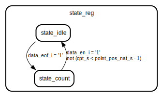

# Entity: extract_data_from_burst

## Diagram

## Generics

| Generic name         | Type    | Value | Description |
| -------------------- | ------- | ----- | ----------- |
| ID                   | natural | 1     |             |
| DATA_SIZE            | natural | 16    |             |
| POINT_POS            | natural | 70    |             |
| C_S00_AXI_DATA_WIDTH | integer | 32    |             |
| C_S00_AXI_ADDR_WIDTH | integer | 4     |             |
## Ports

| Port name       | Direction | Type                                                  | Description |
| --------------- | --------- | ----------------------------------------------------- | ----------- |
| data_i_i        | in        | std_logic_vector(DATA_SIZE-1 downto 0)                |             |
| data_q_i        | in        | std_logic_vector(DATA_SIZE-1 downto 0)                |             |
| data_eof_i      | in        | std_logic                                             |             |
| data_en_i       | in        | std_logic                                             |             |
| data_clk_i      | in        | std_logic                                             |             |
| data_rst_i      | in        | std_logic                                             |             |
| data_i_o        | out       | std_logic_vector(DATA_SIZE-1 downto 0)                |             |
| data_q_o        | out       | std_logic_vector(DATA_SIZE-1 downto 0)                |             |
| data_en_o       | out       | std_logic                                             |             |
| data_clk_o      | out       | std_logic                                             |             |
| data_rst_o      | out       | std_logic                                             |             |
| s00_axi_aclk    | in        | std_logic                                             | axi         |
| s00_axi_reset   | in        | std_logic                                             |             |
| s00_axi_awaddr  | in        | std_logic_vector(C_S00_AXI_ADDR_WIDTH-1 downto 0)     |             |
| s00_axi_awprot  | in        | std_logic_vector(2 downto 0)                          |             |
| s00_axi_awvalid | in        | std_logic                                             |             |
| s00_axi_awready | out       | std_logic                                             |             |
| s00_axi_wdata   | in        | std_logic_vector(C_S00_AXI_DATA_WIDTH-1 downto 0)     |             |
| s00_axi_wstrb   | in        | std_logic_vector((C_S00_AXI_DATA_WIDTH/8)-1 downto 0) |             |
| s00_axi_wvalid  | in        | std_logic                                             |             |
| s00_axi_wready  | out       | std_logic                                             |             |
| s00_axi_bresp   | out       | std_logic_vector(1 downto 0)                          |             |
| s00_axi_bvalid  | out       | std_logic                                             |             |
| s00_axi_bready  | in        | std_logic                                             |             |
| s00_axi_araddr  | in        | std_logic_vector(C_S00_AXI_ADDR_WIDTH-1 downto 0)     |             |
| s00_axi_arprot  | in        | std_logic_vector(2 downto 0)                          |             |
| s00_axi_arvalid | in        | std_logic                                             |             |
| s00_axi_arready | out       | std_logic                                             |             |
| s00_axi_rdata   | out       | std_logic_vector(C_S00_AXI_DATA_WIDTH-1 downto 0)     |             |
| s00_axi_rresp   | out       | std_logic_vector(1 downto 0)                          |             |
| s00_axi_rvalid  | out       | std_logic                                             |             |
| s00_axi_rready  | in        | std_logic                                             |             |
## Signals

| Name            | Type                                   | Description |
| --------------- | -------------------------------------- | ----------- |
| state_reg       | state_type                             |             |
| data_i_s        | std_logic_vector(DATA_SIZE-1 downto 0) |             |
|  data_q_s       | std_logic_vector(DATA_SIZE-1 downto 0) |             |
| data_en_s       | std_logic                              |             |
| cpt_s           | natural range 0 to 2**16-1             |             |
| addr_s          | std_logic_vector(1 downto 0)           | comm        |
| write_en_s      | std_logic                              |             |
|  read_en_s      | std_logic                              |             |
| point_pos_s     | std_logic_vector(15 downto 0)          |             |
| pos_ret1_s      | std_logic_vector(15 downto 0)          |             |
|  pos_ret2_s     | std_logic_vector(15 downto 0)          |             |
| point_pos_en_s  | std_logic                              |             |
| point_pos_en2_s | std_logic                              |             |
| point_pos_nat_s | natural range 0 to 2**16-1             |             |
## Types

| Name       | Type                                                           | Description |
| ---------- | -------------------------------------------------------------- | ----------- |
| state_type | (state_idle,  state_count)  |             |
## Processes
- unnamed: ( data_clk_i )
- unnamed: ( data_clk_i )
- unnamed: ( data_clk_i )
## Instantiations

- wb_edfb_inst: work.wb_edfb
- handle_comm: work.edfb_handComm
**Description**
Instantiation of Axi Bus Interface S00_AXI

## State machines

