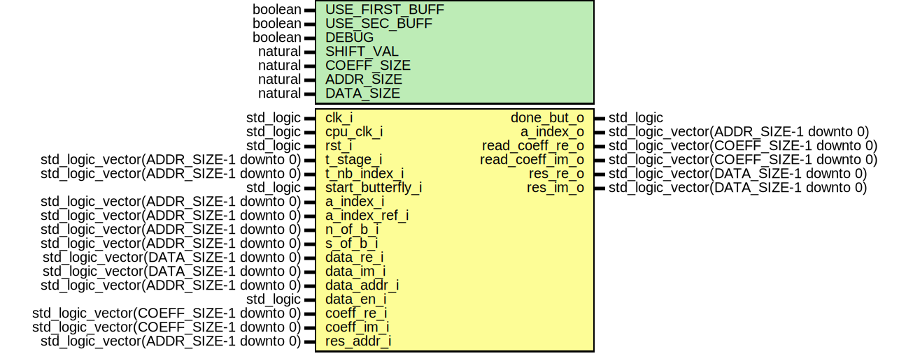

# Entity: fft_comp_butterfly

- **File**: fft_comp_butterfly.vhd
## Diagram

## Generics

| Generic name   | Type    | Value | Description |
| -------------- | ------- | ----- | ----------- |
| USE_FIRST_BUFF | boolean | true  |             |
| USE_SEC_BUFF   | boolean | true  |             |
| DEBUG          | boolean | false |             |
| SHIFT_VAL      | natural | 16    |             |
| COEFF_SIZE     | natural | 16    |             |
| ADDR_SIZE      | natural | 10    |             |
| DATA_SIZE      | natural | 16    |             |
## Ports

| Port name         | Direction | Type                                    | Description         |
| ----------------- | --------- | --------------------------------------- | ------------------- |
| clk_i             | in        | std_logic                               | Syscon signals      |
| cpu_clk_i         | in        | std_logic                               |                     |
| rst_i             | in        | std_logic                               |                     |
| t_stage_i         | in        | std_logic_vector(ADDR_SIZE-1 downto 0)  | test                |
| t_nb_index_i      | in        | std_logic_vector(ADDR_SIZE-1 downto 0)  |                     |
| start_butterfly_i | in        | std_logic                               | control             |
| done_but_o        | out       | std_logic                               |                     |
| a_index_i         | in        | std_logic_vector(ADDR_SIZE-1 downto 0)  | from previous stage |
| a_index_ref_i     | in        | std_logic_vector(ADDR_SIZE-1 downto 0)  |                     |
| a_index_o         | out       | std_logic_vector(ADDR_SIZE-1 downto 0)  |                     |
| n_of_b_i          | in        | std_logic_vector(ADDR_SIZE-1 downto 0)  |                     |
| s_of_b_i          | in        | std_logic_vector(ADDR_SIZE-1 downto 0)  |                     |
| data_re_i         | in        | std_logic_vector(DATA_SIZE-1 downto 0)  | input data          |
| data_im_i         | in        | std_logic_vector(DATA_SIZE-1 downto 0)  |                     |
| data_addr_i       | in        | std_logic_vector(ADDR_SIZE-1 downto 0)  |                     |
| data_en_i         | in        | std_logic                               |                     |
| read_coeff_re_o   | out       | std_logic_vector(COEFF_SIZE-1 downto 0) |                     |
| read_coeff_im_o   | out       | std_logic_vector(COEFF_SIZE-1 downto 0) |                     |
| coeff_re_i        | in        | std_logic_vector(COEFF_SIZE-1 downto 0) |                     |
| coeff_re_addr_i   |           | std_logic_vector(ADDR_SIZE-1 downto 0)  |                     |
| coeff_re_en_i     |           | std_logic                               |                     |
| coeff_im_i        | in        | std_logic_vector(COEFF_SIZE-1 downto 0) |                     |
| coeff_im_addr_i   |           | std_logic_vector(ADDR_SIZE-1 downto 0)  |                     |
| coeff_im_en_i     |           | std_logic                               |                     |
| res_re_o          | out       | std_logic_vector(DATA_SIZE-1 downto 0)  |                     |
| res_im_o          | out       | std_logic_vector(DATA_SIZE-1 downto 0)  |                     |
| res_addr_i        | in        | std_logic_vector(ADDR_SIZE-1 downto 0)  |                     |
## Signals

| Name                | Type                                    | Description |
| ------------------- | --------------------------------------- | ----------- |
| state_s             | state_type                              |             |
| data_a_re_s         | std_logic_vector(DATA_SIZE-1 downto 0)  |             |
|  data_a_im_s        | std_logic_vector(DATA_SIZE-1 downto 0)  |             |
| data_b_re_s         | std_logic_vector(DATA_SIZE-1 downto 0)  |             |
|  data_b_im_s        | std_logic_vector(DATA_SIZE-1 downto 0)  |             |
| coeff_re_s          | std_logic_vector(COEFF_SIZE-1 downto 0) |             |
|  coeff_im_s         | std_logic_vector(COEFF_SIZE-1 downto 0) |             |
| a_index_s           | std_logic_vector(ADDR_SIZE-1 downto 0)  |             |
| a_index_out_s       | std_logic_vector(ADDR_SIZE-1 downto 0)  |             |
| b_index_s           | std_logic_vector(ADDR_SIZE-1 downto 0)  |             |
| a2_index_s          | std_logic_vector(ADDR_SIZE-1 downto 0)  |             |
| sb_index            | natural range 0 to 2**ADDR_SIZE-1       |             |
| enable_data_s       | std_logic                               | state       |
|  enable_next_comp_s | std_logic                               | state       |
| clear_accum_s       | std_logic                               | coeff       |
| s_index_plus_one_s  | std_logic_vector(ADDR_SIZE-1 downto 0)  |             |
| s_of_b_nat_s        | natural range 0 to 2**ADDR_SIZE-1       |             |
| sob_minus_one_s     | std_logic_vector(ADDR_SIZE-1 downto 0)  |             |
| comp_done_s         | std_logic                               | complex     |
| cplx_addr_a_s       | std_logic_vector(ADDR_SIZE-1 downto 0)  |             |
| cplx_addr_b_s       | std_logic_vector(ADDR_SIZE-1 downto 0)  |             |
| cplx_data_a_re_s    | std_logic_vector(DATA_SIZE-1 downto 0)  |             |
| cplx_data_a_im_s    | std_logic_vector(DATA_SIZE-1 downto 0)  |             |
| cplx_data_b_re_s    | std_logic_vector(DATA_SIZE-1 downto 0)  |             |
| cplx_data_b_im_s    | std_logic_vector(DATA_SIZE-1 downto 0)  |             |
| sb_index_slv_s      | std_logic_vector(ADDR_SIZE-1 downto 0)  |             |
| state_next_s        | state_type                              | new         |
| clear_accum_next_s  | std_logic                               |             |
| enable_next_data_s  | std_logic                               |             |
| a_index_next_s      | std_logic_vector(ADDR_SIZE-1 downto 0)  |             |
| done_but_next_o     | std_logic                               |             |
| sb_index_next_s     | natural range 0 to 2**ADDR_SIZE-1       |             |
## Types

| Name       | Type                                                       | Description |
| ---------- | ---------------------------------------------------------- | ----------- |
| state_type | (IDLE,  WAIT_END_COMP)  |             |
## Processes
- unnamed: ( clk_i )
- unnamed: ( state_s, a_index_s, sb_index, start_butterfly_i,
			a_index_i, comp_done_s, a2_index_s, s_of_b_nat_s )
- unnamed: ( comp_done_s, sb_index, s_of_b_nat_s )
- unnamed: ( a_index_s, a_index_i, a2_index_s, start_butterfly_i, comp_done_s )
## Instantiations

- fft_data_hand_inst: work.fft_data_handler
- fft_c_c_inst: work.fft_comp_complex
- fft_coeff_hand_inst: work.fft_coeff_handler
