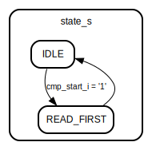

# Entity: fft_data_handler

## Diagram

## Generics

| Generic name | Type    | Value | Description |
| ------------ | ------- | ----- | ----------- |
| ADDR_SIZE    | natural | 10    |             |
| DATA_SIZE    | natural | 16    |             |
## Ports

| Port name        | Direction | Type                                   | Description             |
| ---------------- | --------- | -------------------------------------- | ----------------------- |
| clk_i            | in        | std_logic                              | Syscon signals          |
| rst_i            | in        | std_logic                              |                         |
| s_of_b_i         | in        | std_logic_vector(ADDR_SIZE-1 downto 0) | control                 |
| fs_data_en_i     | in        | std_logic                              | data from first stage   |
| fs_data_re_i     | in        | std_logic_vector(DATA_SIZE-1 downto 0) |                         |
| fs_data_im_i     | in        | std_logic_vector(DATA_SIZE-1 downto 0) |                         |
| fs_data_addr_i   | in        | std_logic_vector(ADDR_SIZE-1 downto 0) |                         |
| cmp_start_i      | in        | std_logic                              | data for compute        |
| cmp_data_a_re_o  | out       | std_logic_vector(DATA_SIZE-1 downto 0) |                         |
| cmp_data_a_im_o  | out       | std_logic_vector(DATA_SIZE-1 downto 0) |                         |
| cmp_a_addr_i     | in        | std_logic_vector(ADDR_SIZE-1 downto 0) |                         |
| cmp_data_b_re_o  | out       | std_logic_vector(DATA_SIZE-1 downto 0) |                         |
| cmp_data_b_im_o  | out       | std_logic_vector(DATA_SIZE-1 downto 0) |                         |
| cmp_b_addr_i     | in        | std_logic_vector(ADDR_SIZE-1 downto 0) |                         |
| cmp_data_en_o    | out       | std_logic                              |                         |
| cplx_data_a_re_i | in        | std_logic_vector(DATA_SIZE-1 downto 0) | data from compute       |
| cplx_data_a_im_i | in        | std_logic_vector(DATA_SIZE-1 downto 0) |                         |
| cplx_data_b_re_i | in        | std_logic_vector(DATA_SIZE-1 downto 0) |                         |
| cplx_data_b_im_i | in        | std_logic_vector(DATA_SIZE-1 downto 0) |                         |
| cplx_addr_a_i    | in        | std_logic_vector(ADDR_SIZE-1 downto 0) |                         |
| cplx_addr_b_i    | in        | std_logic_vector(ADDR_SIZE-1 downto 0) |                         |
| cplx_data_en_i   | in        | std_logic                              |                         |
| res_re_o         | out       | std_logic_vector(DATA_SIZE-1 downto 0) | read to regen data flow |
| res_im_o         | out       | std_logic_vector(DATA_SIZE-1 downto 0) |                         |
| res_addr_i       | in        | std_logic_vector(ADDR_SIZE-1 downto 0) |                         |
## Signals

| Name                 | Type                                   | Description |
| -------------------- | -------------------------------------- | ----------- |
| state_s              | state_type                             |             |
| tmp_data_a_re_s      | std_logic_vector(DATA_SIZE-1 downto 0) |             |
|  tmp_data_a_im_s     | std_logic_vector(DATA_SIZE-1 downto 0) |             |
| tmp_data_b_re_s      | std_logic_vector(DATA_SIZE-1 downto 0) |             |
|  tmp_data_b_im_s     | std_logic_vector(DATA_SIZE-1 downto 0) |             |
| cmp_data_a_re_s      | std_logic_vector(DATA_SIZE-1 downto 0) |             |
| cmp_data_a_im_s      | std_logic_vector(DATA_SIZE-1 downto 0) |             |
| cmp_data_b_re_s      | std_logic_vector(DATA_SIZE-1 downto 0) |             |
| cmp_data_b_im_s      | std_logic_vector(DATA_SIZE-1 downto 0) |             |
| port_b_addr_s        | std_logic_vector(ADDR_SIZE-1 downto 0) | ram mux     |
|  port_a_addr_s       | std_logic_vector(ADDR_SIZE-1 downto 0) | ram mux     |
| port_a_data_re_s     | std_logic_vector(DATA_SIZE-1 downto 0) |             |
| port_a_data_re_out_s | std_logic_vector(DATA_SIZE-1 downto 0) |             |
| port_a_data_im_s     | std_logic_vector(DATA_SIZE-1 downto 0) |             |
| port_a_data_im_out_s | std_logic_vector(DATA_SIZE-1 downto 0) |             |
| port_b_data_re_s     | std_logic_vector(DATA_SIZE-1 downto 0) |             |
| port_b_data_re_out_s | std_logic_vector(DATA_SIZE-1 downto 0) |             |
| port_b_data_im_s     | std_logic_vector(DATA_SIZE-1 downto 0) |             |
| port_b_data_im_out_s | std_logic_vector(DATA_SIZE-1 downto 0) |             |
| we_en_s              | std_logic                              |             |
| pa_select_s          | std_logic_vector(1 downto 0)           |             |
|  pb_select_s         | std_logic_vector(1 downto 0)           |             |
## Types

| Name       | Type                                                    | Description |
| ---------- | ------------------------------------------------------- | ----------- |
| state_type | (IDLE,  READ_FIRST)  |             |
## Processes
- unnamed: ( clk_i, rst_i )
- porta_mux: ( pa_select_s,
		cplx_addr_a_i, cplx_data_a_re_i, cplx_data_a_im_i,
		fs_data_addr_i, fs_data_re_i, fs_data_im_i,
		cmp_a_addr_i )
- portb_mux: ( pb_select_s,
		cmp_b_addr_i, res_addr_i,
		cplx_addr_b_i, cplx_data_b_re_i, cplx_data_b_im_i )
## Instantiations

- ram_re_dat_inst: work.fft_ram
- ram_im_dat_inst: work.fft_ram
## State machines

