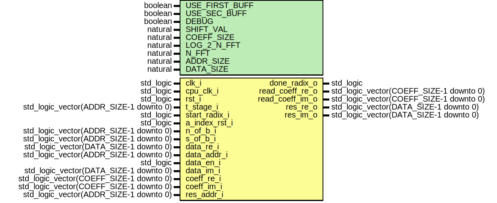

# Entity: fft_loop_radix

- **File**: fft_loop_radix.vhd
## Diagram

## Generics

| Generic name   | Type    | Value | Description |
| -------------- | ------- | ----- | ----------- |
| USE_FIRST_BUFF | boolean | true  |             |
| USE_SEC_BUFF   | boolean | true  |             |
| DEBUG          | boolean | false |             |
| SHIFT_VAL      | natural | 16    |             |
| COEFF_SIZE     | natural | 16    |             |
| LOG_2_N_FFT    | natural | 8     |             |
| N_FFT          | natural | 2048  |             |
| ADDR_SIZE      | natural | 10    |             |
| DATA_SIZE      | natural | 16    |             |
## Ports

| Port name       | Direction | Type                                    | Description         |
| --------------- | --------- | --------------------------------------- | ------------------- |
| clk_i           | in        | std_logic                               | Syscon signals      |
| cpu_clk_i       | in        | std_logic                               |                     |
| rst_i           | in        | std_logic                               |                     |
| t_stage_i       | in        | std_logic_vector(ADDR_SIZE-1 downto 0)  | test                |
| start_radix_i   | in        | std_logic                               | control             |
| done_radix_o    | out       | std_logic                               |                     |
| a_index_rst_i   | in        | std_logic                               |                     |
| n_of_b_i        | in        | std_logic_vector(ADDR_SIZE-1 downto 0)  | from previous stage |
| s_of_b_i        | in        | std_logic_vector(ADDR_SIZE-1 downto 0)  |                     |
| data_re_i       | in        | std_logic_vector(DATA_SIZE-1 downto 0)  | input data          |
| data_addr_i     | in        | std_logic_vector(ADDR_SIZE-1 downto 0)  |                     |
| data_en_i       | in        | std_logic                               |                     |
| data_im_i       | in        | std_logic_vector(DATA_SIZE-1 downto 0)  |                     |
| read_coeff_re_o | out       | std_logic_vector(COEFF_SIZE-1 downto 0) |                     |
| read_coeff_im_o | out       | std_logic_vector(COEFF_SIZE-1 downto 0) |                     |
| coeff_re_i      | in        | std_logic_vector(COEFF_SIZE-1 downto 0) |                     |
| coeff_re_addr_i |           | std_logic_vector(ADDR_SIZE-1 downto 0)  |                     |
| coeff_re_en_i   |           | std_logic                               |                     |
| coeff_im_i      | in        | std_logic_vector(COEFF_SIZE-1 downto 0) |                     |
| coeff_im_addr_i |           | std_logic_vector(ADDR_SIZE-1 downto 0)  |                     |
| coeff_im_en_i   |           | std_logic                               |                     |
| res_re_o        | out       | std_logic_vector(DATA_SIZE-1 downto 0)  |                     |
| res_im_o        | out       | std_logic_vector(DATA_SIZE-1 downto 0)  |                     |
| res_addr_i      | in        | std_logic_vector(ADDR_SIZE-1 downto 0)  |                     |
## Signals

| Name               | Type                                   | Description |
| ------------------ | -------------------------------------- | ----------- |
| N_FFT_MINUS_1      | std_logic_vector(ADDR_SIZE-1 downto 0) |             |
| state_s            | state_type                             |             |
| nb_index_s         | natural range 0 to 2**ADDR_SIZE-1      |             |
| start_but_s        | std_logic                              |             |
| done_but_s         | std_logic                              |             |
| a_index_s          | std_logic_vector(ADDR_SIZE-1 downto 0) |             |
| a_index_ref_s      | std_logic_vector(ADDR_SIZE-1 downto 0) |             |
| a_index_out_s      | std_logic_vector(ADDR_SIZE-1 downto 0) |             |
| n_of_b_nat_s       | natural range 0 to 2**ADDR_SIZE        |             |
| a2_index_s         | std_logic_vector(ADDR_SIZE-1 downto 0) |             |
| nb_index_slv_s     | std_logic_vector(ADDR_SIZE-1 downto 0) |             |
| state_next_s       | state_type                             | new         |
| nb_index_next_s    | natural range 0 to 2**ADDR_SIZE-1      |             |
| start_but_next_s   | std_logic                              |             |
| a_index_next_s     | std_logic_vector(ADDR_SIZE-1 downto 0) |             |
| a_index_ref_next_s | std_logic_vector(ADDR_SIZE-1 downto 0) |             |
| done_radix_next_s  | std_logic                              |             |
## Types

| Name       | Type                                                       | Description |
| ---------- | ---------------------------------------------------------- | ----------- |
| state_type | (IDLE,  WAIT_END_COMP)  |             |
## Processes
- unnamed: ( clk_i )
- unnamed: ( state_s, nb_index_s,
			start_radix_i, a_index_rst_i, done_but_s, a2_index_s,
			nb_index_s, n_of_b_nat_s )
- unnamed: ( a_index_s, a_index_ref_s, a_index_rst_i,
			done_but_s, a2_index_s )
## Instantiations

- fft_butterfly_inst: work.fft_comp_butterfly
