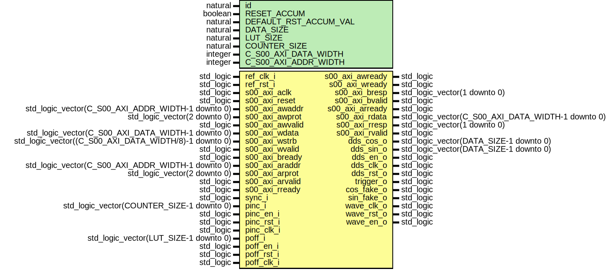

# Entity: nco_counter

- **File**: nco_counter.vhd
## Diagram

## Description

-------------------------------------------------------------------------
 (c) Copyright: OscillatorIMP Digital
 Author : Gwenhael Goavec-Merou<gwenhael.goavec-merou@trabucayre.com>
 Creation date : 2015/04/08
-------------------------------------------------------------------------
## Generics

| Generic name          | Type    | Value | Description                                    |
| --------------------- | ------- | ----- | ---------------------------------------------- |
| id                    | natural | 1     |                                                |
| RESET_ACCUM           | boolean | false |                                                |
| DEFAULT_RST_ACCUM_VAL | natural | 25    |                                                |
| DATA_SIZE             | natural | 16    |                                                |
| LUT_SIZE              | natural | 10    |                                                |
| COUNTER_SIZE          | natural | 28    |                                                |
| C_S00_AXI_DATA_WIDTH  | integer | 32    | Parameters of Axi Slave Bus Interface S00_AXI  |
| C_S00_AXI_ADDR_WIDTH  | integer | 5     |                                                |
## Ports

| Port name       | Direction | Type                                                  | Description            |
| --------------- | --------- | ----------------------------------------------------- | ---------------------- |
| ref_clk_i       | in        | std_logic                                             | Syscon signals         |
| ref_rst_i       | in        | std_logic                                             |                        |
| s00_axi_aclk    | in        | std_logic                                             | Wishbone signals       |
| s00_axi_reset   | in        | std_logic                                             |                        |
| s00_axi_awaddr  | in        | std_logic_vector(C_S00_AXI_ADDR_WIDTH-1 downto 0)     |                        |
| s00_axi_awprot  | in        | std_logic_vector(2 downto 0)                          |                        |
| s00_axi_awvalid | in        | std_logic                                             |                        |
| s00_axi_awready | out       | std_logic                                             |                        |
| s00_axi_wdata   | in        | std_logic_vector(C_S00_AXI_DATA_WIDTH-1 downto 0)     |                        |
| s00_axi_wstrb   | in        | std_logic_vector((C_S00_AXI_DATA_WIDTH/8)-1 downto 0) |                        |
| s00_axi_wvalid  | in        | std_logic                                             |                        |
| s00_axi_wready  | out       | std_logic                                             |                        |
| s00_axi_bresp   | out       | std_logic_vector(1 downto 0)                          |                        |
| s00_axi_bvalid  | out       | std_logic                                             |                        |
| s00_axi_bready  | in        | std_logic                                             |                        |
| s00_axi_araddr  | in        | std_logic_vector(C_S00_AXI_ADDR_WIDTH-1 downto 0)     |                        |
| s00_axi_arprot  | in        | std_logic_vector(2 downto 0)                          |                        |
| s00_axi_arvalid | in        | std_logic                                             |                        |
| s00_axi_arready | out       | std_logic                                             |                        |
| s00_axi_rdata   | out       | std_logic_vector(C_S00_AXI_DATA_WIDTH-1 downto 0)     |                        |
| s00_axi_rresp   | out       | std_logic_vector(1 downto 0)                          |                        |
| s00_axi_rvalid  | out       | std_logic                                             |                        |
| s00_axi_rready  | in        | std_logic                                             |                        |
| sync_i          | in        | std_logic                                             | hardware pinc and poff |
| pinc_i          | in        | std_logic_vector(COUNTER_SIZE-1 downto 0)             |                        |
| pinc_en_i       | in        | std_logic                                             |                        |
| pinc_rst_i      | in        | std_logic                                             |                        |
| pinc_clk_i      | in        | std_logic                                             |                        |
| poff_i          | in        | std_logic_vector(LUT_SIZE-1 downto 0)                 |                        |
| poff_en_i       | in        | std_logic                                             |                        |
| poff_rst_i      | in        | std_logic                                             |                        |
| poff_clk_i      | in        | std_logic                                             |                        |
| dds_cos_o       | out       | std_logic_vector(DATA_SIZE-1 downto 0)                | output data bit3       |
| dds_sin_o       | out       | std_logic_vector(DATA_SIZE-1 downto 0)                |                        |
| dds_en_o        | out       | std_logic                                             |                        |
| dds_clk_o       | out       | std_logic                                             |                        |
| dds_rst_o       | out       | std_logic                                             |                        |
| trigger_o       | out       | std_logic                                             |                        |
| cos_fake_o      | out       | std_logic                                             | output single bit3     |
| sin_fake_o      | out       | std_logic                                             |                        |
| wave_clk_o      | out       | std_logic                                             |                        |
| wave_rst_o      | out       | std_logic                                             |                        |
| wave_en_o       | out       | std_logic                                             |                        |
## Signals

| Name              | Type                                             | Description |
| ----------------- | ------------------------------------------------ | ----------- |
| cpt_step_s        | std_logic_vector(COUNTER_SIZE-1 downto 0)        |             |
|  cpt_step_sync_s  | std_logic_vector(COUNTER_SIZE-1 downto 0)        |             |
| cpt_step_mux_s    | std_logic_vector(COUNTER_SIZE-1 downto 0)        |             |
| cpt_off_s         | std_logic_vector(LUT_SIZE-1 downto 0)            |             |
|  cpt_off_sync_s   | std_logic_vector(LUT_SIZE-1 downto 0)            |             |
| cpt_off_mux_s     | std_logic_vector(LUT_SIZE-1 downto 0)            |             |
| pinc_sw_s         | std_logic                                        |             |
|  pinc_sw_sync_s   | std_logic                                        |             |
| poff_sw_s         | std_logic                                        |             |
|  poff_sw_sync_s   | std_logic                                        |             |
| enable_s          | std_logic                                        |             |
|  enable_sync_s    | std_logic                                        |             |
| addr_s            | std_logic_vector(INTERNAL_ADDR_WIDTH-1 downto 0) |  comm       |
| write_en_s        | std_logic                                        |             |
|  read_en_s        | std_logic                                        |             |
| wave_en_s         | std_logic                                        |             |
| step_scale_s      | std_logic_vector(LUT_SIZE-1 downto 0)            |             |
| max_accum_s       | std_logic_vector(COUNTER_SIZE-1 downto 0)        |  reset      |
|  max_accum_sync_s | std_logic_vector(COUNTER_SIZE-1 downto 0)        |  reset      |
## Constants

| Name                | Type    | Value | Description |
| ------------------- | ------- | ----- | ----------- |
| INTERNAL_ADDR_WIDTH | integer |  3    |             |
## Instantiations

- nco_inst1: work.nco_counter_logic
- pinc_syn: work.nco_counter_synchronizer_bit
**Description**
- synchro ---

- poff_syn: work.nco_counter_synchronizer_bit
- max_acc_syn: work.nco_counter_synchronizer_vector
- cpt_off_syn: work.nco_counter_synchronizer_vector
- cpt_step_syn: work.nco_counter_synchronizer_vector
- enable_syn: work.nco_counter_synchronizer_bit
- wb_nco_inst: work.wb_nco_counter
**Description**
-------------

- handle_comm: work.nco_counter_handcomm
**Description**
 Instantiation of Axi Bus Interface S00_AXI

