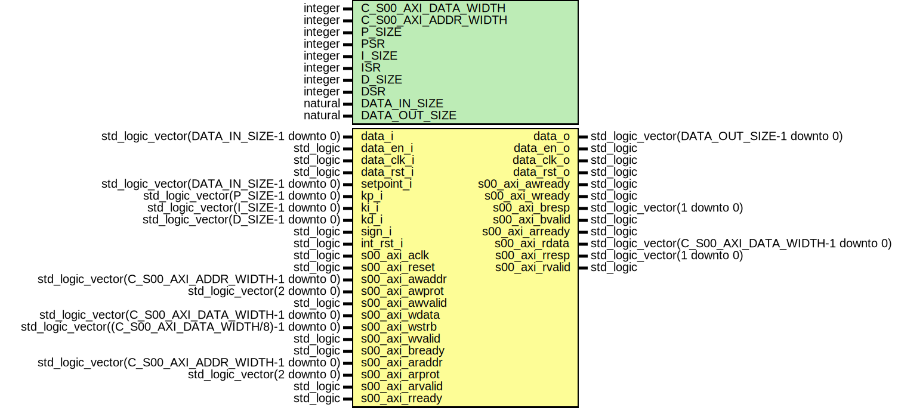

# Entity: pidv3_axi

- **File**: pidv3_axi.vhd
## Diagram

## Description

-------------------------------------------------------------------------
 (c) Copyright: OscillatorIMP Digital
 Author : Gwenhael Goavec-Merou<gwenhael.goavec-merou@trabucayre.com>
 Creation date : 2019/04/20
-------------------------------------------------------------------------
## Generics

| Generic name         | Type    | Value | Description |
| -------------------- | ------- | ----- | ----------- |
| C_S00_AXI_DATA_WIDTH | integer | 32    |             |
| C_S00_AXI_ADDR_WIDTH | integer | 5     |             |
| P_SIZE               | integer | 14    |             |
| PSR                  | integer | 12    | PSR_SIZE    |
| I_SIZE               | integer | 14    |             |
| ISR                  | integer | 28    |             |
| D_SIZE               | integer | 14    |             |
| DSR                  | integer | 8     |             |
| DATA_IN_SIZE         | natural | 14    |             |
| DATA_OUT_SIZE        | natural | 14    |             |
## Ports

| Port name       | Direction | Type                                                  | Description   |
| --------------- | --------- | ----------------------------------------------------- | ------------- |
| data_i          | in        | std_logic_vector(DATA_IN_SIZE-1 downto 0)             | block signals |
| data_en_i       | in        | std_logic                                             |               |
| data_clk_i      | in        | std_logic                                             |               |
| data_rst_i      | in        | std_logic                                             |               |
| setpoint_i      | in        | std_logic_vector(DATA_IN_SIZE-1 downto 0)             |               |
| kp_i            | in        | std_logic_vector(P_SIZE-1 downto 0)                   |               |
| ki_i            | in        | std_logic_vector(I_SIZE-1 downto 0)                   |               |
| kd_i            | in        | std_logic_vector(D_SIZE-1 downto 0)                   |               |
| sign_i          | in        | std_logic                                             |               |
| int_rst_i       | in        | std_logic                                             |               |
| data_o          | out       | std_logic_vector(DATA_OUT_SIZE-1 downto 0)            |               |
| data_en_o       | out       | std_logic                                             |               |
| data_clk_o      | out       | std_logic                                             |               |
| data_rst_o      | out       | std_logic                                             |               |
| s00_axi_aclk    | in        | std_logic                                             | AXI signals   |
| s00_axi_reset   | in        | std_logic                                             |               |
| s00_axi_awaddr  | in        | std_logic_vector(C_S00_AXI_ADDR_WIDTH-1 downto 0)     |               |
| s00_axi_awprot  | in        | std_logic_vector(2 downto 0)                          |               |
| s00_axi_awvalid | in        | std_logic                                             |               |
| s00_axi_awready | out       | std_logic                                             |               |
| s00_axi_wdata   | in        | std_logic_vector(C_S00_AXI_DATA_WIDTH-1 downto 0)     |               |
| s00_axi_wstrb   | in        | std_logic_vector((C_S00_AXI_DATA_WIDTH/8)-1 downto 0) |               |
| s00_axi_wvalid  | in        | std_logic                                             |               |
| s00_axi_wready  | out       | std_logic                                             |               |
| s00_axi_bresp   | out       | std_logic_vector(1 downto 0)                          |               |
| s00_axi_bvalid  | out       | std_logic                                             |               |
| s00_axi_bready  | in        | std_logic                                             |               |
| s00_axi_araddr  | in        | std_logic_vector(C_S00_AXI_ADDR_WIDTH-1 downto 0)     |               |
| s00_axi_arprot  | in        | std_logic_vector(2 downto 0)                          |               |
| s00_axi_arvalid | in        | std_logic                                             |               |
| s00_axi_arready | out       | std_logic                                             |               |
| s00_axi_rdata   | out       | std_logic_vector(C_S00_AXI_DATA_WIDTH-1 downto 0)     |               |
| s00_axi_rresp   | out       | std_logic_vector(1 downto 0)                          |               |
| s00_axi_rvalid  | out       | std_logic                                             |               |
| s00_axi_rready  | in        | std_logic                                             |               |
## Signals

| Name            | Type                                             | Description |
| --------------- | ------------------------------------------------ | ----------- |
| setpoint_s      | std_logic_vector(DATA_IN_SIZE-1 downto 0)        |             |
| setpoint2_s     | std_logic_vector(DATA_IN_SIZE-1 downto 0)        |             |
| setpoint_sync_s | std_logic_vector(DATA_IN_SIZE-1 downto 0)        |             |
| kp_s            | std_logic_vector(P_SIZE-1 downto 0)              |             |
| kp2_s           | std_logic_vector(P_SIZE-1 downto 0)              |             |
| kp_sync_s       | std_logic_vector(P_SIZE-1 downto 0)              |             |
| ki_s            | std_logic_vector(I_SIZE-1 downto 0)              |             |
| ki2_s           | std_logic_vector(I_SIZE-1 downto 0)              |             |
| ki_sync_s       | std_logic_vector(I_SIZE-1 downto 0)              |             |
| kd_s            | std_logic_vector(D_SIZE-1 downto 0)              |             |
| kd2_s           | std_logic_vector(D_SIZE-1 downto 0)              |             |
| kd_sync_s       | std_logic_vector(D_SIZE-1 downto 0)              |             |
| sign_s          | std_logic                                        |             |
| sign2_s         | std_logic                                        |             |
| sign_sync_s     | std_logic                                        |             |
| int_rst_s       | std_logic                                        |             |
| int_rst2_s      | std_logic                                        |             |
| int_rst_sync_s  | std_logic                                        |             |
| is_input_s      | std_logic_vector(5 downto 0)                     |             |
| is_input_sync_s | std_logic_vector(5 downto 0)                     |             |
| addr_s          | std_logic_vector(INTERNAL_ADDR_WIDTH-1 downto 0) |             |
| write_en_s      | std_logic                                        |             |
|  read_en_s      | std_logic                                        |             |
## Constants

| Name                | Type    | Value | Description |
| ------------------- | ------- | ----- | ----------- |
| INTERNAL_ADDR_WIDTH | integer |  3    | comm        |
## Instantiations

- pidv3_axiLogic: work.pidv3_axi_logic
- septpoint_syn: work.pidv3_axi_sync_vector
- kp_syn: work.pidv3_axi_sync_vector
- ki_syn: work.pidv3_axi_sync_vector
- kd_syn: work.pidv3_axi_sync_vector
- input_syn: work.pidv3_axi_sync_vector
- sign_syn: work.pidv3_axi_sync_bit
- int_rst_syn: work.pidv3_axi_sync_bit
- comm_inst: work.pidv3_axi_comm
 **Description**
-------------

- handle_comm: work.pidv3_axi_handComm
 **Description**
 Instantiation of Axi Bus Interface S00_AXI

