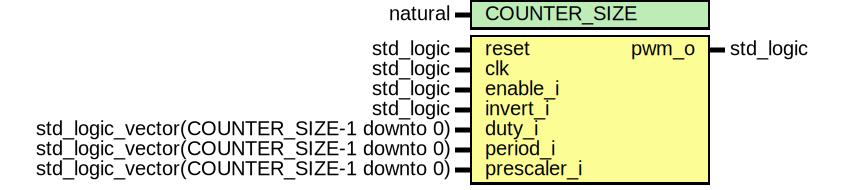

# Entity: pwm_logic

- **File**: pwm_logic.vhd
## Diagram

## Generics

| Generic name | Type    | Value | Description |
| ------------ | ------- | ----- | ----------- |
| COUNTER_SIZE | natural | 32    |             |
## Ports

| Port name   | Direction | Type                                      | Description |
| ----------- | --------- | ----------------------------------------- | ----------- |
| reset       | in        | std_logic                                 | CANDR       |
| clk         | in        | std_logic                                 |             |
| enable_i    | in        | std_logic                                 | conf        |
| invert_i    | in        | std_logic                                 |             |
| duty_i      | in        | std_logic_vector(COUNTER_SIZE-1 downto 0) |             |
| period_i    | in        | std_logic_vector(COUNTER_SIZE-1 downto 0) |             |
| prescaler_i | in        | std_logic_vector(COUNTER_SIZE-1 downto 0) |             |
| pwm_o       | out       | std_logic                                 | out signals |
## Signals

| Name      | Type                              | Description |
| --------- | --------------------------------- | ----------- |
| pwm_reg   | std_logic                         |             |
| tick_s    | std_logic                         |             |
| nb_tick_s | unsigned(COUNTER_SIZE-1 downto 0) |             |
## Processes
- unnamed: ( clk )
## Instantiations

- pwm_cpt_inst: work.pwm_cpt
