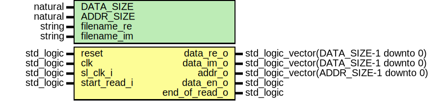

# Entity: readComplexFromFile

- **File**: readComplexFromFile.vhd
## Diagram

## Description

use work.sp_vision_test_pkg.all;
## Generics

| Generic name | Type    | Value | Description |
| ------------ | ------- | ----- | ----------- |
| DATA_SIZE    | natural | 16    |             |
| ADDR_SIZE    | natural | 10    |             |
| filename_re  | string  | ""    |             |
| filename_im  | string  | ""    |             |
## Ports

| Port name     | Direction | Type                                   | Description       |
| ------------- | --------- | -------------------------------------- | ----------------- |
| reset         | in        | std_logic                              |                   |
| clk           | in        | std_logic                              |                   |
| sl_clk_i      | in        | std_logic                              |                   |
| start_read_i  | in        | std_logic                              | ichier : in text; |
| data_re_o     | out       | std_logic_vector(DATA_SIZE-1 downto 0) |                   |
| data_im_o     | out       | std_logic_vector(DATA_SIZE-1 downto 0) |                   |
| addr_o        | out       | std_logic_vector(ADDR_SIZE-1 downto 0) |                   |
| data_en_o     | out       | std_logic                              |                   |
| end_of_read_o | out       | std_logic                              |                   |
## Signals

| Name               | Type                                   | Description |
| ------------------ | -------------------------------------- | ----------- |
| counter_s          | natural range 0 to 2**ADDR_SIZE-1      |             |
| read_data_re_val_s | std_logic_vector(DATA_SIZE-1 downto 0) |             |
| read_data_im_val_s | std_logic_vector(DATA_SIZE-1 downto 0) |             |
| read_data_en_s     | std_logic                              |             |
| end_read_s         | std_logic                              |             |
| fin_s              | std_logic                              |             |
## Processes
- read_data: ( clk, reset )
- counter_coeff_storage: ( clk, reset )
