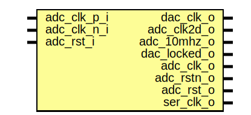

# Entity: redpitaya_adc_dac_clk

## Diagram

## Ports

| Port name    | Direction | Type | Description |
| ------------ | --------- | ---- | ----------- |
| adc_clk_p_i  | input     |      |             |
| adc_clk_n_i  | input     |      |             |
| dac_clk_o    | output    |      |             |
| adc_clk2d_o  | output    |      |             |
| adc_10mhz_o  | output    |      |             |
| dac_locked_o | output    |      |             |
| adc_clk_o    | output    |      |             |
| adc_rstn_o   | output    |      |             |
| adc_rst_o    | output    |      |             |
| adc_rst_i    | input     |      |             |
| ser_clk_o    | output    |      |             |
## Signals

| Name           | Type    | Description               |
| -------------- | ------- | ------------------------- |
| adc_clk_in     | wire    | ADC input registers       |
| adc_clk        | wire    |                           |
| dac_clk_fb     | wire    | Fast DAC - DDR interface  |
| dac_clk_fb_buf | wire    |                           |
| dac_clk_out    | wire    |                           |
| adc_clk2d_out  | wire    |                           |
| dac_clk        | wire    |                           |
| adc_clk2d      | wire    |                           |
| dac_locked     | wire    |                           |
| dac_rst        | reg     |                           |
| ser_clk_out    | wire    |                           |
| adc_10mhz_out  | wire    |                           |
| adc_10mhz      | wire    |                           |
| value          | reg     |                           |
| k              | integer |                           |
## Constants

| Name        | Type | Value | Description |
| ----------- | ---- | ----- | ----------- |
| STAGES      |      | 3     |             |
| INITIAL_VAL |      | 1'b1  |             |
## Instantiations

- i_clk: IBUFDS
**Description**
differential clock input
- i_adc_buf: BUFG
**Description**
use global clock buffer
- i_dac_plle2: PLLE2_ADV
- i_dacfb_buf: BUFG
- i_dac1_buf: BUFG
- i_dac2_buf: BUFG
- i_dac2ph_buf: BUFG
- i_ser_buf: BUFG
