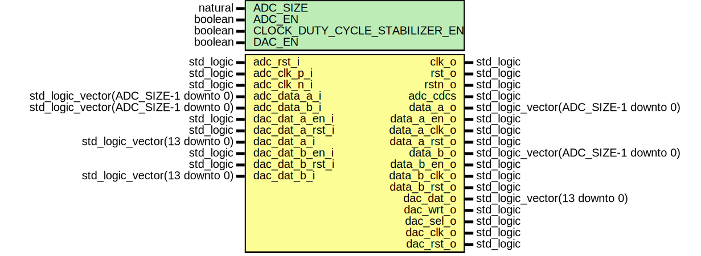

# Entity: redpitaya_converters

- **File**: redpitaya_converters.vhd
## Diagram

## Generics

| Generic name                   | Type    | Value | Description |
| ------------------------------ | ------- | ----- | ----------- |
| ADC_SIZE                       | natural | 14    |             |
| ADC_EN                         | boolean | true  |             |
| CLOCK_DUTY_CYCLE_STABILIZER_EN | boolean | true  |             |
| DAC_EN                         | boolean | true  |             |
## Ports

| Port name       | Direction | Type                                  | Description                         |
| --------------- | --------- | ------------------------------------- | ----------------------------------- |
| adc_rst_i       | in        | std_logic                             | CANDR                               |
| clk_o           | out       | std_logic                             |                                     |
| rst_o           | out       | std_logic                             |                                     |
| rstn_o          | out       | std_logic                             |                                     |
| adc_clk_p_i     | in        | std_logic                             | input diff clk                      |
| adc_clk_n_i     | in        | std_logic                             |                                     |
| adc_data_a_i    | in        | std_logic_vector(ADC_SIZE-1 downto 0) | adc  phys - lvds/cmos input/output  |
| adc_data_b_i    | in        | std_logic_vector(ADC_SIZE-1 downto 0) |                                     |
| adc_cdcs        | out       | std_logic                             |                                     |
| data_a_o        | out       | std_logic_vector(ADC_SIZE-1 downto 0) |   adc data to design                |
| data_a_en_o     | out       | std_logic                             |                                     |
| data_a_clk_o    | out       | std_logic                             |                                     |
| data_a_rst_o    | out       | std_logic                             |                                     |
| data_b_o        | out       | std_logic_vector(ADC_SIZE-1 downto 0) |                                     |
| data_b_en_o     | out       | std_logic                             |                                     |
| data_b_clk_o    | out       | std_logic                             |                                     |
| data_b_rst_o    | out       | std_logic                             |                                     |
| dac_dat_a_en_i  | in        | std_logic                             | ad9767 from design                  |
| dac_dat_a_rst_i | in        | std_logic                             |                                     |
| dac_dat_a_i     | in        | std_logic_vector(13 downto 0)         |                                     |
| dac_dat_b_en_i  | in        | std_logic                             |                                     |
| dac_dat_b_rst_i | in        | std_logic                             |                                     |
| dac_dat_b_i     | in        | std_logic_vector(13 downto 0)         |                                     |
| dac_dat_o       | out       | std_logic_vector(13 downto 0)         |  phys                               |
| dac_wrt_o       | out       | std_logic                             |                                     |
| dac_sel_o       | out       | std_logic                             |                                     |
| dac_clk_o       | out       | std_logic                             |                                     |
| dac_rst_o       | out       | std_logic                             |                                     |
## Signals

| Name          | Type      | Description |
| ------------- | --------- | ----------- |
| dac_clk_s     | std_logic |             |
|  dac_2clk_s   | std_logic |             |
| dac_2ph_s     | std_logic |             |
|  dac_locked_s | std_logic |             |
| adc_clk_s     | std_logic |             |
| adc_rstn_s    | std_logic |             |
| adc_rst_s     | std_logic |             |
| data_en_s     | std_logic |             |
## Instantiations

- redpitaya_clk: redpitaya_adc_dac_clk
