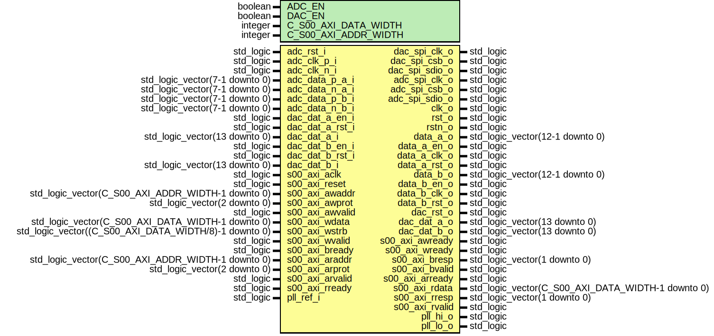

# Entity: redpitaya_converters_12

- **File**: redpitaya_converters_12.vhd
## Diagram

## Generics

| Generic name         | Type    | Value | Description |
| -------------------- | ------- | ----- | ----------- |
| ADC_EN               | boolean | true  |             |
| DAC_EN               | boolean | true  |             |
| C_S00_AXI_DATA_WIDTH | integer | 32    |             |
| C_S00_AXI_ADDR_WIDTH | integer | 5     |             |
## Ports

| Port name       | Direction | Type                                                  | Description          |
| --------------- | --------- | ----------------------------------------------------- | -------------------- |
| dac_spi_clk_o   | out       | std_logic                                             | SPI DAC control      |
| dac_spi_csb_o   | out       | std_logic                                             |                      |
| dac_spi_sdio_o  | out       | std_logic                                             |                      |
| adc_spi_clk_o   | out       | std_logic                                             | SPI ADC control      |
| adc_spi_csb_o   | out       | std_logic                                             |                      |
| adc_spi_sdio_o  | out       | std_logic                                             |                      |
| adc_rst_i       | in        | std_logic                                             | CANDR                |
| clk_o           | out       | std_logic                                             |                      |
| rst_o           | out       | std_logic                                             |                      |
| rstn_o          | out       | std_logic                                             |                      |
| adc_clk_p_i     | in        | std_logic                                             | input diff clk       |
| adc_clk_n_i     | in        | std_logic                                             |                      |
| adc_data_p_a_i  | in        | std_logic_vector(7-1 downto 0)                        | adc  phys ADC        |
| adc_data_n_a_i  | in        | std_logic_vector(7-1 downto 0)                        |                      |
| adc_data_p_b_i  | in        | std_logic_vector(7-1 downto 0)                        |                      |
| adc_data_n_b_i  | in        | std_logic_vector(7-1 downto 0)                        |                      |
| data_a_o        | out       | std_logic_vector(12-1 downto 0)                       |   adc data to design |
| data_a_en_o     | out       | std_logic                                             |                      |
| data_a_clk_o    | out       | std_logic                                             |                      |
| data_a_rst_o    | out       | std_logic                                             |                      |
| data_b_o        | out       | std_logic_vector(12-1 downto 0)                       |                      |
| data_b_en_o     | out       | std_logic                                             |                      |
| data_b_clk_o    | out       | std_logic                                             |                      |
| data_b_rst_o    | out       | std_logic                                             |                      |
| dac_dat_a_en_i  | in        | std_logic                                             | ad9746 from design   |
| dac_dat_a_rst_i | in        | std_logic                                             |                      |
| dac_dat_a_i     | in        | std_logic_vector(13 downto 0)                         |                      |
| dac_dat_b_en_i  | in        | std_logic                                             |                      |
| dac_dat_b_rst_i | in        | std_logic                                             |                      |
| dac_dat_b_i     | in        | std_logic_vector(13 downto 0)                         |                      |
| dac_rst_o       | out       | std_logic                                             |  phys                |
| dac_dat_a_o     | out       | std_logic_vector(13 downto 0)                         |                      |
| dac_dat_b_o     | out       | std_logic_vector(13 downto 0)                         |                      |
| s00_axi_aclk    | in        | std_logic                                             | AXI signals          |
| s00_axi_reset   | in        | std_logic                                             |                      |
| s00_axi_awaddr  | in        | std_logic_vector(C_S00_AXI_ADDR_WIDTH-1 downto 0)     |                      |
| s00_axi_awprot  | in        | std_logic_vector(2 downto 0)                          |                      |
| s00_axi_awvalid | in        | std_logic                                             |                      |
| s00_axi_awready | out       | std_logic                                             |                      |
| s00_axi_wdata   | in        | std_logic_vector(C_S00_AXI_DATA_WIDTH-1 downto 0)     |                      |
| s00_axi_wstrb   | in        | std_logic_vector((C_S00_AXI_DATA_WIDTH/8)-1 downto 0) |                      |
| s00_axi_wvalid  | in        | std_logic                                             |                      |
| s00_axi_wready  | out       | std_logic                                             |                      |
| s00_axi_bresp   | out       | std_logic_vector(1 downto 0)                          |                      |
| s00_axi_bvalid  | out       | std_logic                                             |                      |
| s00_axi_bready  | in        | std_logic                                             |                      |
| s00_axi_araddr  | in        | std_logic_vector(C_S00_AXI_ADDR_WIDTH-1 downto 0)     |                      |
| s00_axi_arprot  | in        | std_logic_vector(2 downto 0)                          |                      |
| s00_axi_arvalid | in        | std_logic                                             |                      |
| s00_axi_arready | out       | std_logic                                             |                      |
| s00_axi_rdata   | out       | std_logic_vector(C_S00_AXI_DATA_WIDTH-1 downto 0)     |                      |
| s00_axi_rresp   | out       | std_logic_vector(1 downto 0)                          |                      |
| s00_axi_rvalid  | out       | std_logic                                             |                      |
| s00_axi_rready  | in        | std_logic                                             |                      |
| pll_ref_i       | in        | std_logic                                             | PLL                  |
| pll_hi_o        | out       | std_logic                                             |                      |
| pll_lo_o        | out       | std_logic                                             |                      |
## Signals

| Name          | Type                                   | Description |
| ------------- | -------------------------------------- | ----------- |
| adc_clk_s     | std_logic                              |             |
| adc_rstn_s    | std_logic                              |             |
| adc_rst_s     | std_logic                              |             |
| data_en_s     | std_logic                              |             |
| dac_clk_s     | std_logic                              |             |
|  adc_clk2d_s  | std_logic                              |             |
| adc_10mhz_s   | std_logic                              |             |
|  dac_locked_s | std_logic                              |             |
| addr_s        | std_logic_vector(2 downto 0)           |             |
| write_en_s    | std_logic                              |             |
|  read_en_s    | std_logic                              |             |
| conf_s        | std_logic_vector(CONF_SIZE-1 downto 0) |             |
|  conf_spi     | std_logic_vector(CONF_SIZE-1 downto 0) |             |
| conf_en_s     | std_logic                              |             |
|  conf_en_spi  | std_logic                              |             |
| conf_sel_s    | std_logic                              |             |
|  conf_sel_spi | std_logic                              |             |
| pll_cfg_en_s  | std_logic                              |             |
|  pll_cfg_en_o | std_logic                              |             |
|  pll_ok_o     | std_logic                              |             |
|  pll_ok_s     | std_logic                              |             |
## Constants

| Name                | Type    | Value | Description |
| ------------------- | ------- | ----- | ----------- |
| INTERNAL_ADDR_WIDTH | integer |  3    |             |
| CONF_SIZE           | integer |  21   |             |
## Instantiations

- redpitaya_clk: redpitaya_adc_dac_clk
- spi_en_conf: work.redpitaya_converters_12_sync_bit
 **Description**
---------------------------------------------------------------------------------------------------------------------------
 AXI COMM
---------------------------------------------------------------------------------------------------------------------------

- spi_sel_conf: work.redpitaya_converters_12_sync_bit
- spi_conf: work.redpitaya_converters_12_sync_vector
- pll_cfg_en: work.redpitaya_converters_12_sync_bit
- comm_inst: work.redpitaya_converters_12_comm
- handle_comm: work.redpitaya_converters_12_handComm
 **Description**
 Instantiation of Axi Bus Interface S00_AXI

- spi_control: adc_dac_spi_control
 **Description**
---------------------------------------------------------------------------------------------------------------------------
 ADC DAC SPI CONTROL
---------------------------------------------------------------------------------------------------------------------------

- pll_to_vcxo: Si571_pll
 **Description**
---------------------------------------------------------------------------------------------------------------------------
 PLL ENABLE 
---------------------------------------------------------------------------------------------------------------------------                    

