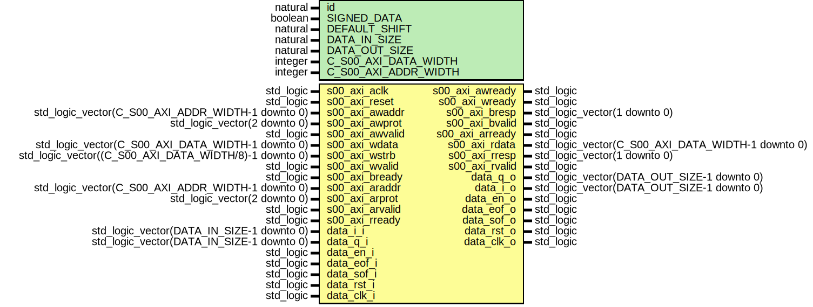

# Entity: shifterComplex_dyn

- **File**: shifterComplex_dyn.vhd
## Diagram

## Description

-------------------------------------------------------------------------
 (c) Copyright: OscillatorIMP Digital
 Author : Gwenhael Goavec-Merou<gwenhael.goavec-merou@trabucayre.com>
 Creation date : 2016/05/25
-------------------------------------------------------------------------
## Generics

| Generic name         | Type    | Value | Description                                    |
| -------------------- | ------- | ----- | ---------------------------------------------- |
| id                   | natural | 1     |                                                |
| SIGNED_DATA          | boolean | true  |                                                |
| DEFAULT_SHIFT        | natural | 0     |                                                |
| DATA_IN_SIZE         | natural | 32    |                                                |
| DATA_OUT_SIZE        | natural | 16    |                                                |
| C_S00_AXI_DATA_WIDTH | integer | 32    | Parameters of Axi Slave Bus Interface S00_AXI  |
| C_S00_AXI_ADDR_WIDTH | integer | 4     |                                                |
## Ports

| Port name       | Direction | Type                                                  | Description      |
| --------------- | --------- | ----------------------------------------------------- | ---------------- |
| s00_axi_aclk    | in        | std_logic                                             | Wishbone signals |
| s00_axi_reset   | in        | std_logic                                             |                  |
| s00_axi_awaddr  | in        | std_logic_vector(C_S00_AXI_ADDR_WIDTH-1 downto 0)     |                  |
| s00_axi_awprot  | in        | std_logic_vector(2 downto 0)                          |                  |
| s00_axi_awvalid | in        | std_logic                                             |                  |
| s00_axi_awready | out       | std_logic                                             |                  |
| s00_axi_wdata   | in        | std_logic_vector(C_S00_AXI_DATA_WIDTH-1 downto 0)     |                  |
| s00_axi_wstrb   | in        | std_logic_vector((C_S00_AXI_DATA_WIDTH/8)-1 downto 0) |                  |
| s00_axi_wvalid  | in        | std_logic                                             |                  |
| s00_axi_wready  | out       | std_logic                                             |                  |
| s00_axi_bresp   | out       | std_logic_vector(1 downto 0)                          |                  |
| s00_axi_bvalid  | out       | std_logic                                             |                  |
| s00_axi_bready  | in        | std_logic                                             |                  |
| s00_axi_araddr  | in        | std_logic_vector(C_S00_AXI_ADDR_WIDTH-1 downto 0)     |                  |
| s00_axi_arprot  | in        | std_logic_vector(2 downto 0)                          |                  |
| s00_axi_arvalid | in        | std_logic                                             |                  |
| s00_axi_arready | out       | std_logic                                             |                  |
| s00_axi_rdata   | out       | std_logic_vector(C_S00_AXI_DATA_WIDTH-1 downto 0)     |                  |
| s00_axi_rresp   | out       | std_logic_vector(1 downto 0)                          |                  |
| s00_axi_rvalid  | out       | std_logic                                             |                  |
| s00_axi_rready  | in        | std_logic                                             |                  |
| data_i_i        | in        | std_logic_vector(DATA_IN_SIZE-1 downto 0)             | input            |
| data_q_i        | in        | std_logic_vector(DATA_IN_SIZE-1 downto 0)             |                  |
| data_en_i       | in        | std_logic                                             |                  |
| data_eof_i      | in        | std_logic                                             |                  |
| data_sof_i      | in        | std_logic                                             |                  |
| data_rst_i      | in        | std_logic                                             |                  |
| data_clk_i      | in        | std_logic                                             |                  |
| data_q_o        | out       | std_logic_vector(DATA_OUT_SIZE-1 downto 0)            | output           |
| data_i_o        | out       | std_logic_vector(DATA_OUT_SIZE-1 downto 0)            |                  |
| data_en_o       | out       | std_logic                                             |                  |
| data_eof_o      | out       | std_logic                                             |                  |
| data_sof_o      | out       | std_logic                                             |                  |
| data_rst_o      | out       | std_logic                                             |                  |
| data_clk_o      | out       | std_logic                                             |                  |
## Signals

| Name             | Type                                      | Description |
| ---------------- | ----------------------------------------- | ----------- |
| shift_val_s      | std_logic_vector(SHFT_ADDR_SZ-1 downto 0) |             |
| shift_val_sync_s | std_logic_vector(SHFT_ADDR_SZ-1 downto 0) |             |
| addr_s           | std_logic_vector(1 downto 0)              |  comm       |
| wr_en_s          | std_logic                                 |             |
|  rd_en_s         | std_logic                                 |             |
## Constants

| Name         | Type    | Value                                 | Description |
| ------------ | ------- | ------------------------------------- | ----------- |
| MAX_SHIFT    | natural |  DATA_IN_SIZE - DATA_OUT_SIZE + 1     |             |
| SHFT_ADDR_SZ | natural |  natural(ceil(log2(real(MAX_SHIFT)))) |             |
## Instantiations

- shift_inst1: work.shifterComplex_dyn_logic
- shift_sync: work.shifterComplex_dyn_synchronizer_vector
- shift_comm_inst: work.shifterComplex_dyn_comm
- handle_comm: work.shifterComplex_dyn_handcomm
**Description**
 Instantiation of Axi Bus Interface S00_AXI

