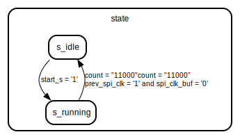

# Entity: spi_master

- **File**: spi_master.vhd
## Diagram

## Description

 source https://opencores.org/projects/system09
 http://volkerschatz.de/hardware/vhdocl-example/sources/spi-master.html
## Ports

| Port name | Direction | Type                          | Description                           |
| --------- | --------- | ----------------------------- | ------------------------------------- |
| clk       | in        | std_logic                     |  CPU Interface Signals                |
| reset     | in        | std_logic                     |                                       |
| start_en  | in        | std_logic                     |                                       |
| data_in   | in        | std_logic_vector(20 downto 0) | (20 downto 0) = datasize -1 downto 0  |
| spi_mosi  | out       | std_logic                     |  SPI Interface Signals                |
| spi_clk   | out       | std_logic                     |                                       |
| spi_cs_n  | out       | std_logic                     |                                       |
## Signals

| Name            | Type                            | Description                                                                              |
| --------------- | ------------------------------- | ---------------------------------------------------------------------------------------- |
| state           | state_type                      |                                                                                          |
| shift_reg       | std_logic_vector(23 downto 0)   | (23 downto 0) = datasize +2 downto 0                                                     |
| spi_data_buf    | std_logic_vector(23 downto 0)   | (23 downto 0) = datasize +2 downto 0                                                     |
| start           | std_logic                       |  Start transmission flag                                                                 |
|  start_s        | std_logic                       |  Start transmission flag                                                                 |
| count           | std_logic_vector(4 downto 0)    |  Number of bits transfered                                                               |
| spi_clk_buf     | std_logic                       |  Buffered SPI clock                                                                      |
| spi_clk_out     | std_logic                       |  Buffered SPI clock output                                                               |
| prev_spi_clk    | std_logic                       |  Previous SPI clock state                                                                |
| spi_clk_count   | std_logic_vector(23 downto 0)   |  Number of clk cycles-1 in this SPI clock period                                         |
| spi_clk_divide  | std_logic_vector(1 downto 0)    |  SPI clock divisor                                                                       |
| transfer_length | std_logic_vector(1 downto 0)    |  SPI transfer length                                                                     |
| deselect        | std_logic                       |  Flag to indicate that the SPI slave should be deselected after the current   transfer   |
| spi_cs          | std_logic                       |                                                                                          |
| delay           | std_logic_vector(dn-1 downto 0) |                                                                                          |
## Constants

| Name | Type     | Value | Description |
| ---- | -------- | ----- | ----------- |
| dn   | positive |  50   |             |
## Types

| Name       | Type                                                     | Description |
| ---------- | -------------------------------------------------------- | ----------- |
| state_type | (s_idle,  s_running)  |             |
## Processes
- cpu_write: ( clk, reset )
- p_rising_edge_detector: ( clk )
- spi_proc: ( clk, reset )
 **Description**
* SPI transfer state machine  
- spi_clock_gen: ( clk, reset )
 **Description**
* Generate SPI clock  
## State machines

- * SPI transfer state machine 

