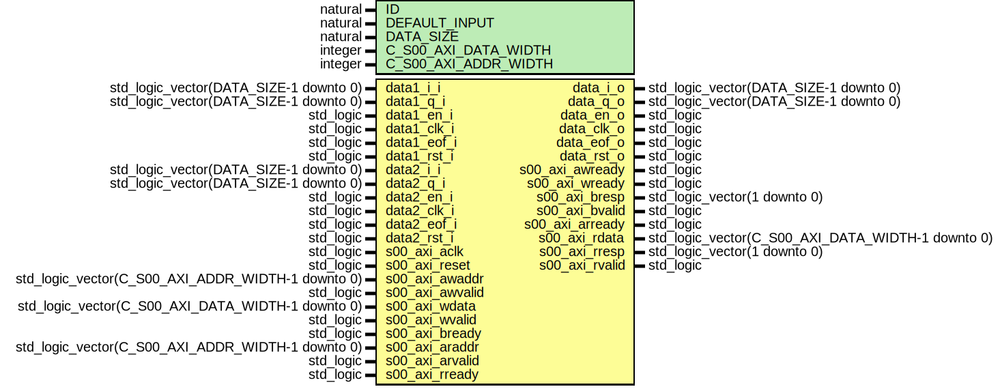

# Entity: switchComplex

- **File**: switchComplex.vhd
## Diagram

## Generics

| Generic name         | Type    | Value | Description |
| -------------------- | ------- | ----- | ----------- |
| ID                   | natural | 1     |             |
| DEFAULT_INPUT        | natural | 0     |             |
| DATA_SIZE            | natural | 16    |             |
| C_S00_AXI_DATA_WIDTH | integer | 32    |             |
| C_S00_AXI_ADDR_WIDTH | integer | 4     |             |
## Ports

| Port name       | Direction | Type                                              | Description                                                              |
| --------------- | --------- | ------------------------------------------------- | ------------------------------------------------------------------------ |
| data1_i_i       | in        | std_logic_vector(DATA_SIZE-1 downto 0)            | rocessing                                                                |
| data1_q_i       | in        | std_logic_vector(DATA_SIZE-1 downto 0)            |                                                                          |
| data1_en_i      | in        | std_logic                                         |                                                                          |
| data1_clk_i     | in        | std_logic                                         |                                                                          |
| data1_eof_i     | in        | std_logic                                         |                                                                          |
| data1_rst_i     | in        | std_logic                                         |                                                                          |
| data2_i_i       | in        | std_logic_vector(DATA_SIZE-1 downto 0)            |                                                                          |
| data2_q_i       | in        | std_logic_vector(DATA_SIZE-1 downto 0)            |                                                                          |
| data2_en_i      | in        | std_logic                                         |                                                                          |
| data2_clk_i     | in        | std_logic                                         |                                                                          |
| data2_eof_i     | in        | std_logic                                         |                                                                          |
| data2_rst_i     | in        | std_logic                                         |                                                                          |
| data_i_o        | out       | std_logic_vector(DATA_SIZE-1 downto 0)            |                                                                          |
| data_q_o        | out       | std_logic_vector(DATA_SIZE-1 downto 0)            |                                                                          |
| data_en_o       | out       | std_logic                                         |                                                                          |
| data_clk_o      | out       | std_logic                                         |                                                                          |
| data_eof_o      | out       | std_logic                                         |                                                                          |
| data_rst_o      | out       | std_logic                                         |                                                                          |
| s00_axi_aclk    | in        | std_logic                                         |                                                                          |
| s00_axi_reset   | in        | std_logic                                         |                                                                          |
| s00_axi_awaddr  | in        | std_logic_vector(C_S00_AXI_ADDR_WIDTH-1 downto 0) |                                                                          |
| s00_axi_awvalid | in        | std_logic                                         | 00_axi_awprot	: in std_logic_vector(2 downto 0);                         |
| s00_axi_awready | out       | std_logic                                         |                                                                          |
| s00_axi_wdata   | in        | std_logic_vector(C_S00_AXI_DATA_WIDTH-1 downto 0) |                                                                          |
| s00_axi_wvalid  | in        | std_logic                                         | 00_axi_wstrb	: in std_logic_vector((C_S00_AXI_DATA_WIDTH/8)-1 downto 0); |
| s00_axi_wready  | out       | std_logic                                         |                                                                          |
| s00_axi_bresp   | out       | std_logic_vector(1 downto 0)                      |                                                                          |
| s00_axi_bvalid  | out       | std_logic                                         |                                                                          |
| s00_axi_bready  | in        | std_logic                                         |                                                                          |
| s00_axi_araddr  | in        | std_logic_vector(C_S00_AXI_ADDR_WIDTH-1 downto 0) |                                                                          |
| s00_axi_arvalid | in        | std_logic                                         | 00_axi_arprot	: in std_logic_vector(2 downto 0);                         |
| s00_axi_arready | out       | std_logic                                         |                                                                          |
| s00_axi_rdata   | out       | std_logic_vector(C_S00_AXI_DATA_WIDTH-1 downto 0) |                                                                          |
| s00_axi_rresp   | out       | std_logic_vector(1 downto 0)                      |                                                                          |
| s00_axi_rvalid  | out       | std_logic                                         |                                                                          |
| s00_axi_rready  | in        | std_logic                                         |                                                                          |
## Signals

| Name         | Type                         | Description |
| ------------ | ---------------------------- | ----------- |
| addr_s       | std_logic_vector(1 downto 0) |             |
| write_en_s   | std_logic                    |             |
|  read_en_s   | std_logic                    |             |
| witchIn      | std_logic                    |             |
| witchIn_sync | std_logic                    |             |
## Instantiations

- switch_sync: work.switchComplex_synch
- switchComplexWb_inst: work.switchComplex_wb
- handle_comm: work.switchComplex_handComm
**Description**
 Instantiation of Axi Bus Interface S00_AXI

