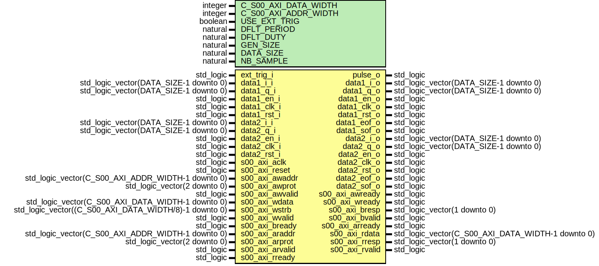

# Entity: syncTrigStream

- **File**: syncTrigStream.vhd
## Diagram

## Description

-------------------------------------------------------------------------
 (c) Copyright: OscillatorIMP Digital
 Author : Gwenhael Goavec-Merou<gwenhael.goavec-merou@trabucayre.com>
 2013-2018
-------------------------------------------------------------------------
## Generics

| Generic name         | Type    | Value     | Description |
| -------------------- | ------- | --------- | ----------- |
| C_S00_AXI_DATA_WIDTH | integer | 32        |             |
| C_S00_AXI_ADDR_WIDTH | integer | 4         |             |
| USE_EXT_TRIG         | boolean | false     |             |
| DFLT_PERIOD          | natural | 300000000 |  3s@100MHz  |
| DFLT_DUTY            | natural | 100       |  1us@100MHz |
| GEN_SIZE             | natural | 32        |             |
| DATA_SIZE            | natural | 16        |             |
| NB_SAMPLE            | natural | 1024      |             |
## Ports

| Port name       | Direction | Type                                                  | Description    |
| --------------- | --------- | ----------------------------------------------------- | -------------- |
| pulse_o         | out       | std_logic                                             | Syscon signals |
| ext_trig_i      | in        | std_logic                                             |                |
| data1_i_i       | in        | std_logic_vector(DATA_SIZE-1 downto 0)                | input          |
| data1_q_i       | in        | std_logic_vector(DATA_SIZE-1 downto 0)                |                |
| data1_en_i      | in        | std_logic                                             |                |
| data1_clk_i     | in        | std_logic                                             |                |
| data1_rst_i     | in        | std_logic                                             |                |
| data2_i_i       | in        | std_logic_vector(DATA_SIZE-1 downto 0)                |                |
| data2_q_i       | in        | std_logic_vector(DATA_SIZE-1 downto 0)                |                |
| data2_en_i      | in        | std_logic                                             |                |
| data2_clk_i     | in        | std_logic                                             |                |
| data2_rst_i     | in        | std_logic                                             |                |
| data1_i_o       | out       | std_logic_vector(DATA_SIZE-1 downto 0)                | output         |
| data1_q_o       | out       | std_logic_vector(DATA_SIZE-1 downto 0)                |                |
| data1_en_o      | out       | std_logic                                             |                |
| data1_clk_o     | out       | std_logic                                             |                |
| data1_rst_o     | out       | std_logic                                             |                |
| data1_eof_o     | out       | std_logic                                             |                |
| data1_sof_o     | out       | std_logic                                             |                |
| data2_i_o       | out       | std_logic_vector(DATA_SIZE-1 downto 0)                |                |
| data2_q_o       | out       | std_logic_vector(DATA_SIZE-1 downto 0)                |                |
| data2_en_o      | out       | std_logic                                             |                |
| data2_clk_o     | out       | std_logic                                             |                |
| data2_rst_o     | out       | std_logic                                             |                |
| data2_eof_o     | out       | std_logic                                             |                |
| data2_sof_o     | out       | std_logic                                             |                |
| s00_axi_aclk    | in        | std_logic                                             | axi            |
| s00_axi_reset   | in        | std_logic                                             |                |
| s00_axi_awaddr  | in        | std_logic_vector(C_S00_AXI_ADDR_WIDTH-1 downto 0)     |                |
| s00_axi_awprot  | in        | std_logic_vector(2 downto 0)                          |                |
| s00_axi_awvalid | in        | std_logic                                             |                |
| s00_axi_awready | out       | std_logic                                             |                |
| s00_axi_wdata   | in        | std_logic_vector(C_S00_AXI_DATA_WIDTH-1 downto 0)     |                |
| s00_axi_wstrb   | in        | std_logic_vector((C_S00_AXI_DATA_WIDTH/8)-1 downto 0) |                |
| s00_axi_wvalid  | in        | std_logic                                             |                |
| s00_axi_wready  | out       | std_logic                                             |                |
| s00_axi_bresp   | out       | std_logic_vector(1 downto 0)                          |                |
| s00_axi_bvalid  | out       | std_logic                                             |                |
| s00_axi_bready  | in        | std_logic                                             |                |
| s00_axi_araddr  | in        | std_logic_vector(C_S00_AXI_ADDR_WIDTH-1 downto 0)     |                |
| s00_axi_arprot  | in        | std_logic_vector(2 downto 0)                          |                |
| s00_axi_arvalid | in        | std_logic                                             |                |
| s00_axi_arready | out       | std_logic                                             |                |
| s00_axi_rdata   | out       | std_logic_vector(C_S00_AXI_DATA_WIDTH-1 downto 0)     |                |
| s00_axi_rresp   | out       | std_logic_vector(1 downto 0)                          |                |
| s00_axi_rvalid  | out       | std_logic                                             |                |
| s00_axi_rready  | in        | std_logic                                             |                |
## Signals

| Name              | Type                                  | Description |
| ----------------- | ------------------------------------- | ----------- |
| addr_s            | std_logic_vector(1 downto 0)          |             |
| write_en_s        | std_logic                             |             |
|  read_en_s        | std_logic                             |             |
| period_cnt_s      | std_logic_vector(GEN_SIZE-1 downto 0) |             |
| period_cnt_sync_s | std_logic_vector(GEN_SIZE-1 downto 0) |             |
| duty_cnt_s        | std_logic_vector(GEN_SIZE-1 downto 0) |             |
| duty_cnt_sync_s   | std_logic_vector(GEN_SIZE-1 downto 0) |             |
| enable_s          | std_logic                             |             |
|  enable_sync_s    | std_logic                             |             |
| data_en_s         | std_logic                             |             |
|  data_eof_s       | std_logic                             |             |
|  data_sof_s       | std_logic                             |             |
## Instantiations

- gr_logic_inst: work.syncTrigStream_logic
- sync_period: work.syncTrigStream_sync_vector
- sync_duty: work.syncTrigStream_sync_vector
- sync_en: work.syncTrigStream_sync_bit
- wb_inst: work.syncTrigStream_comm
- handle_comm: work.syncTrigStream_handComm
 **Description**
 Instantiation of Axi Bus Interface S00_AXI

