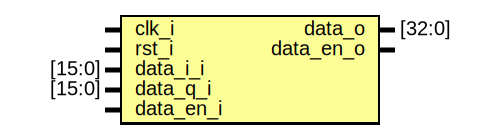

# Entity: top_dut

- **File**: top_dut.v
## Diagram

## Ports

| Port name | Direction | Type   | Description |
| --------- | --------- | ------ | ----------- |
| clk_i     | input     |        |             |
| rst_i     | input     |        |             |
| data_i_i  | input     | [15:0] |             |
| data_q_i  | input     | [15:0] |             |
| data_en_i | input     |        |             |
| data_o    | output    | [32:0] |             |
| data_en_o | output    |        |             |
## Instantiations

- magnitude_inst: magnitude
