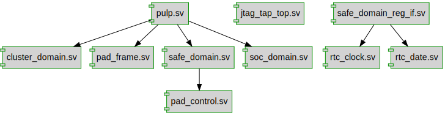

# Documentation for: 

Generated by **TerosHDL** © 2020-2021 License GPLv3 Carlos Alberto Ruiz Naranjo (carlosruiznaranjo@gmail.com) Ismael Perez Rojo (ismaelprojo@gmail.com)  Project revision 2021-09-06 11:55:55  

## Designs

- Module: [cluster_domain ](./doc_internal/cluster_domain.md)
- Module: [jtag_tap_top ](./doc_internal/jtag_tap_top.md)
- Module: [pad_control ](./doc_internal/pad_control.md)
- Module: [pad_frame ](./doc_internal/pad_frame.md)
- Module: [pulp ](./doc_internal/pulp.md)
- Module: [rtc_clock ](./doc_internal/rtc_clock.md)
- Module: [rtc_date ](./doc_internal/rtc_date.md)
- Module: [safe_domain ](./doc_internal/safe_domain.md)
- Module: [safe_domain_reg_if ](./doc_internal/safe_domain_reg_if.md)
- Module: [soc_domain ](./doc_internal/soc_domain.md)

