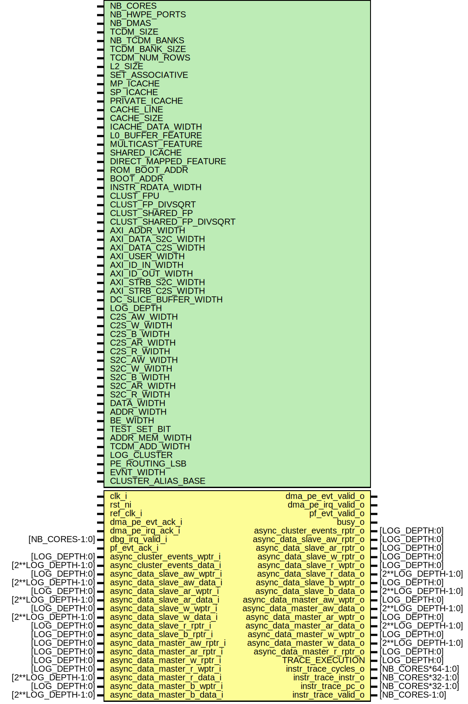

# Entity: cluster_domain
## Diagram

## Description
Copyright 2018 ETH Zurich and University of Bologna.
 Copyright and related rights are licensed under the Solderpad Hardware
 License, Version 0.51 (the "License"); you may not use this file except in
 compliance with the License.  You may obtain a copy of the License at
 http://solderpad.org/licenses/SHL-0.51. Unless required by applicable law
 or agreed to in writing, software, hardware and materials distributed under
 this License is distributed on an "AS IS" BASIS, WITHOUT WARRANTIES OR
 CONDITIONS OF ANY KIND, either express or implied. See the License for the
 specific language governing permissions and limitations under the License.
 
## Generics
| Generic name            | Type | Value                                      | Description                                                                                                        |
| ----------------------- | ---- | ------------------------------------------ | ------------------------------------------------------------------------------------------------------------------ |
| NB_CORES                |      | `NB_CORES                                  |                                                                                                                    |
| NB_HWPE_PORTS           |      | 9                                          |                                                                                                                    |
| NB_DMAS                 |      | 4                                          |                                                                                                                    |
| TCDM_SIZE               |      | 64*1024                                    | in Byte, POWER of 2                                                                                                |
| NB_TCDM_BANKS           |      | 16                                         | POWER of 2                                                                                                         |
| TCDM_BANK_SIZE          |      | TCDM_SIZE/NB_TCDM_BANKS                    | eg 4096                                                                                                            |
| TCDM_NUM_ROWS           |      | TCDM_BANK_SIZE/4                           | --> 4 byte, mem are 32 bit wide                                                                                    |
| L2_SIZE                 |      | 512*1024                                   |                                                                                                                    |
| SET_ASSOCIATIVE         |      | 4                                          |                                                                                                                    |
| MP_ICACHE               |      | 2                                          |                                                                                                                    |
| SP_ICACHE               |      | 8                                          |                                                                                                                    |
| PRIVATE_ICACHE          |      | 8                                          |                                                                                                                    |
| CACHE_LINE              |      | 1                                          |                                                                                                                    |
| CACHE_SIZE              |      | 4096                                       |                                                                                                                    |
| ICACHE_DATA_WIDTH       |      | 128                                        |                                                                                                                    |
| L0_BUFFER_FEATURE       |      | "DISABLED"                                 |                                                                                                                    |
| MULTICAST_FEATURE       |      | "DISABLED"                                 |                                                                                                                    |
| SHARED_ICACHE           |      | "ENABLED"                                  |                                                                                                                    |
| DIRECT_MAPPED_FEATURE   |      | "DISABLED"                                 |                                                                                                                    |
| ROM_BOOT_ADDR           |      | 32'h1A000000                               |                                                                                                                    |
| BOOT_ADDR               |      | 32'h1C000000                               |                                                                                                                    |
| INSTR_RDATA_WIDTH       |      | 32                                         |                                                                                                                    |
| CLUST_FPU               |      | `CLUST_FPU                                 |                                                                                                                    |
| CLUST_FP_DIVSQRT        |      | `CLUST_FP_DIVSQRT                          |                                                                                                                    |
| CLUST_SHARED_FP         |      | `CLUST_SHARED_FP                           |                                                                                                                    |
| CLUST_SHARED_FP_DIVSQRT |      | `CLUST_SHARED_FP_DIVSQRT                   |                                                                                                                    |
| AXI_ADDR_WIDTH          |      | 32                                         | AXI PARAMETERS                                                                                                     |
| AXI_DATA_S2C_WIDTH      |      | 32                                         |                                                                                                                    |
| AXI_DATA_C2S_WIDTH      |      | 64                                         |                                                                                                                    |
| AXI_USER_WIDTH          |      | 6                                          |                                                                                                                    |
| AXI_ID_IN_WIDTH         |      | 4                                          |                                                                                                                    |
| AXI_ID_OUT_WIDTH        |      | 6                                          |                                                                                                                    |
| AXI_STRB_S2C_WIDTH      |      | AXI_DATA_S2C_WIDTH/8                       |                                                                                                                    |
| AXI_STRB_C2S_WIDTH      |      | AXI_DATA_C2S_WIDTH/8                       |                                                                                                                    |
| DC_SLICE_BUFFER_WIDTH   |      | 8                                          |                                                                                                                    |
| LOG_DEPTH               |      | 3                                          |                                                                                                                    |
| C2S_AW_WIDTH            |      | 1                                          | AXI CLUSTER TO SOC PARAMETERS                                                                                      |
| C2S_W_WIDTH             |      | 1                                          |                                                                                                                    |
| C2S_B_WIDTH             |      | 1                                          |                                                                                                                    |
| C2S_AR_WIDTH            |      | 1                                          |                                                                                                                    |
| C2S_R_WIDTH             |      | 1                                          |                                                                                                                    |
| S2C_AW_WIDTH            |      | 1                                          | AXI SOC TO CLUSTER PARAMETERS                                                                                      |
| S2C_W_WIDTH             |      | 1                                          |                                                                                                                    |
| S2C_B_WIDTH             |      | 1                                          |                                                                                                                    |
| S2C_AR_WIDTH            |      | 1                                          |                                                                                                                    |
| S2C_R_WIDTH             |      | 1                                          |                                                                                                                    |
| DATA_WIDTH              |      | 32                                         |                                                                                                                    |
| ADDR_WIDTH              |      | 32                                         |                                                                                                                    |
| BE_WIDTH                |      | DATA_WIDTH/8                               |                                                                                                                    |
| TEST_SET_BIT            |      | 20                                         | bits used to indicate a test and set opration during a load in TCDM                                                |
| ADDR_MEM_WIDTH          |      | $clog2(TCDM_BANK_SIZE/4)                   | Memory datawidth is 4 byte (32bit) --> bits used to address a single bank in SRAM TCDM                             |
| TCDM_ADD_WIDTH          |      | ADDR_MEM_WIDTH + $clog2(NB_TCDM_BANKS) + 2 | Total bit used to address the whole TCDM ( 2^17 = 128K, TCDM SIZE = 64Kof SRAM + 8K of SCM, ADDR WIDTH = 17 bits ) |
| LOG_CLUSTER             |      | 5                                          | NOT USED RIGTH NOW                                                                                                 |
| PE_ROUTING_LSB          |      | 10                                         |                                                                                                                    |
| EVNT_WIDTH              |      | 8                                          |                                                                                                                    |
| CLUSTER_ALIAS_BASE      |      | 12'h000                                    |                                                                                                                    |
## Ports
| Port name                   | Direction | Type               | Description            |
| --------------------------- | --------- | ------------------ | ---------------------- |
| clk_i                       | input     |                    |                        |
| rst_ni                      | input     |                    |                        |
| ref_clk_i                   | input     |                    |                        |
| dma_pe_evt_ack_i            | input     |                    |                        |
| dma_pe_evt_valid_o          | output    |                    |                        |
| dma_pe_irq_ack_i            | input     |                    |                        |
| dma_pe_irq_valid_o          | output    |                    |                        |
| dbg_irq_valid_i             | input     | [NB_CORES-1:0]     |                        |
| pf_evt_ack_i                | input     |                    |                        |
| pf_evt_valid_o              | output    |                    |                        |
| busy_o                      | output    |                    |                        |
| async_cluster_events_wptr_i | input     | [LOG_DEPTH:0]      |                        |
| async_cluster_events_rptr_o | output    | [LOG_DEPTH:0]      |                        |
| async_cluster_events_data_i | input     | [2**LOG_DEPTH-1:0] |                        |
| async_data_slave_aw_wptr_i  | input     | [LOG_DEPTH:0]      | WRITE ADDRESS CHANNEL  |
| async_data_slave_aw_data_i  | input     | [2**LOG_DEPTH-1:0] |                        |
| async_data_slave_aw_rptr_o  | output    | [LOG_DEPTH:0]      |                        |
| async_data_slave_ar_wptr_i  | input     | [LOG_DEPTH:0]      | READ ADDRESS CHANNEL   |
| async_data_slave_ar_data_i  | input     | [2**LOG_DEPTH-1:0] |                        |
| async_data_slave_ar_rptr_o  | output    | [LOG_DEPTH:0]      |                        |
| async_data_slave_w_wptr_i   | input     | [LOG_DEPTH:0]      | WRITE DATA CHANNEL     |
| async_data_slave_w_data_i   | input     | [2**LOG_DEPTH-1:0] |                        |
| async_data_slave_w_rptr_o   | output    | [LOG_DEPTH:0]      |                        |
| async_data_slave_r_wptr_o   | output    | [LOG_DEPTH:0]      | READ DATA CHANNEL      |
| async_data_slave_r_data_o   | output    | [2**LOG_DEPTH-1:0] |                        |
| async_data_slave_r_rptr_i   | input     | [LOG_DEPTH:0]      |                        |
| async_data_slave_b_wptr_o   | output    | [LOG_DEPTH:0]      | WRITE RESPONSE CHANNEL |
| async_data_slave_b_data_o   | output    | [2**LOG_DEPTH-1:0] |                        |
| async_data_slave_b_rptr_i   | input     | [LOG_DEPTH:0]      |                        |
| async_data_master_aw_wptr_o | output    | [LOG_DEPTH:0]      | WRITE ADDRESS CHANNEL  |
| async_data_master_aw_data_o | output    | [2**LOG_DEPTH-1:0] |                        |
| async_data_master_aw_rptr_i | input     | [LOG_DEPTH:0]      |                        |
| async_data_master_ar_wptr_o | output    | [LOG_DEPTH:0]      | READ ADDRESS CHANNEL   |
| async_data_master_ar_data_o | output    | [2**LOG_DEPTH-1:0] |                        |
| async_data_master_ar_rptr_i | input     | [LOG_DEPTH:0]      |                        |
| async_data_master_w_wptr_o  | output    | [LOG_DEPTH:0]      | WRITE DATA CHANNEL     |
| async_data_master_w_data_o  | output    | [2**LOG_DEPTH-1:0] |                        |
| async_data_master_w_rptr_i  | input     | [LOG_DEPTH:0]      |                        |
| async_data_master_r_wptr_i  | input     | [LOG_DEPTH:0]      | READ DATA CHANNEL      |
| async_data_master_r_data_i  | input     | [2**LOG_DEPTH-1:0] |                        |
| async_data_master_r_rptr_o  | output    | [LOG_DEPTH:0]      |                        |
| async_data_master_b_wptr_i  | input     | [LOG_DEPTH:0]      | WRITE RESPONSE CHANNEL |
| async_data_master_b_data_i  | input     | [2**LOG_DEPTH-1:0] |                        |
| TRACE_EXECUTION             | output    | [LOG_DEPTH:0]      |                        |
| instr_trace_cycles_o        | output    | [NB_CORES*64-1:0]  |                        |
| instr_trace_instr_o         | output    | [NB_CORES*32-1:0]  |                        |
| instr_trace_pc_o            | output    | [NB_CORES*32-1:0]  |                        |
| instr_trace_valid_o         | output    | [NB_CORES-1:0]     |                        |
