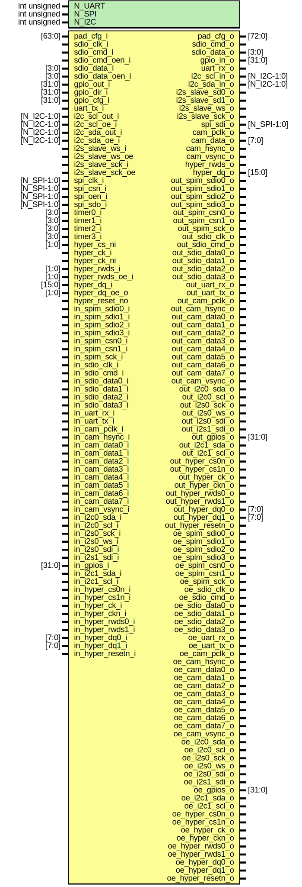

# Entity: pad_control
## Diagram

## Description
Copyright 2018 ETH Zurich and University of Bologna.
 Copyright and related rights are licensed under the Solderpad Hardware
 License, Version 0.51 (the "License"); you may not use this file except in
 compliance with the License.  You may obtain a copy of the License at
 http://solderpad.org/licenses/SHL-0.51. Unless required by applicable law
 or agreed to in writing, software, hardware and materials distributed under
 this License is distributed on an "AS IS" BASIS, WITHOUT WARRANTIES OR
 CONDITIONS OF ANY KIND, either express or implied. See the License for the
 specific language governing permissions and limitations under the License.
 
## Generics
| Generic name | Type         | Value | Description |
| ------------ | ------------ | ----- | ----------- |
| N_UART       | int unsigned | 1     |             |
| N_SPI        | int unsigned | 1     |             |
| N_I2C        | int unsigned | 2     |             |
## Ports
| Port name          | Direction | Type        | Description                                                      |
| ------------------ | --------- | ----------- | ---------------------------------------------------------------- |
| pad_cfg_i          | input     | [63:0]      | PAD CONTROL REGISTERinput  logic [63:0][1:0] pad_mux_i        ,  |
| pad_cfg_o          | output    | [72:0]      |                                                                  |
| sdio_clk_i         | input     |             |                                                                  |
| sdio_cmd_i         | input     |             |                                                                  |
| sdio_cmd_o         | output    |             |                                                                  |
| sdio_cmd_oen_i     | input     |             |                                                                  |
| sdio_data_i        | input     | [3:0]       |                                                                  |
| sdio_data_o        | output    | [3:0]       |                                                                  |
| sdio_data_oen_i    | input     | [3:0]       |                                                                  |
| gpio_out_i         | input     | [31:0]      | GPIOS                                                            |
| gpio_in_o          | output    | [31:0]      |                                                                  |
| gpio_dir_i         | input     | [31:0]      |                                                                  |
| gpio_cfg_i         | input     | [31:0]      |                                                                  |
| uart_tx_i          | input     |             | UART                                                             |
| uart_rx_o          | output    |             |                                                                  |
| i2c_scl_out_i      | input     | [N_I2C-1:0] | I2C                                                              |
| i2c_scl_in_o       | output    | [N_I2C-1:0] |                                                                  |
| i2c_scl_oe_i       | input     | [N_I2C-1:0] |                                                                  |
| i2c_sda_out_i      | input     | [N_I2C-1:0] |                                                                  |
| i2c_sda_in_o       | output    | [N_I2C-1:0] |                                                                  |
| i2c_sda_oe_i       | input     | [N_I2C-1:0] |                                                                  |
| i2s_slave_sd0_o    | output    |             | I2S                                                              |
| i2s_slave_sd1_o    | output    |             |                                                                  |
| i2s_slave_ws_o     | output    |             |                                                                  |
| i2s_slave_ws_i     | input     |             |                                                                  |
| i2s_slave_ws_oe    | input     |             |                                                                  |
| i2s_slave_sck_o    | output    |             |                                                                  |
| i2s_slave_sck_i    | input     |             |                                                                  |
| i2s_slave_sck_oe   | input     |             |                                                                  |
| spi_clk_i          | input     | [N_SPI-1:0] | SPI MASTER                                                       |
| spi_csn_i          | input     | [N_SPI-1:0] |                                                                  |
| spi_oen_i          | input     | [N_SPI-1:0] |                                                                  |
| spi_sdo_i          | input     | [N_SPI-1:0] |                                                                  |
| spi_sdi_o          | output    | [N_SPI-1:0] |                                                                  |
| cam_pclk_o         | output    |             | CAMERA INTERFACE                                                 |
| cam_data_o         | output    | [7:0]       |                                                                  |
| cam_hsync_o        | output    |             |                                                                  |
| cam_vsync_o        | output    |             |                                                                  |
| timer0_i           | input     | [3:0]       | TIMER                                                            |
| timer1_i           | input     | [3:0]       |                                                                  |
| timer2_i           | input     | [3:0]       |                                                                  |
| timer3_i           | input     | [3:0]       |                                                                  |
| hyper_cs_ni        | input     | [1:0]       | HYPERBUS                                                         |
| hyper_ck_i         | input     |             |                                                                  |
| hyper_ck_ni        | input     |             |                                                                  |
| hyper_rwds_i       | input     | [1:0]       |                                                                  |
| hyper_rwds_o       | output    |             |                                                                  |
| hyper_rwds_oe_i    | input     | [1:0]       |                                                                  |
| hyper_dq_o         | output    | [15:0]      |                                                                  |
| hyper_dq_i         | input     | [15:0]      |                                                                  |
| hyper_dq_oe_o      | input     | [1:0]       |                                                                  |
| hyper_reset_no     | input     |             |                                                                  |
| out_spim_sdio0_o   | output    |             | PADS OUTPUTS                                                     |
| out_spim_sdio1_o   | output    |             |                                                                  |
| out_spim_sdio2_o   | output    |             |                                                                  |
| out_spim_sdio3_o   | output    |             |                                                                  |
| out_spim_csn0_o    | output    |             |                                                                  |
| out_spim_csn1_o    | output    |             |                                                                  |
| out_spim_sck_o     | output    |             |                                                                  |
| out_sdio_clk_o     | output    |             |                                                                  |
| out_sdio_cmd_o     | output    |             |                                                                  |
| out_sdio_data0_o   | output    |             |                                                                  |
| out_sdio_data1_o   | output    |             |                                                                  |
| out_sdio_data2_o   | output    |             |                                                                  |
| out_sdio_data3_o   | output    |             |                                                                  |
| out_uart_rx_o      | output    |             |                                                                  |
| out_uart_tx_o      | output    |             |                                                                  |
| out_cam_pclk_o     | output    |             |                                                                  |
| out_cam_hsync_o    | output    |             |                                                                  |
| out_cam_data0_o    | output    |             |                                                                  |
| out_cam_data1_o    | output    |             |                                                                  |
| out_cam_data2_o    | output    |             |                                                                  |
| out_cam_data3_o    | output    |             |                                                                  |
| out_cam_data4_o    | output    |             |                                                                  |
| out_cam_data5_o    | output    |             |                                                                  |
| out_cam_data6_o    | output    |             |                                                                  |
| out_cam_data7_o    | output    |             |                                                                  |
| out_cam_vsync_o    | output    |             |                                                                  |
| out_i2c0_sda_o     | output    |             |                                                                  |
| out_i2c0_scl_o     | output    |             |                                                                  |
| out_i2s0_sck_o     | output    |             |                                                                  |
| out_i2s0_ws_o      | output    |             |                                                                  |
| out_i2s0_sdi_o     | output    |             |                                                                  |
| out_i2s1_sdi_o     | output    |             |                                                                  |
| out_gpios_o        | output    | [31:0]      |                                                                  |
| out_i2c1_sda_o     | output    |             |                                                                  |
| out_i2c1_scl_o     | output    |             |                                                                  |
| out_hyper_cs0n_o   | output    |             |                                                                  |
| out_hyper_cs1n_o   | output    |             |                                                                  |
| out_hyper_ck_o     | output    |             |                                                                  |
| out_hyper_ckn_o    | output    |             |                                                                  |
| out_hyper_rwds0_o  | output    |             |                                                                  |
| out_hyper_rwds1_o  | output    |             |                                                                  |
| out_hyper_dq0_o    | output    | [7:0]       |                                                                  |
| out_hyper_dq1_o    | output    | [7:0]       |                                                                  |
| out_hyper_resetn_o | output    |             |                                                                  |
| in_spim_sdio0_i    | input     |             | PAD INPUTS                                                       |
| in_spim_sdio1_i    | input     |             |                                                                  |
| in_spim_sdio2_i    | input     |             |                                                                  |
| in_spim_sdio3_i    | input     |             |                                                                  |
| in_spim_csn0_i     | input     |             |                                                                  |
| in_spim_csn1_i     | input     |             |                                                                  |
| in_spim_sck_i      | input     |             |                                                                  |
| in_sdio_clk_i      | input     |             |                                                                  |
| in_sdio_cmd_i      | input     |             |                                                                  |
| in_sdio_data0_i    | input     |             |                                                                  |
| in_sdio_data1_i    | input     |             |                                                                  |
| in_sdio_data2_i    | input     |             |                                                                  |
| in_sdio_data3_i    | input     |             |                                                                  |
| in_uart_rx_i       | input     |             |                                                                  |
| in_uart_tx_i       | input     |             |                                                                  |
| in_cam_pclk_i      | input     |             |                                                                  |
| in_cam_hsync_i     | input     |             |                                                                  |
| in_cam_data0_i     | input     |             |                                                                  |
| in_cam_data1_i     | input     |             |                                                                  |
| in_cam_data2_i     | input     |             |                                                                  |
| in_cam_data3_i     | input     |             |                                                                  |
| in_cam_data4_i     | input     |             |                                                                  |
| in_cam_data5_i     | input     |             |                                                                  |
| in_cam_data6_i     | input     |             |                                                                  |
| in_cam_data7_i     | input     |             |                                                                  |
| in_cam_vsync_i     | input     |             |                                                                  |
| in_i2c0_sda_i      | input     |             |                                                                  |
| in_i2c0_scl_i      | input     |             |                                                                  |
| in_i2s0_sck_i      | input     |             |                                                                  |
| in_i2s0_ws_i       | input     |             |                                                                  |
| in_i2s0_sdi_i      | input     |             |                                                                  |
| in_i2s1_sdi_i      | input     |             |                                                                  |
| in_gpios_i         | input     | [31:0]      |                                                                  |
| in_i2c1_sda_i      | input     |             |                                                                  |
| in_i2c1_scl_i      | input     |             |                                                                  |
| in_hyper_cs0n_i    | input     |             |                                                                  |
| in_hyper_cs1n_i    | input     |             |                                                                  |
| in_hyper_ck_i      | input     |             |                                                                  |
| in_hyper_ckn_i     | input     |             |                                                                  |
| in_hyper_rwds0_i   | input     |             |                                                                  |
| in_hyper_rwds1_i   | input     |             |                                                                  |
| in_hyper_dq0_i     | input     | [7:0]       |                                                                  |
| in_hyper_dq1_i     | input     | [7:0]       |                                                                  |
| in_hyper_resetn_i  | input     |             |                                                                  |
| oe_spim_sdio0_o    | output    |             | OUTPUT ENABLE                                                    |
| oe_spim_sdio1_o    | output    |             |                                                                  |
| oe_spim_sdio2_o    | output    |             |                                                                  |
| oe_spim_sdio3_o    | output    |             |                                                                  |
| oe_spim_csn0_o     | output    |             |                                                                  |
| oe_spim_csn1_o     | output    |             |                                                                  |
| oe_spim_sck_o      | output    |             |                                                                  |
| oe_sdio_clk_o      | output    |             |                                                                  |
| oe_sdio_cmd_o      | output    |             |                                                                  |
| oe_sdio_data0_o    | output    |             |                                                                  |
| oe_sdio_data1_o    | output    |             |                                                                  |
| oe_sdio_data2_o    | output    |             |                                                                  |
| oe_sdio_data3_o    | output    |             |                                                                  |
| oe_uart_rx_o       | output    |             |                                                                  |
| oe_uart_tx_o       | output    |             |                                                                  |
| oe_cam_pclk_o      | output    |             |                                                                  |
| oe_cam_hsync_o     | output    |             |                                                                  |
| oe_cam_data0_o     | output    |             |                                                                  |
| oe_cam_data1_o     | output    |             |                                                                  |
| oe_cam_data2_o     | output    |             |                                                                  |
| oe_cam_data3_o     | output    |             |                                                                  |
| oe_cam_data4_o     | output    |             |                                                                  |
| oe_cam_data5_o     | output    |             |                                                                  |
| oe_cam_data6_o     | output    |             |                                                                  |
| oe_cam_data7_o     | output    |             |                                                                  |
| oe_cam_vsync_o     | output    |             |                                                                  |
| oe_i2c0_sda_o      | output    |             |                                                                  |
| oe_i2c0_scl_o      | output    |             |                                                                  |
| oe_i2s0_sck_o      | output    |             |                                                                  |
| oe_i2s0_ws_o       | output    |             |                                                                  |
| oe_i2s0_sdi_o      | output    |             |                                                                  |
| oe_i2s1_sdi_o      | output    |             |                                                                  |
| oe_gpios_o         | output    | [31:0]      |                                                                  |
| oe_i2c1_sda_o      | output    |             |                                                                  |
| oe_i2c1_scl_o      | output    |             |                                                                  |
| oe_hyper_cs0n_o    | output    |             |                                                                  |
| oe_hyper_cs1n_o    | output    |             |                                                                  |
| oe_hyper_ck_o      | output    |             |                                                                  |
| oe_hyper_ckn_o     | output    |             |                                                                  |
| oe_hyper_rwds0_o   | output    |             |                                                                  |
| oe_hyper_rwds1_o   | output    |             |                                                                  |
| oe_hyper_dq0_o     | output    |             |                                                                  |
| oe_hyper_dq1_o     | output    |             |                                                                  |
| oe_hyper_resetn_o  | output    |             |                                                                  |
## Signals
| Name   | Type  | Description |
| ------ | ----- | ----------- |
| s_alt0 | logic |             |
| s_alt1 | logic |             |
| s_alt2 | logic |             |
| s_alt3 | logic |             |
