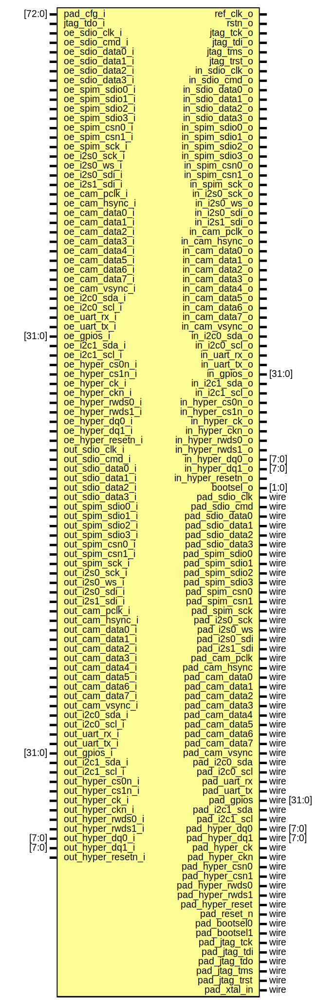

# Entity: pad_frame

- **File**: pad_frame.sv
## Diagram

## Description

 Copyright 2018 ETH Zurich and University of Bologna.
 Copyright and related rights are licensed under the Solderpad Hardware
 License, Version 0.51 (the "License"); you may not use this file except in
 compliance with the License.  You may obtain a copy of the License at
 http://solderpad.org/licenses/SHL-0.51. Unless required by applicable law
 or agreed to in writing, software, hardware and materials distributed under
 this License is distributed on an "AS IS" BASIS, WITHOUT WARRANTIES OR
 CONDITIONS OF ANY KIND, either express or implied. See the License for the
 specific language governing permissions and limitations under the License.

## Ports

| Port name          | Direction | Type        | Description                   |
| ------------------ | --------- | ----------- | ----------------------------- |
| pad_cfg_i          | input     | [72:0]      |                               |
| ref_clk_o          | output    |             |  REF CLOCK                    |
| rstn_o             | output    |             |  RESET SIGNALS                |
| jtag_tck_o         | output    |             |  JTAG SIGNALS                 |
| jtag_tdi_o         | output    |             |                               |
| jtag_tdo_i         | input     |             |                               |
| jtag_tms_o         | output    |             |                               |
| jtag_trst_o        | output    |             |                               |
| oe_sdio_clk_i      | input     |             |                               |
| oe_sdio_cmd_i      | input     |             |                               |
| oe_sdio_data0_i    | input     |             |                               |
| oe_sdio_data1_i    | input     |             |                               |
| oe_sdio_data2_i    | input     |             |                               |
| oe_sdio_data3_i    | input     |             |                               |
| oe_spim_sdio0_i    | input     |             |                               |
| oe_spim_sdio1_i    | input     |             |                               |
| oe_spim_sdio2_i    | input     |             |                               |
| oe_spim_sdio3_i    | input     |             |                               |
| oe_spim_csn0_i     | input     |             |                               |
| oe_spim_csn1_i     | input     |             |                               |
| oe_spim_sck_i      | input     |             |                               |
| oe_i2s0_sck_i      | input     |             |                               |
| oe_i2s0_ws_i       | input     |             |                               |
| oe_i2s0_sdi_i      | input     |             |                               |
| oe_i2s1_sdi_i      | input     |             |                               |
| oe_cam_pclk_i      | input     |             |                               |
| oe_cam_hsync_i     | input     |             |                               |
| oe_cam_data0_i     | input     |             |                               |
| oe_cam_data1_i     | input     |             |                               |
| oe_cam_data2_i     | input     |             |                               |
| oe_cam_data3_i     | input     |             |                               |
| oe_cam_data4_i     | input     |             |                               |
| oe_cam_data5_i     | input     |             |                               |
| oe_cam_data6_i     | input     |             |                               |
| oe_cam_data7_i     | input     |             |                               |
| oe_cam_vsync_i     | input     |             |                               |
| oe_i2c0_sda_i      | input     |             |                               |
| oe_i2c0_scl_i      | input     |             |                               |
| oe_uart_rx_i       | input     |             |                               |
| oe_uart_tx_i       | input     |             |                               |
| oe_gpios_i         | input     | [31:0]      |                               |
| oe_i2c1_sda_i      | input     |             |                               |
| oe_i2c1_scl_i      | input     |             |                               |
| oe_hyper_cs0n_i    | input     |             |                               |
| oe_hyper_cs1n_i    | input     |             |                               |
| oe_hyper_ck_i      | input     |             |                               |
| oe_hyper_ckn_i     | input     |             |                               |
| oe_hyper_rwds0_i   | input     |             |                               |
| oe_hyper_rwds1_i   | input     |             |                               |
| oe_hyper_dq0_i     | input     |             |                               |
| oe_hyper_dq1_i     | input     |             |                               |
| oe_hyper_resetn_i  | input     |             |                               |
| out_sdio_clk_i     | input     |             |  INPUTS SIGNALS TO THE PADS   |
| out_sdio_cmd_i     | input     |             |                               |
| out_sdio_data0_i   | input     |             |                               |
| out_sdio_data1_i   | input     |             |                               |
| out_sdio_data2_i   | input     |             |                               |
| out_sdio_data3_i   | input     |             |                               |
| out_spim_sdio0_i   | input     |             |                               |
| out_spim_sdio1_i   | input     |             |                               |
| out_spim_sdio2_i   | input     |             |                               |
| out_spim_sdio3_i   | input     |             |                               |
| out_spim_csn0_i    | input     |             |                               |
| out_spim_csn1_i    | input     |             |                               |
| out_spim_sck_i     | input     |             |                               |
| out_i2s0_sck_i     | input     |             |                               |
| out_i2s0_ws_i      | input     |             |                               |
| out_i2s0_sdi_i     | input     |             |                               |
| out_i2s1_sdi_i     | input     |             |                               |
| out_cam_pclk_i     | input     |             |                               |
| out_cam_hsync_i    | input     |             |                               |
| out_cam_data0_i    | input     |             |                               |
| out_cam_data1_i    | input     |             |                               |
| out_cam_data2_i    | input     |             |                               |
| out_cam_data3_i    | input     |             |                               |
| out_cam_data4_i    | input     |             |                               |
| out_cam_data5_i    | input     |             |                               |
| out_cam_data6_i    | input     |             |                               |
| out_cam_data7_i    | input     |             |                               |
| out_cam_vsync_i    | input     |             |                               |
| out_i2c0_sda_i     | input     |             |                               |
| out_i2c0_scl_i     | input     |             |                               |
| out_uart_rx_i      | input     |             |                               |
| out_uart_tx_i      | input     |             |                               |
| out_gpios_i        | input     | [31:0]      |                               |
| out_i2c1_sda_i     | input     |             |                               |
| out_i2c1_scl_i     | input     |             |                               |
| out_hyper_cs0n_i   | input     |             |                               |
| out_hyper_cs1n_i   | input     |             |                               |
| out_hyper_ck_i     | input     |             |                               |
| out_hyper_ckn_i    | input     |             |                               |
| out_hyper_rwds0_i  | input     |             |                               |
| out_hyper_rwds1_i  | input     |             |                               |
| out_hyper_dq0_i    | input     | [7:0]       |                               |
| out_hyper_dq1_i    | input     | [7:0]       |                               |
| out_hyper_resetn_i | input     |             |                               |
| in_sdio_clk_o      | output    |             |  OUTPUT SIGNALS FROM THE PADS |
| in_sdio_cmd_o      | output    |             |                               |
| in_sdio_data0_o    | output    |             |                               |
| in_sdio_data1_o    | output    |             |                               |
| in_sdio_data2_o    | output    |             |                               |
| in_sdio_data3_o    | output    |             |                               |
| in_spim_sdio0_o    | output    |             |                               |
| in_spim_sdio1_o    | output    |             |                               |
| in_spim_sdio2_o    | output    |             |                               |
| in_spim_sdio3_o    | output    |             |                               |
| in_spim_csn0_o     | output    |             |                               |
| in_spim_csn1_o     | output    |             |                               |
| in_spim_sck_o      | output    |             |                               |
| in_i2s0_sck_o      | output    |             |                               |
| in_i2s0_ws_o       | output    |             |                               |
| in_i2s0_sdi_o      | output    |             |                               |
| in_i2s1_sdi_o      | output    |             |                               |
| in_cam_pclk_o      | output    |             |                               |
| in_cam_hsync_o     | output    |             |                               |
| in_cam_data0_o     | output    |             |                               |
| in_cam_data1_o     | output    |             |                               |
| in_cam_data2_o     | output    |             |                               |
| in_cam_data3_o     | output    |             |                               |
| in_cam_data4_o     | output    |             |                               |
| in_cam_data5_o     | output    |             |                               |
| in_cam_data6_o     | output    |             |                               |
| in_cam_data7_o     | output    |             |                               |
| in_cam_vsync_o     | output    |             |                               |
| in_i2c0_sda_o      | output    |             |                               |
| in_i2c0_scl_o      | output    |             |                               |
| in_uart_rx_o       | output    |             |                               |
| in_uart_tx_o       | output    |             |                               |
| in_gpios_o         | output    | [31:0]      |                               |
| in_i2c1_sda_o      | output    |             |                               |
| in_i2c1_scl_o      | output    |             |                               |
| in_hyper_cs0n_o    | output    |             |                               |
| in_hyper_cs1n_o    | output    |             |                               |
| in_hyper_ck_o      | output    |             |                               |
| in_hyper_ckn_o     | output    |             |                               |
| in_hyper_rwds0_o   | output    |             |                               |
| in_hyper_rwds1_o   | output    |             |                               |
| in_hyper_dq0_o     | output    | [7:0]       |                               |
| in_hyper_dq1_o     | output    | [7:0]       |                               |
| in_hyper_resetn_o  | output    |             |                               |
| bootsel_o          | output    | [1:0]       |                               |
| pad_sdio_clk       | inout     | wire        |  EXT CHIP TP PADS             |
| pad_sdio_cmd       | inout     | wire        |                               |
| pad_sdio_data0     | inout     | wire        |                               |
| pad_sdio_data1     | inout     | wire        |                               |
| pad_sdio_data2     | inout     | wire        |                               |
| pad_sdio_data3     | inout     | wire        |                               |
| pad_spim_sdio0     | inout     | wire        |                               |
| pad_spim_sdio1     | inout     | wire        |                               |
| pad_spim_sdio2     | inout     | wire        |                               |
| pad_spim_sdio3     | inout     | wire        |                               |
| pad_spim_csn0      | inout     | wire        |                               |
| pad_spim_csn1      | inout     | wire        |                               |
| pad_spim_sck       | inout     | wire        |                               |
| pad_i2s0_sck       | inout     | wire        |                               |
| pad_i2s0_ws        | inout     | wire        |                               |
| pad_i2s0_sdi       | inout     | wire        |                               |
| pad_i2s1_sdi       | inout     | wire        |                               |
| pad_cam_pclk       | inout     | wire        |                               |
| pad_cam_hsync      | inout     | wire        |                               |
| pad_cam_data0      | inout     | wire        |                               |
| pad_cam_data1      | inout     | wire        |                               |
| pad_cam_data2      | inout     | wire        |                               |
| pad_cam_data3      | inout     | wire        |                               |
| pad_cam_data4      | inout     | wire        |                               |
| pad_cam_data5      | inout     | wire        |                               |
| pad_cam_data6      | inout     | wire        |                               |
| pad_cam_data7      | inout     | wire        |                               |
| pad_cam_vsync      | inout     | wire        |                               |
| pad_i2c0_sda       | inout     | wire        |                               |
| pad_i2c0_scl       | inout     | wire        |                               |
| pad_uart_rx        | inout     | wire        |                               |
| pad_uart_tx        | inout     | wire        |                               |
| pad_gpios          | inout     | wire [31:0] |                               |
| pad_i2c1_sda       | inout     | wire        |                               |
| pad_i2c1_scl       | inout     | wire        |                               |
| pad_hyper_dq0      | inout     | wire [7:0]  |                               |
| pad_hyper_dq1      | inout     | wire [7:0]  |                               |
| pad_hyper_ck       | inout     | wire        |                               |
| pad_hyper_ckn      | inout     | wire        |                               |
| pad_hyper_csn0     | inout     | wire        |                               |
| pad_hyper_csn1     | inout     | wire        |                               |
| pad_hyper_rwds0    | inout     | wire        |                               |
| pad_hyper_rwds1    | inout     | wire        |                               |
| pad_hyper_reset    | inout     | wire        |                               |
| pad_reset_n        | inout     | wire        |                               |
| pad_bootsel0       | inout     | wire        |                               |
| pad_bootsel1       | inout     | wire        |                               |
| pad_jtag_tck       | inout     | wire        |                               |
| pad_jtag_tdi       | inout     | wire        |                               |
| pad_jtag_tdo       | inout     | wire        |                               |
| pad_jtag_tms       | inout     | wire        |                               |
| pad_jtag_trst      | inout     | wire        |                               |
| pad_xtal_in        | inout     | wire        |                               |
## Instantiations

- padinst_sdio_data0: pad_functional_pd
- padinst_sdio_data1: pad_functional_pd
- padinst_sdio_data2: pad_functional_pd
- padinst_sdio_data3: pad_functional_pd
- padinst_sdio_clk: pad_functional_pd
- padinst_sdio_cmd: pad_functional_pd
- padinst_spim_sck: pad_functional_pd
- padinst_spim_sdio0: pad_functional_pd
- padinst_spim_sdio1: pad_functional_pd
- padinst_spim_sdio2: pad_functional_pd
- padinst_spim_sdio3: pad_functional_pd
- padinst_spim_csn1: pad_functional_pd
- padinst_spim_csn0: pad_functional_pd
- padinst_i2s1_sdi: pad_functional_pd
- padinst_i2s0_ws: pad_functional_pd
- padinst_i2s0_sdi: pad_functional_pd
- padinst_i2s0_sck: pad_functional_pd
- padinst_cam_pclk: pad_functional_pd
- padinst_cam_hsync: pad_functional_pd
- padinst_cam_data0: pad_functional_pd
- padinst_cam_data1: pad_functional_pd
- padinst_cam_data2: pad_functional_pd
- padinst_cam_data3: pad_functional_pd
- padinst_cam_data4: pad_functional_pd
- padinst_cam_data5: pad_functional_pd
- padinst_cam_data6: pad_functional_pd
- padinst_cam_data7: pad_functional_pd
- padinst_cam_vsync: pad_functional_pd
- padinst_uart_rx: pad_functional_pu
- padinst_uart_tx: pad_functional_pu
- padinst_i2c0_sda: pad_functional_pu
- padinst_i2c0_scl: pad_functional_pu
- padinst_hyper_csno0: pad_functional_pu
- padinst_hyper_csno1: pad_functional_pu
- padinst_hyper_ck: pad_functional_pu
- padinst_hyper_ckno: pad_functional_pu
- padinst_hyper_rwds0: pad_functional_pu
- padinst_hyper_rwds1: pad_functional_pu
- padinst_hyper_resetn: pad_functional_pu
- padinst_i2c1_sda: pad_functional_pu
- padinst_i2c1_scl: pad_functional_pu
- padinst_bootsel0: pad_functional_pu
- padinst_bootsel1: pad_functional_pu
- padinst_ref_clk: pad_functional_pu
- padinst_reset_n: pad_functional_pu
- padinst_jtag_tck: pad_functional_pu
- padinst_jtag_tms: pad_functional_pu
- padinst_jtag_tdi: pad_functional_pu
- padinst_jtag_trstn: pad_functional_pu
- padinst_jtag_tdo: pad_functional_pd
