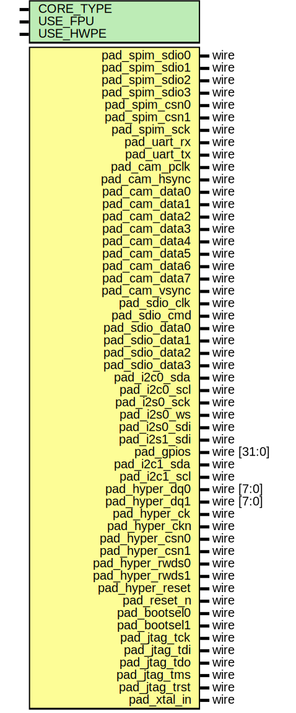

# Entity: pulp

## Diagram

## Description

Copyright 2018 ETH Zurich and University of Bologna.
 Copyright and related rights are licensed under the Solderpad Hardware
 License, Version 0.51 (the "License"); you may not use this file except in
 compliance with the License.  You may obtain a copy of the License at
 http://solderpad.org/licenses/SHL-0.51. Unless required by applicable law
 or agreed to in writing, software, hardware and materials distributed under
 this License is distributed on an "AS IS" BASIS, WITHOUT WARRANTIES OR
 CONDITIONS OF ANY KIND, either express or implied. See the License for the
 specific language governing permissions and limitations under the License.
 
## Generics

| Generic name | Type | Value | Description                                                                                   |
| ------------ | ---- | ----- | --------------------------------------------------------------------------------------------- |
| CORE_TYPE    |      | 0     | 0 for RISCY, 1 for IBEX RV32IMC (formerly ZERORISCY), 2 for IBEX RV32EC (formerly MICRORISCY) |
| USE_FPU      |      | 1     |                                                                                               |
| USE_HWPE     |      | 1     |                                                                                               |
## Ports

| Port name       | Direction | Type        | Description |
| --------------- | --------- | ----------- | ----------- |
| pad_spim_sdio0  | inout     | wire        |             |
| pad_spim_sdio1  | inout     | wire        |             |
| pad_spim_sdio2  | inout     | wire        |             |
| pad_spim_sdio3  | inout     | wire        |             |
| pad_spim_csn0   | inout     | wire        |             |
| pad_spim_csn1   | inout     | wire        |             |
| pad_spim_sck    | inout     | wire        |             |
| pad_uart_rx     | inout     | wire        |             |
| pad_uart_tx     | inout     | wire        |             |
| pad_cam_pclk    | inout     | wire        |             |
| pad_cam_hsync   | inout     | wire        |             |
| pad_cam_data0   | inout     | wire        |             |
| pad_cam_data1   | inout     | wire        |             |
| pad_cam_data2   | inout     | wire        |             |
| pad_cam_data3   | inout     | wire        |             |
| pad_cam_data4   | inout     | wire        |             |
| pad_cam_data5   | inout     | wire        |             |
| pad_cam_data6   | inout     | wire        |             |
| pad_cam_data7   | inout     | wire        |             |
| pad_cam_vsync   | inout     | wire        |             |
| pad_sdio_clk    | inout     | wire        |             |
| pad_sdio_cmd    | inout     | wire        |             |
| pad_sdio_data0  | inout     | wire        |             |
| pad_sdio_data1  | inout     | wire        |             |
| pad_sdio_data2  | inout     | wire        |             |
| pad_sdio_data3  | inout     | wire        |             |
| pad_i2c0_sda    | inout     | wire        |             |
| pad_i2c0_scl    | inout     | wire        |             |
| pad_i2s0_sck    | inout     | wire        |             |
| pad_i2s0_ws     | inout     | wire        |             |
| pad_i2s0_sdi    | inout     | wire        |             |
| pad_i2s1_sdi    | inout     | wire        |             |
| pad_gpios       | inout     | wire [31:0] |             |
| pad_i2c1_sda    | inout     | wire        |             |
| pad_i2c1_scl    | inout     | wire        |             |
| pad_hyper_dq0   | inout     | wire [7:0]  |             |
| pad_hyper_dq1   | inout     | wire [7:0]  |             |
| pad_hyper_ck    | inout     | wire        |             |
| pad_hyper_ckn   | inout     | wire        |             |
| pad_hyper_csn0  | inout     | wire        |             |
| pad_hyper_csn1  | inout     | wire        |             |
| pad_hyper_rwds0 | inout     | wire        |             |
| pad_hyper_rwds1 | inout     | wire        |             |
| pad_hyper_reset | inout     | wire        |             |
| pad_reset_n     | inout     | wire        |             |
| pad_bootsel0    | inout     | wire        |             |
| pad_bootsel1    | inout     | wire        |             |
| pad_jtag_tck    | inout     | wire        |             |
| pad_jtag_tdi    | inout     | wire        |             |
| pad_jtag_tdo    | inout     | wire        |             |
| pad_jtag_tms    | inout     | wire        |             |
| pad_jtag_trst   | inout     | wire        |             |
| pad_xtal_in     | inout     | wire        |             |
## Signals

| Name                      | Type                                                   | Description             |
| ------------------------- | ------------------------------------------------------ | ----------------------- |
| s_pad_cfg                 | logic [72:0][5:0]                                      |                         |
| s_out_spim_sdio0          | logic                                                  |                         |
| s_out_spim_sdio1          | logic                                                  |                         |
| s_out_spim_sdio2          | logic                                                  |                         |
| s_out_spim_sdio3          | logic                                                  |                         |
| s_out_spim_csn0           | logic                                                  |                         |
| s_out_spim_csn1           | logic                                                  |                         |
| s_out_spim_sck            | logic                                                  |                         |
| s_out_uart_rx             | logic                                                  |                         |
| s_out_uart_tx             | logic                                                  |                         |
| s_out_cam_pclk            | logic                                                  |                         |
| s_out_cam_hsync           | logic                                                  |                         |
| s_out_cam_data0           | logic                                                  |                         |
| s_out_cam_data1           | logic                                                  |                         |
| s_out_cam_data2           | logic                                                  |                         |
| s_out_cam_data3           | logic                                                  |                         |
| s_out_cam_data4           | logic                                                  |                         |
| s_out_cam_data5           | logic                                                  |                         |
| s_out_cam_data6           | logic                                                  |                         |
| s_out_cam_data7           | logic                                                  |                         |
| s_out_cam_vsync           | logic                                                  |                         |
| s_out_sdio_clk            | logic                                                  |                         |
| s_out_sdio_cmd            | logic                                                  |                         |
| s_out_sdio_data0          | logic                                                  |                         |
| s_out_sdio_data1          | logic                                                  |                         |
| s_out_sdio_data2          | logic                                                  |                         |
| s_out_sdio_data3          | logic                                                  |                         |
| s_out_i2c0_sda            | logic                                                  |                         |
| s_out_i2c0_scl            | logic                                                  |                         |
| s_out_i2s0_sck            | logic                                                  |                         |
| s_out_i2s0_ws             | logic                                                  |                         |
| s_out_i2s0_sdi            | logic                                                  |                         |
| s_out_i2s1_sdi            | logic                                                  |                         |
| s_out_gpios               | logic[31:0]                                            |                         |
| s_out_i2c1_sda            | logic                                                  |                         |
| s_out_i2c1_scl            | logic                                                  |                         |
| s_out_hyper_csn0          | logic                                                  |                         |
| s_out_hyper_csn1          | logic                                                  |                         |
| s_out_hyper_ck            | logic                                                  |                         |
| s_out_hyper_ckn           | logic                                                  |                         |
| s_out_hyper_rwds0         | logic                                                  |                         |
| s_out_hyper_rwds1         | logic                                                  |                         |
| s_out_hyper_dq0           | logic[7:0]                                             |                         |
| s_out_hyper_dq1           | logic[7:0]                                             |                         |
| s_out_hyper_reset         | logic                                                  |                         |
| s_in_spim_sdio0           | logic                                                  |                         |
| s_in_spim_sdio1           | logic                                                  |                         |
| s_in_spim_sdio2           | logic                                                  |                         |
| s_in_spim_sdio3           | logic                                                  |                         |
| s_in_spim_csn0            | logic                                                  |                         |
| s_in_spim_csn1            | logic                                                  |                         |
| s_in_spim_sck             | logic                                                  |                         |
| s_in_uart_rx              | logic                                                  |                         |
| s_in_uart_tx              | logic                                                  |                         |
| s_in_cam_pclk             | logic                                                  |                         |
| s_in_cam_hsync            | logic                                                  |                         |
| s_in_cam_data0            | logic                                                  |                         |
| s_in_cam_data1            | logic                                                  |                         |
| s_in_cam_data2            | logic                                                  |                         |
| s_in_cam_data3            | logic                                                  |                         |
| s_in_cam_data4            | logic                                                  |                         |
| s_in_cam_data5            | logic                                                  |                         |
| s_in_cam_data6            | logic                                                  |                         |
| s_in_cam_data7            | logic                                                  |                         |
| s_in_cam_vsync            | logic                                                  |                         |
| s_in_sdio_clk             | logic                                                  |                         |
| s_in_sdio_cmd             | logic                                                  |                         |
| s_in_sdio_data0           | logic                                                  |                         |
| s_in_sdio_data1           | logic                                                  |                         |
| s_in_sdio_data2           | logic                                                  |                         |
| s_in_sdio_data3           | logic                                                  |                         |
| s_in_i2c0_sda             | logic                                                  |                         |
| s_in_i2c0_scl             | logic                                                  |                         |
| s_in_i2s0_sck             | logic                                                  |                         |
| s_in_i2s0_ws              | logic                                                  |                         |
| s_in_i2s0_sdi             | logic                                                  |                         |
| s_in_i2s1_sdi             | logic                                                  |                         |
| s_in_gpios                | logic[31:0]                                            |                         |
| s_in_i2c1_sda             | logic                                                  |                         |
| s_in_i2c1_scl             | logic                                                  |                         |
| s_in_hyper_csn0           | logic                                                  |                         |
| s_in_hyper_csn1           | logic                                                  |                         |
| s_in_hyper_ck             | logic                                                  |                         |
| s_in_hyper_ckn            | logic                                                  |                         |
| s_in_hyper_rwds0          | logic                                                  |                         |
| s_in_hyper_rwds1          | logic                                                  |                         |
| s_in_hyper_dq0            | logic[7:0]                                             |                         |
| s_in_hyper_dq1            | logic[7:0]                                             |                         |
| s_in_hyper_reset          | logic                                                  |                         |
| s_oe_spim_sdio0           | logic                                                  |                         |
| s_oe_spim_sdio1           | logic                                                  |                         |
| s_oe_spim_sdio2           | logic                                                  |                         |
| s_oe_spim_sdio3           | logic                                                  |                         |
| s_oe_spim_csn0            | logic                                                  |                         |
| s_oe_spim_csn1            | logic                                                  |                         |
| s_oe_spim_sck             | logic                                                  |                         |
| s_oe_uart_rx              | logic                                                  |                         |
| s_oe_uart_tx              | logic                                                  |                         |
| s_oe_cam_pclk             | logic                                                  |                         |
| s_oe_cam_hsync            | logic                                                  |                         |
| s_oe_cam_data0            | logic                                                  |                         |
| s_oe_cam_data1            | logic                                                  |                         |
| s_oe_cam_data2            | logic                                                  |                         |
| s_oe_cam_data3            | logic                                                  |                         |
| s_oe_cam_data4            | logic                                                  |                         |
| s_oe_cam_data5            | logic                                                  |                         |
| s_oe_cam_data6            | logic                                                  |                         |
| s_oe_cam_data7            | logic                                                  |                         |
| s_oe_cam_vsync            | logic                                                  |                         |
| s_oe_sdio_clk             | logic                                                  |                         |
| s_oe_sdio_cmd             | logic                                                  |                         |
| s_oe_sdio_data0           | logic                                                  |                         |
| s_oe_sdio_data1           | logic                                                  |                         |
| s_oe_sdio_data2           | logic                                                  |                         |
| s_oe_sdio_data3           | logic                                                  |                         |
| s_oe_i2c0_sda             | logic                                                  |                         |
| s_oe_i2c0_scl             | logic                                                  |                         |
| s_oe_i2s0_sck             | logic                                                  |                         |
| s_oe_i2s0_ws              | logic                                                  |                         |
| s_oe_i2s0_sdi             | logic                                                  |                         |
| s_oe_i2s1_sdi             | logic                                                  |                         |
| s_oe_gpios                | logic[31:0]                                            |                         |
| s_oe_i2c1_sda             | logic                                                  |                         |
| s_oe_i2c1_scl             | logic                                                  |                         |
| s_oe_hyper_csn0           | logic                                                  |                         |
| s_oe_hyper_csn1           | logic                                                  |                         |
| s_oe_hyper_ck             | logic                                                  |                         |
| s_oe_hyper_ckn            | logic                                                  |                         |
| s_oe_hyper_rwds0          | logic                                                  |                         |
| s_oe_hyper_rwds1          | logic                                                  |                         |
| s_oe_hyper_dq0            | logic                                                  |                         |
| s_oe_hyper_dq1            | logic                                                  |                         |
| s_oe_hyper_reset          | logic                                                  |                         |
| s_ref_clk                 | logic                                                  |                         |
| s_rstn                    | logic                                                  |                         |
| s_jtag_tck                | logic                                                  |                         |
| s_jtag_tdi                | logic                                                  |                         |
| s_jtag_tdo                | logic                                                  |                         |
| s_jtag_tms                | logic                                                  |                         |
| s_jtag_trst               | logic                                                  |                         |
| s_test_clk                | logic                                                  |                         |
| s_slow_clk                | logic                                                  |                         |
| s_sel_fll_clk             | logic                                                  |                         |
| s_pm_cfg_data             | logic [11:0]                                           |                         |
| s_pm_cfg_req              | logic                                                  |                         |
| s_pm_cfg_ack              | logic                                                  |                         |
| s_soc_tck                 | logic                                                  |                         |
| s_soc_trstn               | logic                                                  |                         |
| s_soc_tms                 | logic                                                  |                         |
| s_soc_tdi                 | logic                                                  |                         |
| s_test_mode               | logic                                                  |                         |
| s_dft_cg_enable           | logic                                                  |                         |
| s_mode_select             | logic                                                  |                         |
| s_gpio_out                | logic [31:0]                                           |                         |
| s_gpio_in                 | logic [31:0]                                           |                         |
| s_gpio_dir                | logic [31:0]                                           |                         |
| s_gpio_cfg                | logic [191:0]                                          |                         |
| s_rf_tx_clk               | logic                                                  |                         |
| s_rf_tx_oeb               | logic                                                  |                         |
| s_rf_tx_enb               | logic                                                  |                         |
| s_rf_tx_mode              | logic                                                  |                         |
| s_rf_tx_vsel              | logic                                                  |                         |
| s_rf_tx_data              | logic                                                  |                         |
| s_rf_rx_clk               | logic                                                  |                         |
| s_rf_rx_enb               | logic                                                  |                         |
| s_rf_rx_data              | logic                                                  |                         |
| s_uart_tx                 | logic                                                  |                         |
| s_uart_rx                 | logic                                                  |                         |
| s_i2c0_scl_out            | logic                                                  |                         |
| s_i2c0_scl_in             | logic                                                  |                         |
| s_i2c0_scl_oe             | logic                                                  |                         |
| s_i2c0_sda_out            | logic                                                  |                         |
| s_i2c0_sda_in             | logic                                                  |                         |
| s_i2c0_sda_oe             | logic                                                  |                         |
| s_i2c1_scl_out            | logic                                                  |                         |
| s_i2c1_scl_in             | logic                                                  |                         |
| s_i2c1_scl_oe             | logic                                                  |                         |
| s_i2c1_sda_out            | logic                                                  |                         |
| s_i2c1_sda_in             | logic                                                  |                         |
| s_i2c1_sda_oe             | logic                                                  |                         |
| s_i2s_sd0_in              | logic                                                  |                         |
| s_i2s_sd1_in              | logic                                                  |                         |
| s_i2s_sck_in              | logic                                                  |                         |
| s_i2s_ws_in               | logic                                                  |                         |
| s_i2s_sck0_out            | logic                                                  |                         |
| s_i2s_ws0_out             | logic                                                  |                         |
| s_i2s_mode0_out           | logic [1:0]                                            |                         |
| s_i2s_sck1_out            | logic                                                  |                         |
| s_i2s_ws1_out             | logic                                                  |                         |
| s_i2s_mode1_out           | logic [1:0]                                            |                         |
| s_i2s_slave_sck_oe        | logic                                                  |                         |
| s_i2s_slave_ws_oe         | logic                                                  |                         |
| s_spi_master0_csn0        | logic                                                  |                         |
| s_spi_master0_csn1        | logic                                                  |                         |
| s_spi_master0_sck         | logic                                                  |                         |
| s_spi_master0_sdi0        | logic                                                  |                         |
| s_spi_master0_sdi1        | logic                                                  |                         |
| s_spi_master0_sdi2        | logic                                                  |                         |
| s_spi_master0_sdi3        | logic                                                  |                         |
| s_spi_master0_sdo0        | logic                                                  |                         |
| s_spi_master0_sdo1        | logic                                                  |                         |
| s_spi_master0_sdo2        | logic                                                  |                         |
| s_spi_master0_sdo3        | logic                                                  |                         |
| s_spi_master0_oen0        | logic                                                  |                         |
| s_spi_master0_oen1        | logic                                                  |                         |
| s_spi_master0_oen2        | logic                                                  |                         |
| s_spi_master0_oen3        | logic                                                  |                         |
| s_spi_master1_csn0        | logic                                                  |                         |
| s_spi_master1_csn1        | logic                                                  |                         |
| s_spi_master1_sck         | logic                                                  |                         |
| s_spi_master1_sdi         | logic                                                  |                         |
| s_spi_master1_sdo         | logic                                                  |                         |
| s_spi_master1_mode        | logic [1:0]                                            |                         |
| s_sdio_clk                | logic                                                  |                         |
| s_sdio_cmdi               | logic                                                  |                         |
| s_sdio_cmdo               | logic                                                  |                         |
| s_sdio_cmd_oen            | logic                                                  |                         |
| s_sdio_datai              | logic [3:0]                                            |                         |
| s_sdio_datao              | logic [3:0]                                            |                         |
| s_sdio_data_oen           | logic [3:0]                                            |                         |
| s_cam_pclk                | logic                                                  |                         |
| s_cam_data                | logic [7:0]                                            |                         |
| s_cam_hsync               | logic                                                  |                         |
| s_cam_vsync               | logic                                                  |                         |
| s_timer0                  | logic [3:0]                                            |                         |
| s_timer1                  | logic [3:0]                                            |                         |
| s_timer2                  | logic [3:0]                                            |                         |
| s_timer3                  | logic [3:0]                                            |                         |
| s_hyper_cs_n              | logic [1:0]                                            |                         |
| s_hyper_ck                | logic                                                  |                         |
| s_hyper_ck_n              | logic                                                  |                         |
| s_hyper_rwds_o            | logic [1:0]                                            |                         |
| s_hyper_rwds_i            | logic                                                  |                         |
| s_hyper_rwds_oe           | logic [1:0]                                            |                         |
| s_hyper_dq_i              | logic [15:0]                                           |                         |
| s_hyper_dq_o              | logic [15:0]                                           |                         |
| s_hyper_dq_oe             | logic [1:0]                                            |                         |
| s_hyper_reset_n           | logic                                                  |                         |
| s_jtag_shift_dr           | logic                                                  |                         |
| s_jtag_update_dr          | logic                                                  |                         |
| s_jtag_capture_dr         | logic                                                  |                         |
| s_axireg_sel              | logic                                                  |                         |
| s_axireg_tdi              | logic                                                  |                         |
| s_axireg_tdo              | logic                                                  |                         |
| s_soc_jtag_regi           | logic [7:0]                                            |                         |
| s_soc_jtag_rego           | logic [7:0]                                            |                         |
| s_dbg_irq_valid           | logic  [`NB_CORES-1:0]                                 |                         |
| s_rstn_por                | logic                                                  |                         |
| s_dma_pe_irq_ack          | logic                                                  |                         |
| s_dma_pe_irq_valid        | logic                                                  |                         |
| s_pad_mux_soc             | logic [127:0]                                          |                         |
| s_pad_cfg_soc             | logic [383:0]                                          |                         |
| s_spi_clk                 | logic [N_SPI-1:0]                                      |                         |
| s_spi_csn                 | logic [N_SPI-1:0][3:0]                                 |                         |
| s_spi_oen                 | logic [N_SPI-1:0][3:0]                                 |                         |
| s_spi_sdo                 | logic [N_SPI-1:0][3:0]                                 |                         |
| s_spi_sdi                 | logic [N_SPI-1:0][3:0]                                 |                         |
| s_i2c_scl_in              | logic [N_I2C-1:0]                                      |                         |
| s_i2c_scl_out             | logic [N_I2C-1:0]                                      |                         |
| s_i2c_scl_oe              | logic [N_I2C-1:0]                                      |                         |
| s_i2c_sda_in              | logic [N_I2C-1:0]                                      |                         |
| s_i2c_sda_out             | logic [N_I2C-1:0]                                      |                         |
| s_i2c_sda_oe              | logic [N_I2C-1:0]                                      |                         |
| s_cluster_clk             | logic                                                  |                         |
| s_cluster_rstn            | logic                                                  |                         |
| s_cluster_busy            | logic                                                  |                         |
| s_cluster_irq             | logic                                                  |                         |
| s_cluster_rtc             | logic                                                  |                         |
| s_cluster_fetch_enable    | logic                                                  |                         |
| s_cluster_boot_addr       | logic [63:0]                                           |                         |
| s_cluster_test_en         | logic                                                  |                         |
| s_cluster_pow             | logic                                                  |                         |
| s_cluster_byp             | logic                                                  |                         |
| s_dma_pe_evt_ack          | logic                                                  |                         |
| s_dma_pe_evt_valid        | logic                                                  |                         |
| s_dma_pe_int_ack          | logic                                                  |                         |
| s_dma_pe_int_valid        | logic                                                  |                         |
| s_pf_evt_ack              | logic                                                  |                         |
| s_pf_evt_valid            | logic                                                  |                         |
| s_event_wptr              | logic [LOG_DEPTH:0]                                    |                         |
| s_event_rptr              | logic [LOG_DEPTH:0]                                    |                         |
| s_event_dataasync         | logic [2**LOG_DEPTH-1:0][EVENT_WIDTH-1:0]              |                         |
| s_cluster_soc_bus_aw_wptr | logic [LOG_DEPTH:0]                                    | SOC TO CLUSTER AXI BUS  |
| s_cluster_soc_bus_aw_rptr | logic [LOG_DEPTH:0]                                    |                         |
| s_cluster_soc_bus_aw_data | logic [2**LOG_DEPTH-1:0][AXI_CLUSTER_SOC_AW_WIDTH-1:0] |                         |
| s_cluster_soc_bus_ar_wptr | logic [LOG_DEPTH:0]                                    |                         |
| s_cluster_soc_bus_ar_rptr | logic [LOG_DEPTH:0]                                    |                         |
| s_cluster_soc_bus_ar_data | logic [2**LOG_DEPTH-1:0][AXI_CLUSTER_SOC_AR_WIDTH-1:0] |                         |
| s_cluster_soc_bus_w_wptr  | logic [LOG_DEPTH:0]                                    |                         |
| s_cluster_soc_bus_w_rptr  | logic [LOG_DEPTH:0]                                    |                         |
| s_cluster_soc_bus_w_data  | logic [2**LOG_DEPTH-1:0][AXI_CLUSTER_SOC_W_WIDTH-1:0]  |                         |
| s_cluster_soc_bus_r_wptr  | logic [LOG_DEPTH:0]                                    |                         |
| s_cluster_soc_bus_r_rptr  | logic [LOG_DEPTH:0]                                    |                         |
| s_cluster_soc_bus_r_data  | logic [2**LOG_DEPTH-1:0][AXI_CLUSTER_SOC_R_WIDTH-1:0]  |                         |
| s_cluster_soc_bus_b_wptr  | logic [LOG_DEPTH:0]                                    |                         |
| s_cluster_soc_bus_b_rptr  | logic [LOG_DEPTH:0]                                    |                         |
| s_cluster_soc_bus_b_data  | logic [2**LOG_DEPTH-1:0][AXI_CLUSTER_SOC_B_WIDTH-1:0]  |                         |
| s_soc_cluster_bus_aw_wptr | logic [LOG_DEPTH:0]                                    | SOC TO CLUSTER AXI BUS  |
| s_soc_cluster_bus_aw_rptr | logic [LOG_DEPTH:0]                                    |                         |
| s_soc_cluster_bus_aw_data | logic [2**LOG_DEPTH-1:0][AXI_SOC_CLUSTER_AW_WIDTH-1:0] |                         |
| s_soc_cluster_bus_ar_wptr | logic [LOG_DEPTH:0]                                    |                         |
| s_soc_cluster_bus_ar_rptr | logic [LOG_DEPTH:0]                                    |                         |
| s_soc_cluster_bus_ar_data | logic [2**LOG_DEPTH-1:0][AXI_SOC_CLUSTER_AR_WIDTH-1:0] |                         |
| s_soc_cluster_bus_w_wptr  | logic [LOG_DEPTH:0]                                    |                         |
| s_soc_cluster_bus_w_rptr  | logic [LOG_DEPTH:0]                                    |                         |
| s_soc_cluster_bus_w_data  | logic [2**LOG_DEPTH-1:0][AXI_SOC_CLUSTER_W_WIDTH-1:0]  |                         |
| s_soc_cluster_bus_r_wptr  | logic [LOG_DEPTH:0]                                    |                         |
| s_soc_cluster_bus_r_rptr  | logic [LOG_DEPTH:0]                                    |                         |
| s_soc_cluster_bus_r_data  | logic [2**LOG_DEPTH-1:0][AXI_SOC_CLUSTER_R_WIDTH-1:0]  |                         |
| s_soc_cluster_bus_b_wptr  | logic [LOG_DEPTH:0]                                    |                         |
| s_soc_cluster_bus_b_rptr  | logic [LOG_DEPTH:0]                                    |                         |
| s_soc_cluster_bus_b_data  | logic [2**LOG_DEPTH-1:0][AXI_SOC_CLUSTER_B_WIDTH-1:0]  |                         |
| s_bootsel                 | logic[1:0]                                             |                         |
## Constants

| Name                       | Type         | Value                                                                                                                                                                                                                                              | Description                                                                                               |
| -------------------------- | ------------ | -------------------------------------------------------------------------------------------------------------------------------------------------------------------------------------------------------------------------------------------------- | --------------------------------------------------------------------------------------------------------- |
| AXI_ADDR_WIDTH             |              | 32                                                                                                                                                                                                                                                 |                                                                                                           |
| AXI_CLUSTER_SOC_DATA_WIDTH |              | 64                                                                                                                                                                                                                                                 |                                                                                                           |
| AXI_SOC_CLUSTER_DATA_WIDTH |              | 32                                                                                                                                                                                                                                                 |                                                                                                           |
| AXI_SOC_CLUSTER_ID_WIDTH   |              | pkg_soc_interconnect::AXI_ID_OUT_WIDTH                                                                                                                                                                                                             | Backrouting through the AXI-XBAR in pulp_soc requries some extra ID bits. Check axi_xbar docu for details |
| AXI_CLUSTER_SOC_ID_WIDTH   |              | AXI_SOC_CLUSTER_ID_WIDTH + $clog2(`NB_SLAVE)                                                                                                                                                                                                       |                                                                                                           |
| AXI_USER_WIDTH             |              | 6                                                                                                                                                                                                                                                  |                                                                                                           |
| AXI_CLUSTER_SOC_STRB_WIDTH |              | AXI_CLUSTER_SOC_DATA_WIDTH/8                                                                                                                                                                                                                       |                                                                                                           |
| AXI_SOC_CLUSTER_STRB_WIDTH |              | AXI_SOC_CLUSTER_DATA_WIDTH/8                                                                                                                                                                                                                       |                                                                                                           |
| AXI_CLUSTER_SOC_AW_WIDTH   |              | AXI_CLUSTER_SOC_ID_WIDTH+AXI_ADDR_WIDTH+AXI_USER_WIDTH+$bits(axi_pkg::len_t)+$bits(axi_pkg::size_t)+$bits(axi_pkg::burst_t)+$bits(axi_pkg::cache_t)+$bits(axi_pkg::prot_t)+$bits(axi_pkg::qos_t)+$bits(axi_pkg::region_t)+$bits(axi_pkg::atop_t)+1 |                                                                                                           |
| AXI_CLUSTER_SOC_W_WIDTH    |              | AXI_USER_WIDTH+AXI_CLUSTER_SOC_STRB_WIDTH+AXI_CLUSTER_SOC_DATA_WIDTH+1                                                                                                                                                                             |                                                                                                           |
| AXI_CLUSTER_SOC_R_WIDTH    |              | AXI_CLUSTER_SOC_ID_WIDTH+AXI_CLUSTER_SOC_DATA_WIDTH+AXI_USER_WIDTH+$bits(axi_pkg::resp_t)+1                                                                                                                                                        |                                                                                                           |
| AXI_CLUSTER_SOC_B_WIDTH    |              | AXI_USER_WIDTH+AXI_CLUSTER_SOC_ID_WIDTH+$bits(axi_pkg::resp_t)                                                                                                                                                                                     |                                                                                                           |
| AXI_CLUSTER_SOC_AR_WIDTH   |              | AXI_CLUSTER_SOC_ID_WIDTH+AXI_ADDR_WIDTH+AXI_USER_WIDTH+$bits(axi_pkg::len_t)+$bits(axi_pkg::size_t)+$bits(axi_pkg::burst_t)+$bits(axi_pkg::cache_t)+$bits(axi_pkg::prot_t)+$bits(axi_pkg::qos_t)+$bits(axi_pkg::region_t)+1                        |                                                                                                           |
| AXI_SOC_CLUSTER_AW_WIDTH   |              | AXI_SOC_CLUSTER_ID_WIDTH+AXI_ADDR_WIDTH+AXI_USER_WIDTH+$bits(axi_pkg::len_t)+$bits(axi_pkg::size_t)+$bits(axi_pkg::burst_t)+$bits(axi_pkg::cache_t)+$bits(axi_pkg::prot_t)+$bits(axi_pkg::qos_t)+$bits(axi_pkg::region_t)+$bits(axi_pkg::atop_t)+1 |                                                                                                           |
| AXI_SOC_CLUSTER_W_WIDTH    |              | AXI_USER_WIDTH+AXI_SOC_CLUSTER_STRB_WIDTH+AXI_SOC_CLUSTER_DATA_WIDTH+1                                                                                                                                                                             |                                                                                                           |
| AXI_SOC_CLUSTER_R_WIDTH    |              | AXI_SOC_CLUSTER_ID_WIDTH+AXI_SOC_CLUSTER_DATA_WIDTH+AXI_USER_WIDTH+$bits(axi_pkg::resp_t)+1                                                                                                                                                        |                                                                                                           |
| AXI_SOC_CLUSTER_B_WIDTH    |              | AXI_USER_WIDTH+AXI_SOC_CLUSTER_ID_WIDTH+$bits(axi_pkg::resp_t)                                                                                                                                                                                     |                                                                                                           |
| AXI_SOC_CLUSTER_AR_WIDTH   |              | AXI_SOC_CLUSTER_ID_WIDTH+AXI_ADDR_WIDTH+AXI_USER_WIDTH+$bits(axi_pkg::len_t)+$bits(axi_pkg::size_t)+$bits(axi_pkg::burst_t)+$bits(axi_pkg::cache_t)+$bits(axi_pkg::prot_t)+$bits(axi_pkg::qos_t)+$bits(axi_pkg::region_t)+1                        |                                                                                                           |
| BUFFER_WIDTH               |              | 8                                                                                                                                                                                                                                                  |                                                                                                           |
| EVENT_WIDTH                |              | 8                                                                                                                                                                                                                                                  |                                                                                                           |
| LOG_DEPTH                  |              | 3                                                                                                                                                                                                                                                  |                                                                                                           |
| CVP_ADDR_WIDTH             |              | 32                                                                                                                                                                                                                                                 |                                                                                                           |
| CVP_DATA_WIDTH             |              | 32                                                                                                                                                                                                                                                 |                                                                                                           |
| N_UART                     | int unsigned | 1                                                                                                                                                                                                                                                  | due to the pad frame these numbers are fixed. Adjust the padframe accordingly if you change these.        |
| N_SPI                      | int unsigned | 1                                                                                                                                                                                                                                                  |                                                                                                           |
| N_I2C                      | int unsigned | 2                                                                                                                                                                                                                                                  |                                                                                                           |
## Instantiations

- pad_frame_i: pad_frame
- safe_domain_i: safe_domain
- soc_domain_i: soc_domain
**Description**
SOC DOMAIN

- cluster_domain_i: cluster_domain
