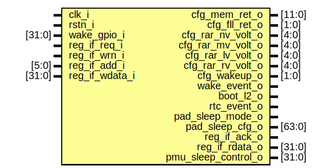

# Entity: safe_domain_reg_if

- **File**: safe_domain_reg_if.sv
## Diagram

## Description

Copyright 2018 ETH Zurich and University of Bologna.
 Copyright and related rights are licensed under the Solderpad Hardware
 License, Version 0.51 (the "License"); you may not use this file except in
 compliance with the License.  You may obtain a copy of the License at
 http://solderpad.org/licenses/SHL-0.51. Unless required by applicable law
 or agreed to in writing, software, hardware and materials distributed under
 this License is distributed on an "AS IS" BASIS, WITHOUT WARRANTIES OR
 CONDITIONS OF ANY KIND, either express or implied. See the License for the
 specific language governing permissions and limitations under the License.
 NOTE: Safe regs will be mapped starting from BASEADDR+0x100.
       Have a look in apb_soc_ctrl for details (7th address bit is used
       to dispatch reg access req between safe_domain_reg_if and
       apb_soc_ctrl)
 PMU REGISTERS
 PAD MUXING
 
## Ports

| Port name           | Direction | Type   | Description |
| ------------------- | --------- | ------ | ----------- |
| clk_i               | input     |        |             |
| rstn_i              | input     |        |             |
| cfg_mem_ret_o       | output    | [11:0] |             |
| cfg_fll_ret_o       | output    | [1:0]  |             |
| cfg_rar_nv_volt_o   | output    | [4:0]  |             |
| cfg_rar_mv_volt_o   | output    | [4:0]  |             |
| cfg_rar_lv_volt_o   | output    | [4:0]  |             |
| cfg_rar_rv_volt_o   | output    | [4:0]  |             |
| cfg_wakeup_o        | output    | [1:0]  |             |
| wake_gpio_i         | input     | [31:0] |             |
| wake_event_o        | output    |        |             |
| boot_l2_o           | output    |        |             |
| rtc_event_o         | output    |        |             |
| pad_sleep_mode_o    | output    |        |             |
| pad_sleep_cfg_o     | output    | [63:0] |             |
| reg_if_req_i        | input     |        |             |
| reg_if_wrn_i        | input     |        |             |
| reg_if_add_i        | input     | [5:0]  |             |
| reg_if_wdata_i      | input     | [31:0] |             |
| reg_if_ack_o        | output    |        |             |
| reg_if_rdata_o      | output    | [31:0] |             |
| pmu_sleep_control_o | output    | [31:0] |             |
## Signals

| Name                | Type         | Description |
| ------------------- | ------------ | ----------- |
| r_rar_nv_volt       | logic  [4:0] |             |
| r_rar_mv_volt       | logic  [4:0] |             |
| r_rar_lv_volt       | logic  [4:0] |             |
| r_rar_rv_volt       | logic  [4:0] |             |
| r_extwake_sel       | logic  [4:0] |             |
| r_extwake_en        | logic        |             |
| r_extwake_type      | logic  [1:0] |             |
| r_extevent          | logic        |             |
| r_extevent_sync     | logic  [2:0] |             |
| r_reboot            | logic  [2:0] |             |
| s_extwake_rise      | logic        |             |
| s_extwake_fall      | logic        |             |
| s_extwake_in        | logic        |             |
| r_wakeup            | logic  [1:0] |             |
| r_cluster_wake      | logic        |             |
| r_cfg_ret           | logic [13:0] |             |
| s_rise              | logic        |             |
| s_fall              | logic        |             |
| r_sleep_pad_cfg0    | logic [63:0] |             |
| r_sleep_pad_cfg1    | logic [63:0] |             |
| r_pad_sleep         | logic        |             |
| s_req_sync          | logic        |             |
| r_boot_l2           | logic        |             |
| s_pmu_sleep_control | logic [31:0] |             |
| s_rtc_clock         | logic [21:0] |             |
| s_rtc_alarm         | logic [21:0] |             |
| s_rtc_date          | logic [31:0] |             |
| s_rtc_timer         | logic [16:0] |             |
## Processes
- unnamed: ( @(posedge clk_i, negedge rstn_i) )
- unnamed: ( @(posedge clk_i, negedge rstn_i) )
- unnamed: (  )
- unnamed: (  )
## Instantiations

- i_sync: pulp_sync_wedge
- i_rtc_clock: rtc_clock
- i_rtc_date: rtc_date
