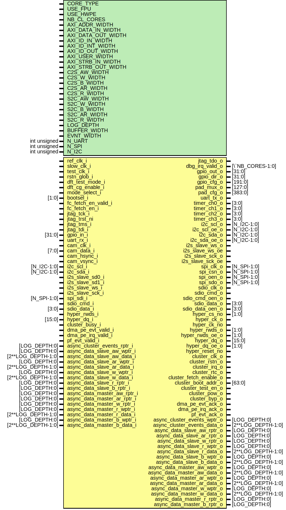

# Entity: soc_domain

- **File**: soc_domain.sv
## Diagram

## Description

 Copyright 2018 ETH Zurich and University of Bologna.
 Copyright and related rights are licensed under the Solderpad Hardware
 License, Version 0.51 (the "License"); you may not use this file except in
 compliance with the License.  You may obtain a copy of the License at
 http://solderpad.org/licenses/SHL-0.51. Unless required by applicable law
 or agreed to in writing, software, hardware and materials distributed under
 this License is distributed on an "AS IS" BASIS, WITHOUT WARRANTIES OR
 CONDITIONS OF ANY KIND, either express or implied. See the License for the
 specific language governing permissions and limitations under the License.

## Generics

| Generic name       | Type         | Value                | Description |
| ------------------ | ------------ | -------------------- | ----------- |
| CORE_TYPE          |              | 0                    |             |
| USE_FPU            |              | 1                    |             |
| USE_HWPE           |              | 1                    |             |
| NB_CL_CORES        |              | 8                    |             |
| AXI_ADDR_WIDTH     |              | 32                   |             |
| AXI_DATA_IN_WIDTH  |              | 64                   |             |
| AXI_DATA_OUT_WIDTH |              | 32                   |             |
| AXI_ID_IN_WIDTH    |              | 4                    |             |
| AXI_ID_INT_WIDTH   |              | 8                    |             |
| AXI_ID_OUT_WIDTH   |              | 6                    |             |
| AXI_USER_WIDTH     |              | 6                    |             |
| AXI_STRB_IN_WIDTH  |              | AXI_DATA_IN_WIDTH/8  |             |
| AXI_STRB_OUT_WIDTH |              | AXI_DATA_OUT_WIDTH/8 |             |
| C2S_AW_WIDTH       |              | 1                    |             |
| C2S_W_WIDTH        |              | 1                    |             |
| C2S_B_WIDTH        |              | 1                    |             |
| C2S_AR_WIDTH       |              | 1                    |             |
| C2S_R_WIDTH        |              | 1                    |             |
| S2C_AW_WIDTH       |              | 1                    |             |
| S2C_W_WIDTH        |              | 1                    |             |
| S2C_B_WIDTH        |              | 1                    |             |
| S2C_AR_WIDTH       |              | 1                    |             |
| S2C_R_WIDTH        |              | 1                    |             |
| LOG_DEPTH          |              | 3                    |             |
| BUFFER_WIDTH       |              | 8                    |             |
| EVNT_WIDTH         |              | 8                    |             |
| N_UART             | int unsigned | 1                    |             |
| N_SPI              | int unsigned | 1                    |             |
| N_I2C              | int unsigned | 2                    |             |
## Ports

| Port name                   | Direction | Type               | Description                                     |
| --------------------------- | --------- | ------------------ | ----------------------------------------------- |
| ref_clk_i                   | input     |                    |                                                 |
| slow_clk_i                  | input     |                    |                                                 |
| test_clk_i                  | input     |                    |                                                 |
| rstn_glob_i                 | input     |                    |                                                 |
| dft_test_mode_i             | input     |                    |                                                 |
| dft_cg_enable_i             | input     |                    |                                                 |
| mode_select_i               | input     |                    |                                                 |
| bootsel_i                   | input     | [1:0]              |                                                 |
| fc_fetch_en_valid_i         | input     |                    |                                                 |
| fc_fetch_en_i               | input     |                    |                                                 |
| jtag_tck_i                  | input     |                    |                                                 |
| jtag_trst_ni                | input     |                    |                                                 |
| jtag_tms_i                  | input     |                    |                                                 |
| jtag_tdi_i                  | input     |                    |                                                 |
| jtag_tdo_o                  | output    |                    |                                                 |
| dbg_irq_valid_o             | output    | [`NB_CORES-1:0]    |                                                 |
| gpio_in_i                   | input     | [31:0]             |                                                 |
| gpio_out_o                  | output    | [31:0]             |                                                 |
| gpio_dir_o                  | output    | [31:0]             |                                                 |
| gpio_cfg_o                  | output    | [191:0]            |                                                 |
| pad_mux_o                   | output    | [127:0]            |                                                 |
| pad_cfg_o                   | output    | [383:0]            |                                                 |
| uart_tx_o                   | output    |                    |                                                 |
| uart_rx_i                   | input     |                    |                                                 |
| cam_clk_i                   | input     |                    |                                                 |
| cam_data_i                  | input     | [7:0]              |                                                 |
| cam_hsync_i                 | input     |                    |                                                 |
| cam_vsync_i                 | input     |                    |                                                 |
| timer_ch0_o                 | output    | [3:0]              |                                                 |
| timer_ch1_o                 | output    | [3:0]              |                                                 |
| timer_ch2_o                 | output    | [3:0]              |                                                 |
| timer_ch3_o                 | output    | [3:0]              |                                                 |
| i2c_scl_i                   | input     | [N_I2C-1:0]        |                                                 |
| i2c_scl_o                   | output    | [N_I2C-1:0]        |                                                 |
| i2c_scl_oe_o                | output    | [N_I2C-1:0]        |                                                 |
| i2c_sda_i                   | input     | [N_I2C-1:0]        |                                                 |
| i2c_sda_o                   | output    | [N_I2C-1:0]        |                                                 |
| i2c_sda_oe_o                | output    | [N_I2C-1:0]        |                                                 |
| i2s_slave_sd0_i             | input     |                    |                                                 |
| i2s_slave_sd1_i             | input     |                    |                                                 |
| i2s_slave_ws_i              | input     |                    |                                                 |
| i2s_slave_ws_o              | output    |                    |                                                 |
| i2s_slave_ws_oe             | output    |                    |                                                 |
| i2s_slave_sck_i             | input     |                    |                                                 |
| i2s_slave_sck_o             | output    |                    |                                                 |
| i2s_slave_sck_oe            | output    |                    |                                                 |
| spi_clk_o                   | output    | [N_SPI-1:0]        |                                                 |
| spi_csn_o                   | output    | [N_SPI-1:0]        |                                                 |
| spi_oen_o                   | output    | [N_SPI-1:0]        |                                                 |
| spi_sdo_o                   | output    | [N_SPI-1:0]        |                                                 |
| spi_sdi_i                   | input     | [N_SPI-1:0]        |                                                 |
| sdio_clk_o                  | output    |                    |                                                 |
| sdio_cmd_o                  | output    |                    |                                                 |
| sdio_cmd_i                  | input     |                    |                                                 |
| sdio_cmd_oen_o              | output    |                    |                                                 |
| sdio_data_o                 | output    | [3:0]              |                                                 |
| sdio_data_i                 | input     | [3:0]              |                                                 |
| sdio_data_oen_o             | output    | [3:0]              |                                                 |
| hyper_cs_no                 | output    | [1:0]              |                                                 |
| hyper_ck_o                  | output    |                    |                                                 |
| hyper_ck_no                 | output    |                    |                                                 |
| hyper_rwds_o                | output    | [1:0]              |                                                 |
| hyper_rwds_i                | input     |                    |                                                 |
| hyper_rwds_oe_o             | output    | [1:0]              |                                                 |
| hyper_dq_i                  | input     | [15:0]             |                                                 |
| hyper_dq_o                  | output    | [15:0]             |                                                 |
| hyper_dq_oe_o               | output    | [1:0]              |                                                 |
| hyper_reset_no              | output    |                    |                                                 |
| cluster_clk_o               | output    |                    |  CLUSTER                                        |
| cluster_rstn_o              | output    |                    |                                                 |
| cluster_busy_i              | input     |                    |                                                 |
| cluster_irq_o               | output    |                    |                                                 |
| cluster_rtc_o               | output    |                    |                                                 |
| cluster_fetch_enable_o      | output    |                    |                                                 |
| cluster_boot_addr_o         | output    | [63:0]             |                                                 |
| cluster_test_en_o           | output    |                    |                                                 |
| cluster_pow_o               | output    |                    |                                                 |
| cluster_byp_o               | output    |                    |                                                 |
| dma_pe_evt_ack_o            | output    |                    |                                                 |
| dma_pe_evt_valid_i          | input     |                    |                                                 |
| dma_pe_irq_ack_o            | output    |                    |                                                 |
| dma_pe_irq_valid_i          | input     |                    |                                                 |
| pf_evt_ack_o                | output    |                    |                                                 |
| pf_evt_valid_i              | input     |                    |                                                 |
| async_cluster_events_wptr_o | output    | [LOG_DEPTH:0]      |  EVENT BUS                                      |
| async_cluster_events_data_o | output    | [2**LOG_DEPTH-1:0] |                                                 |
| async_cluster_events_rptr_i | input     | [LOG_DEPTH:0]      |                                                 |
| async_data_slave_aw_wptr_i  | input     | [LOG_DEPTH:0]      |  AXI4 SLAVE                                     |
| async_data_slave_aw_data_i  | input     | [2**LOG_DEPTH-1:0] |                                                 |
| async_data_slave_aw_rptr_o  | output    | [LOG_DEPTH:0]      |                                                 |
| async_data_slave_ar_wptr_i  | input     | [LOG_DEPTH:0]      |  READ ADDRESS CHANNEL                           |
| async_data_slave_ar_data_i  | input     | [2**LOG_DEPTH-1:0] |                                                 |
| async_data_slave_ar_rptr_o  | output    | [LOG_DEPTH:0]      |                                                 |
| async_data_slave_w_wptr_i   | input     | [LOG_DEPTH:0]      |  WRITE DATA CHANNEL                             |
| async_data_slave_w_data_i   | input     | [2**LOG_DEPTH-1:0] |                                                 |
| async_data_slave_w_rptr_o   | output    | [LOG_DEPTH:0]      |                                                 |
| async_data_slave_r_wptr_o   | output    | [LOG_DEPTH:0]      |  READ DATA CHANNEL                              |
| async_data_slave_r_data_o   | output    | [2**LOG_DEPTH-1:0] |                                                 |
| async_data_slave_r_rptr_i   | input     | [LOG_DEPTH:0]      |                                                 |
| async_data_slave_b_wptr_o   | output    | [LOG_DEPTH:0]      |  WRITE RESPONSE CHANNEL                         |
| async_data_slave_b_data_o   | output    | [2**LOG_DEPTH-1:0] |                                                 |
| async_data_slave_b_rptr_i   | input     | [LOG_DEPTH:0]      |                                                 |
| async_data_master_aw_wptr_o | output    | [LOG_DEPTH:0]      |  AXI4 MASTER                                    |
| async_data_master_aw_data_o | output    | [2**LOG_DEPTH-1:0] |                                                 |
| async_data_master_aw_rptr_i | input     | [LOG_DEPTH:0]      |                                                 |
| async_data_master_ar_wptr_o | output    | [LOG_DEPTH:0]      |  READ ADDRESS CHANNEL                           |
| async_data_master_ar_data_o | output    | [2**LOG_DEPTH-1:0] |                                                 |
| async_data_master_ar_rptr_i | input     | [LOG_DEPTH:0]      |                                                 |
| async_data_master_w_wptr_o  | output    | [LOG_DEPTH:0]      |  WRITE DATA CHANNEL                             |
| async_data_master_w_data_o  | output    | [2**LOG_DEPTH-1:0] |                                                 |
| async_data_master_w_rptr_i  | input     | [LOG_DEPTH:0]      |                                                 |
| async_data_master_r_wptr_i  | input     | [LOG_DEPTH:0]      |  READ DATA CHANNEL                              |
| async_data_master_r_data_i  | input     | [2**LOG_DEPTH-1:0] |                                                 |
| async_data_master_r_rptr_o  | output    | [LOG_DEPTH:0]      |                                                 |
| async_data_master_b_wptr_i  | input     | [LOG_DEPTH:0]      |  WRITE RESPONSE CHANNEL                         |
| async_data_master_b_data_i  | input     | [2**LOG_DEPTH-1:0] |                                                 |
| async_data_master_b_rptr_o  | output    | [LOG_DEPTH:0]      |                                                 |
## Instantiations

- pulp_soc_i: pulp_soc
