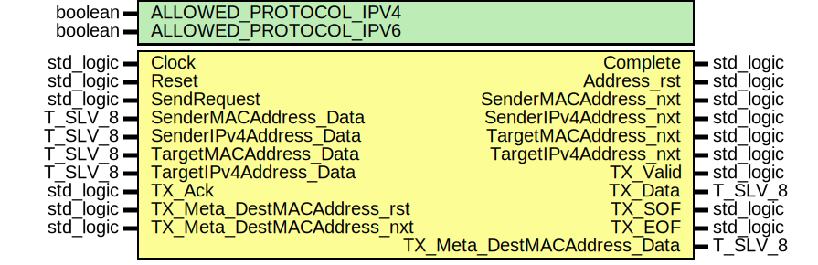

# Entity: arp_BroadCast_Requester
## Diagram

## Description
EMACS settings: -*-  tab-width: 2; indent-tabs-mode: t -*-
vim: tabstop=2:shiftwidth=2:noexpandtab
kate: tab-width 2; replace-tabs off; indent-width 2;
=============================================================================
Authors:           Patrick Lehmann
Entity:           TODO
Description:
-------------------------------------
.. TODO:: No documentation available.
License:
=============================================================================
Copyright 2007-2015 Technische Universitaet Dresden - Germany
                    Chair of VLSI-Design, Diagnostics and Architecture
Licensed under the Apache License, Version 2.0 (the "License");
you may not use this file except in compliance with the License.
You may obtain a copy of the License at
   http://www.apache.org/licenses/LICENSE-2.0
Unless required by applicable law or agreed to in writing, software
distributed under the License is distributed on an "AS IS" BASIS,
WITHOUT WARRANTIES OR CONDITIONS OF ANY KIND, either express or implied.
See the License for the specific language governing permissions and
limitations under the License.
=============================================================================
## Generics
| Generic name          | Type    | Value | Description |
| --------------------- | ------- | ----- | ----------- |
| ALLOWED_PROTOCOL_IPV4 | boolean | TRUE  |             |
| ALLOWED_PROTOCOL_IPV6 | boolean | FALSE |             |
## Ports
| Port name                   | Direction | Type      | Description |
| --------------------------- | --------- | --------- | ----------- |
| Clock                       | in        | std_logic |             |
| Reset                       | in        | std_logic |             |
| SendRequest                 | in        | std_logic |             |
| Complete                    | out       | std_logic |             |
| Address_rst                 | out       | std_logic |             |
| SenderMACAddress_nxt        | out       | std_logic |             |
| SenderMACAddress_Data       | in        | T_SLV_8   |             |
| SenderIPv4Address_nxt       | out       | std_logic |             |
| SenderIPv4Address_Data      | in        | T_SLV_8   |             |
| TargetMACAddress_nxt        | out       | std_logic |             |
| TargetMACAddress_Data       | in        | T_SLV_8   |             |
| TargetIPv4Address_nxt       | out       | std_logic |             |
| TargetIPv4Address_Data      | in        | T_SLV_8   |             |
| TX_Valid                    | out       | std_logic |             |
| TX_Data                     | out       | T_SLV_8   |             |
| TX_SOF                      | out       | std_logic |             |
| TX_EOF                      | out       | std_logic |             |
| TX_Ack                      | in        | std_logic |             |
| TX_Meta_DestMACAddress_rst  | in        | std_logic |             |
| TX_Meta_DestMACAddress_nxt  | in        | std_logic |             |
| TX_Meta_DestMACAddress_Data | out       | T_SLV_8   |             |
## Signals
| Name               | Type                                       | Description |
| ------------------ | ------------------------------------------ | ----------- |
| State              | T_STATE                                    |             |
| NextState          | T_STATE                                    |             |
| IsIPv4_l           | std_logic                                  |             |
| IsIPv6_l           | std_logic                                  |             |
| Reader_Counter_rst | std_logic                                  |             |
| Reader_Counter_en  | std_logic                                  |             |
| Reader_Counter_us  | unsigned(READER_COUNTER_BITS - 1 downto 0) |             |
## Constants
| Name                         | Type     | Value                                                                                             | Description                       |
| ---------------------------- | -------- | ------------------------------------------------------------------------------------------------- | --------------------------------- |
| HARDWARE_ADDRESS_LENGTH      | positive |  6                                                                                                | MAC -> 6 bytes                    |
| PROTOCOL_IPV4_ADDRESS_LENGTH | positive |  4                                                                                                | IPv4 -> 4 bytes                   |
| PROTOCOL_IPV6_ADDRESS_LENGTH | positive |  16                                                                                               | IPv6 -> 16 bytes                  |
| PROTOCOL_ADDRESS_LENGTH      | positive |  ite((ALLOWED_PROTOCOL_IPV6 = FALSE), PROTOCOL_IPV4_ADDRESS_LENGTH, PROTOCOL_IPV6_ADDRESS_LENGTH) | IPv4 -> 4 bytes; IPv6 -> 16 bytes |
| READER_COUNTER_BITS          | positive |  log2ceilnz(imax(HARDWARE_ADDRESS_LENGTH, PROTOCOL_ADDRESS_LENGTH))                               |                                   |
## Types
| Name    | Type                                                                                                                                                                                                                                                                                                                                                                                      | Description |
| ------- | ----------------------------------------------------------------------------------------------------------------------------------------------------------------------------------------------------------------------------------------------------------------------------------------------------------------------------------------------------------------------------------------- | ----------- |
| T_STATE | (     ST_IDLE,       ST_SEND_HARDWARE_type_0,  ST_SEND_HARDWARE_type_1,       ST_SEND_PROTOCOL_type_0,  ST_SEND_PROTOCOL_type_1,       ST_SEND_HARDWARE_ADDRESS_LENGTH, ST_SEND_PROTOCOL_ADDRESS_LENGTH,       ST_SEND_OPERATION_0,      ST_SEND_OPERATION_1,       ST_SEND_SENDER_MAC,        ST_SEND_SENDER_IP,       ST_SEND_TARGET_MAC,        ST_SEND_TARGET_IP,     ST_COMPLETE   ) |             |
## Processes
- unnamed: _( Clock )_

- unnamed: _( State,
          SendRequest,
          IsIPv4_l, IsIPv6_l,
          TX_Ack, TX_Meta_DestMACAddress_rst, TX_Meta_DestMACAddress_nxt,
          SenderMACAddress_Data, SenderIPv4Address_Data, TargetMACAddress_Data, TargetIPv4Address_Data,
          Reader_Counter_us )_

- unnamed: _( Clock )_

