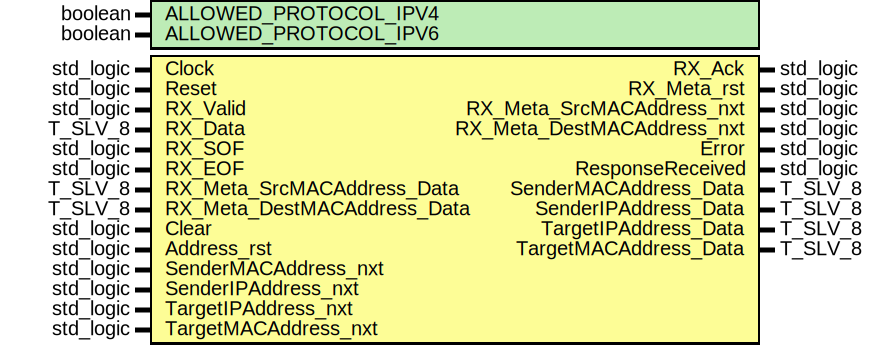

# Entity: arp_UniCast_Receiver

- **File**: arp_UniCast_Receiver.vhdl
## Diagram

## Description

 EMACS settings: -*-  tab-width: 2; indent-tabs-mode: t -*-
 vim: tabstop=2:shiftwidth=2:noexpandtab
 kate: tab-width 2; replace-tabs off; indent-width 2;
 =============================================================================
 Authors:				 	Patrick Lehmann

 Entity:				 	TODO

 Description:
 -------------------------------------
 .. TODO:: No documentation available.

 License:
 =============================================================================
 Copyright 2007-2015 Technische Universitaet Dresden - Germany
										 Chair of VLSI-Design, Diagnostics and Architecture

 Licensed under the Apache License, Version 2.0 (the "License");
 you may not use this file except in compliance with the License.
 You may obtain a copy of the License at

		http://www.apache.org/licenses/LICENSE-2.0

 Unless required by applicable law or agreed to in writing, software
 distributed under the License is distributed on an "AS IS" BASIS,
 WITHOUT WARRANTIES OR CONDITIONS OF ANY KIND, either express or implied.
 See the License for the specific language governing permissions and
 limitations under the License.
 =============================================================================
## Generics

| Generic name          | Type    | Value | Description |
| --------------------- | ------- | ----- | ----------- |
| ALLOWED_PROTOCOL_IPV4 | boolean | TRUE  |             |
| ALLOWED_PROTOCOL_IPV6 | boolean | FALSE |             |
## Ports

| Port name                   | Direction | Type      | Description |
| --------------------------- | --------- | --------- | ----------- |
| Clock                       | in        | std_logic |             |
| Reset                       | in        | std_logic |             |
| RX_Valid                    | in        | std_logic |             |
| RX_Data                     | in        | T_SLV_8   |             |
| RX_SOF                      | in        | std_logic |             |
| RX_EOF                      | in        | std_logic |             |
| RX_Ack                      | out       | std_logic |             |
| RX_Meta_rst                 | out       | std_logic |             |
| RX_Meta_SrcMACAddress_nxt   | out       | std_logic |             |
| RX_Meta_SrcMACAddress_Data  | in        | T_SLV_8   |             |
| RX_Meta_DestMACAddress_nxt  | out       | std_logic |             |
| RX_Meta_DestMACAddress_Data | in        | T_SLV_8   |             |
| Clear                       | in        | std_logic |             |
| Error                       | out       | std_logic |             |
| ResponseReceived            | out       | std_logic |             |
| Address_rst                 | in        | std_logic |             |
| SenderMACAddress_nxt        | in        | std_logic |             |
| SenderMACAddress_Data       | out       | T_SLV_8   |             |
| SenderIPAddress_nxt         | in        | std_logic |             |
| SenderIPAddress_Data        | out       | T_SLV_8   |             |
| TargetIPAddress_nxt         | in        | std_logic |             |
| TargetIPAddress_Data        | out       | T_SLV_8   |             |
| TargetMACAddress_nxt        | in        | std_logic |             |
| TargetMACAddress_Data       | out       | T_SLV_8   |             |
## Signals

| Name                         | Type                                                       | Description |
| ---------------------------- | ---------------------------------------------------------- | ----------- |
| State                        | T_STATE                                                    |             |
| NextState                    | T_STATE                                                    |             |
| Is_SOF                       | std_logic                                                  | "speed1";   |
| Is_EOF                       | std_logic                                                  |             |
| IsIPv4_set                   | std_logic                                                  |             |
| IsIPv4_r                     | std_logic                                                  |             |
| IsIPv6_set                   | std_logic                                                  |             |
| IsIPv6_r                     | std_logic                                                  |             |
| Writer_Counter_rst           | std_logic                                                  |             |
| Writer_Counter_en            | std_logic                                                  |             |
| Writer_Counter_us            | unsigned(WRITER_COUNTER_BITS - 1 downto 0)                 |             |
| Reader_SenderMAC_Counter_rst | std_logic                                                  |             |
| Reader_SenderMAC_Counter_en  | std_logic                                                  |             |
| Reader_SenderMAC_Counter_us  | unsigned(log2ceilnz(HARDWARE_ADDRESS_LENGTH) - 1 downto 0) |             |
| Reader_SenderIP_Counter_rst  | std_logic                                                  |             |
| Reader_SenderIP_Counter_en   | std_logic                                                  |             |
| Reader_SenderIP_Counter_us   | unsigned(log2ceilnz(PROTOCOL_ADDRESS_LENGTH) - 1 downto 0) |             |
| Reader_TargetMAC_Counter_rst | std_logic                                                  |             |
| Reader_TargetMAC_Counter_en  | std_logic                                                  |             |
| Reader_TargetMAC_Counter_us  | unsigned(log2ceilnz(HARDWARE_ADDRESS_LENGTH) - 1 downto 0) |             |
| Reader_TargetIP_Counter_rst  | std_logic                                                  |             |
| Reader_TargetIP_Counter_en   | std_logic                                                  |             |
| Reader_TargetIP_Counter_us   | unsigned(log2ceilnz(PROTOCOL_ADDRESS_LENGTH) - 1 downto 0) |             |
| SenderHardwareAddress_en     | std_logic                                                  |             |
| SenderHardwareAddress_us     | unsigned(log2ceilnz(HARDWARE_ADDRESS_LENGTH) - 1 downto 0) |             |
| SenderHardwareAddress_d      | T_SLVV_8(HARDWARE_ADDRESS_LENGTH - 1 downto 0)             |             |
| SenderProtocolAddress_en     | std_logic                                                  |             |
| SenderProtocolAddress_us     | unsigned(log2ceilnz(PROTOCOL_ADDRESS_LENGTH) - 1 downto 0) |             |
| SenderProtocolAddress_d      | T_SLVV_8(PROTOCOL_ADDRESS_LENGTH - 1 downto 0)             |             |
| TargetHardwareAddress_en     | std_logic                                                  |             |
| TargetHardwareAddress_us     | unsigned(log2ceilnz(HARDWARE_ADDRESS_LENGTH) - 1 downto 0) |             |
| TargetHardwareAddress_d      | T_SLVV_8(HARDWARE_ADDRESS_LENGTH - 1 downto 0)             |             |
| TargetProtocolAddress_en     | std_logic                                                  |             |
| TargetProtocolAddress_us     | unsigned(log2ceilnz(PROTOCOL_ADDRESS_LENGTH) - 1 downto 0) |             |
| TargetProtocolAddress_d      | T_SLVV_8(PROTOCOL_ADDRESS_LENGTH - 1 downto 0)             |             |
## Constants

| Name                         | Type     | Value                                                                                                                                                                     | Description                        |
| ---------------------------- | -------- | ------------------------------------------------------------------------------------------------------------------------------------------------------------------------- | ---------------------------------- |
| HARDWARE_ADDRESS_LENGTH      | positive |  6                                                                                                                                                                        |  MAC -> 6 bytes                    |
| PROTOCOL_IPV4_ADDRESS_LENGTH | positive |  4                                                                                                                                                                        |  IPv4 -> 4 bytes                   |
| PROTOCOL_IPV6_ADDRESS_LENGTH | positive |  16                                                                                                                                                                       |  IPv6 -> 16 bytes                  |
| PROTOCOL_ADDRESS_LENGTH      | positive |  ite((ALLOWED_PROTOCOL_IPV6 = FALSE),  PROTOCOL_IPV4_ADDRESS_LENGTH,  PROTOCOL_IPV6_ADDRESS_LENGTH) |  IPv4 -> 4 bytes; IPv6 -> 16 bytes |
| WRITER_COUNTER_BITS          | positive |  log2ceilnz(imax(HARDWARE_ADDRESS_LENGTH,  PROTOCOL_ADDRESS_LENGTH))                                                                   |                                    |
## Types

| Name    | Type                                                                                                                                                                                                                                                                                                                                                                                                                                                                                                                                                                                                                                                                                                                                                                                                                                                                                                                                                             | Description |
| ------- | ---------------------------------------------------------------------------------------------------------------------------------------------------------------------------------------------------------------------------------------------------------------------------------------------------------------------------------------------------------------------------------------------------------------------------------------------------------------------------------------------------------------------------------------------------------------------------------------------------------------------------------------------------------------------------------------------------------------------------------------------------------------------------------------------------------------------------------------------------------------------------------------------------------------------------------------------------------------- | ----------- |
| T_STATE | ( ST_IDLE,  ST_RECEIVE_HARDWARE_TYPE_1,  ST_RECEIVE_PROTOCOL_TYPE_0,  ST_RECEIVE_PROTOCOL_TYPE_1,  ST_RECEIVE_HARDWARE_ADDRESS_LENGTH,  ST_RECEIVE_PROTOCOL_ADDRESS_LENGTH,  ST_RECEIVE_OPERATION_0, 			ST_RECEIVE_OPERATION_1,  ST_RECEIVE_SENDER_MAC, 			ST_RECEIVE_SENDER_IP,  ST_RECEIVE_TARGET_MAC, 			ST_RECEIVE_TARGET_IP,  ST_DISCARD_ETHERNET_PADDING_BYTES,  ST_COMPLETE,  ST_DISCARD_FRAME,  ST_ERROR )  |             |
## Processes
- unnamed: ( Clock )
- unnamed: ( State,
					Clear,
					RX_Valid, RX_Data, Is_SOF, Is_EOF,
					IsIPv4_r, IsIPv6_r, Writer_Counter_us,
					Address_rst, SenderMACAddress_nxt, SenderIPAddress_nxt, TargetMACAddress_nxt, TargetIPAddress_nxt )
- unnamed: ( Clock )
- unnamed: ( Clock )
- unnamed: ( Clock )
