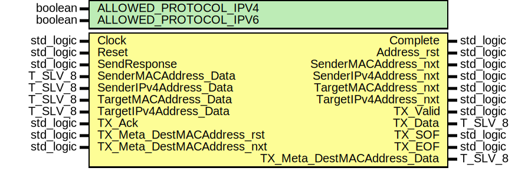

# Entity: arp_UniCast_Responder
## Diagram

## Generics
| Generic name          | Type    | Value | Description |
| --------------------- | ------- | ----- | ----------- |
| ALLOWED_PROTOCOL_IPV4 | boolean | TRUE  |             |
| ALLOWED_PROTOCOL_IPV6 | boolean | FALSE |             |
## Ports
| Port name                   | Direction | Type      | Description |
| --------------------------- | --------- | --------- | ----------- |
| Clock                       | in        | std_logic |             |
| Reset                       | in        | std_logic |             |
| SendResponse                | in        | std_logic |             |
| Complete                    | out       | std_logic |             |
| Address_rst                 | out       | std_logic |             |
| SenderMACAddress_nxt        | out       | std_logic |             |
| SenderMACAddress_Data       | in        | T_SLV_8   |             |
| SenderIPv4Address_nxt       | out       | std_logic |             |
| SenderIPv4Address_Data      | in        | T_SLV_8   |             |
| TargetMACAddress_nxt        | out       | std_logic |             |
| TargetMACAddress_Data       | in        | T_SLV_8   |             |
| TargetIPv4Address_nxt       | out       | std_logic |             |
| TargetIPv4Address_Data      | in        | T_SLV_8   |             |
| TX_Valid                    | out       | std_logic |             |
| TX_Data                     | out       | T_SLV_8   |             |
| TX_SOF                      | out       | std_logic |             |
| TX_EOF                      | out       | std_logic |             |
| TX_Ack                      | in        | std_logic |             |
| TX_Meta_DestMACAddress_rst  | in        | std_logic |             |
| TX_Meta_DestMACAddress_nxt  | in        | std_logic |             |
| TX_Meta_DestMACAddress_Data | out       | T_SLV_8   |             |
## Signals
| Name               | Type                                       | Description |
| ------------------ | ------------------------------------------ | ----------- |
| State              | T_STATE                                    |             |
| NextState          | T_STATE                                    |             |
| IsIPv4_l           | std_logic                                  |             |
| IsIPv6_l           | std_logic                                  |             |
| Reader_Counter_rst | std_logic                                  |             |
| Reader_Counter_en  | std_logic                                  |             |
| Reader_Counter_us  | unsigned(READER_COUNTER_BITS - 1 downto 0) |             |
## Constants
| Name                         | Type     | Value                                                                                             | Description |
| ---------------------------- | -------- | ------------------------------------------------------------------------------------------------- | ----------- |
| HARDWARE_ADDRESS_LENGTH      | positive |  6                                                                                                |             |
| PROTOCOL_IPV4_ADDRESS_LENGTH | positive |  4                                                                                                |             |
| PROTOCOL_IPV6_ADDRESS_LENGTH | positive |  16                                                                                               |             |
| PROTOCOL_ADDRESS_LENGTH      | positive |  ite((ALLOWED_PROTOCOL_IPV6 = FALSE), PROTOCOL_IPV4_ADDRESS_LENGTH, PROTOCOL_IPV6_ADDRESS_LENGTH) |             |
| READER_COUNTER_BITS          | positive |  log2ceilnz(imax(HARDWARE_ADDRESS_LENGTH, PROTOCOL_ADDRESS_LENGTH))                               |             |
## Types
| Name    | Type                                                                                                                                                                                                                                                                                                                                                  | Description |
| ------- | ----------------------------------------------------------------------------------------------------------------------------------------------------------------------------------------------------------------------------------------------------------------------------------------------------------------------------------------------------- | ----------- |
| T_STATE | ( 		ST_IDLE, 			ST_SEND_HARDWARE_TYPE_0,	ST_SEND_HARDWARE_TYPE_1, 			ST_SEND_PROTOCOL_TYPE_0,	ST_SEND_PROTOCOL_TYPE_1, 			ST_SEND_HARDWARE_ADDRESS_LENGTH, ST_SEND_PROTOCOL_ADDRESS_LENGTH, 			ST_SEND_OPERATION_0,			ST_SEND_OPERATION_1, 			ST_SEND_SENDER_MAC,				ST_SEND_SENDER_IP, 			ST_SEND_TARGET_MAC,				ST_SEND_TARGET_IP, 		ST_COMPLETE 	) |             |
## Processes
- unnamed: _( Clock )_

- unnamed: _( State,
					SendResponse,
					IsIPv4_l, IsIPv6_l,
					TX_Ack, TX_Meta_DestMACAddress_rst, TX_Meta_DestMACAddress_nxt,
					SenderMACAddress_Data, SenderIPv4Address_Data, TargetMACAddress_Data, TargetIPv4Address_Data,
					Reader_Counter_us )_

- unnamed: _( Clock )_

