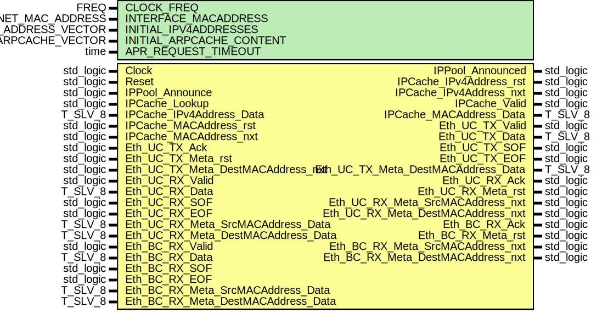

# Entity: arp_Wrapper
## Diagram

## Description
EMACS settings: -*-  tab-width: 2; indent-tabs-mode: t -*-
vim: tabstop=2:shiftwidth=2:noexpandtab
kate: tab-width 2; replace-tabs off; indent-width 2;
=============================================================================
Authors:				 	Patrick Lehmann
Entity:				 	TODO
Description:
-------------------------------------
.. TODO:: No documentation available.
License:
=============================================================================
Copyright 2007-2015 Technische Universitaet Dresden - Germany
Licensed under the Apache License, Version 2.0 (the "License");
you may not use this file except in compliance with the License.
You may obtain a copy of the License at
Unless required by applicable law or agreed to in writing, software
distributed under the License is distributed on an "AS IS" BASIS,
WITHOUT WARRANTIES OR CONDITIONS OF ANY KIND, either express or implied.
See the License for the specific language governing permissions and
limitations under the License.
=============================================================================
## Generics
| Generic name             | Type                      | Value                                                                    | Description |
| ------------------------ | ------------------------- | ------------------------------------------------------------------------ | ----------- |
| CLOCK_FREQ               | FREQ                      | 125 MHz                                                                  |             |
| INTERFACE_MACADDRESS     | T_NET_MAC_ADDRESS         | C_NET_MAC_ADDRESS_EMPTY                                                  |             |
| INITIAL_IPV4ADDRESSES    | T_NET_IPV4_ADDRESS_VECTOR | (0 => C_NET_IPV4_ADDRESS_EMPTY)                                          |             |
| INITIAL_ARPCACHE_CONTENT | T_NET_ARP_ARPCACHE_VECTOR | (0 => (Tag => C_NET_IPV4_ADDRESS_EMPTY, MAC => C_NET_MAC_ADDRESS_EMPTY)) |             |
| APR_REQUEST_TIMEOUT      | time                      | 100 ms                                                                   |             |
## Ports
| Port name                          | Direction | Type      | Description |
| ---------------------------------- | --------- | --------- | ----------- |
| Clock                              | in        | std_logic |             |
| Reset                              | in        | std_logic |             |
| IPPool_Announce                    | in        | std_logic |             |
| IPPool_Announced                   | out       | std_logic |             |
| IPCache_Lookup                     | in        | std_logic |             |
| IPCache_IPv4Address_rst            | out       | std_logic |             |
| IPCache_IPv4Address_nxt            | out       | std_logic |             |
| IPCache_IPv4Address_Data           | in        | T_SLV_8   |             |
| IPCache_Valid                      | out       | std_logic |             |
| IPCache_MACAddress_rst             | in        | std_logic |             |
| IPCache_MACAddress_nxt             | in        | std_logic |             |
| IPCache_MACAddress_Data            | out       | T_SLV_8   |             |
| Eth_UC_TX_Valid                    | out       | std_logic |             |
| Eth_UC_TX_Data                     | out       | T_SLV_8   |             |
| Eth_UC_TX_SOF                      | out       | std_logic |             |
| Eth_UC_TX_EOF                      | out       | std_logic |             |
| Eth_UC_TX_Ack                      | in        | std_logic |             |
| Eth_UC_TX_Meta_rst                 | in        | std_logic |             |
| Eth_UC_TX_Meta_DestMACAddress_nxt  | in        | std_logic |             |
| Eth_UC_TX_Meta_DestMACAddress_Data | out       | T_SLV_8   |             |
| Eth_UC_RX_Valid                    | in        | std_logic |             |
| Eth_UC_RX_Data                     | in        | T_SLV_8   |             |
| Eth_UC_RX_SOF                      | in        | std_logic |             |
| Eth_UC_RX_EOF                      | in        | std_logic |             |
| Eth_UC_RX_Ack                      | out       | std_logic |             |
| Eth_UC_RX_Meta_rst                 | out       | std_logic |             |
| Eth_UC_RX_Meta_SrcMACAddress_nxt   | out       | std_logic |             |
| Eth_UC_RX_Meta_SrcMACAddress_Data  | in        | T_SLV_8   |             |
| Eth_UC_RX_Meta_DestMACAddress_nxt  | out       | std_logic |             |
| Eth_UC_RX_Meta_DestMACAddress_Data | in        | T_SLV_8   |             |
| Eth_BC_RX_Valid                    | in        | std_logic |             |
| Eth_BC_RX_Data                     | in        | T_SLV_8   |             |
| Eth_BC_RX_SOF                      | in        | std_logic |             |
| Eth_BC_RX_EOF                      | in        | std_logic |             |
| Eth_BC_RX_Ack                      | out       | std_logic |             |
| Eth_BC_RX_Meta_rst                 | out       | std_logic |             |
| Eth_BC_RX_Meta_SrcMACAddress_nxt   | out       | std_logic |             |
| Eth_BC_RX_Meta_SrcMACAddress_Data  | in        | T_SLV_8   |             |
| Eth_BC_RX_Meta_DestMACAddress_nxt  | out       | std_logic |             |
| Eth_BC_RX_Meta_DestMACAddress_Data | in        | T_SLV_8   |             |
## Signals
| Name                                  | Type                                        | Description                 |
| ------------------------------------- | ------------------------------------------- | --------------------------- |
| ARPCache_Command                      | T_NET_ARP_ARPCACHE_COMMAND                  |                             |
| IPPool_Command                        | T_NET_ARP_IPPOOL_COMMAND                    |                             |
| IPPool_Announce_l                     | std_logic                                   |                             |
| IPPool_Announced_i                    | std_logic                                   |                             |
| FSMPool_State                         | T_FSMPOOL_STATE                             |                             |
| FSMPool_NextState                     | T_FSMPOOL_STATE                             |                             |
| FSMPool_MACSeq1_SenderMACAddress_rst  | std_logic                                   |                             |
| FSMPool_MACSeq1_SenderMACAddress_nxt  | std_logic                                   |                             |
| FSMPool_BCRcv_Clear                   | std_logic                                   |                             |
| FSMPool_BCRcv_Address_rst             | std_logic                                   |                             |
| FSMPool_BCRcv_SenderMACAddress_nxt    | std_logic                                   |                             |
| FSMPool_BCRcv_SenderIPv4Address_nxt   | std_logic                                   |                             |
| FSMPool_BCRcv_TargetIPv4Address_nxt   | std_logic                                   |                             |
| FSMPool_Command                       | T_NET_ARP_IPPOOL_COMMAND                    |                             |
| FSMPool_NewIPv4Address_Data           | T_NET_IPV4_ADDRESS                          |                             |
| FSMPool_NewMACAddress_Data            | T_NET_MAC_ADDRESS                           |                             |
| FSMPool_IPPool_Lookup                 | std_logic                                   |                             |
| FSMPool_IPPool_IPv4Address_Data       | T_SLV_8                                     |                             |
| FSMPool_UCRsp_SendResponse            | std_logic                                   |                             |
| FSMPool_UCRsp_SenderMACAddress_Data   | T_SLV_8                                     |                             |
| FSMPool_UCRsp_SenderIPv4Address_Data  | T_SLV_8                                     |                             |
| FSMPool_UCRsp_TargetMACAddress_Data   | T_SLV_8                                     |                             |
| FSMPool_UCRsp_TargetIPv4Address_Data  | T_SLV_8                                     |                             |
| MACSeq1_SenderMACAddress_Data         | T_SLV_8                                     | Sender MACAddress sequencer |
| BCRcv_Error                           | std_logic                                   | broadcast receiver          |
| BCRcv_RequestReceived                 | std_logic                                   |                             |
| BCRcv_SenderMACAddress_Data           | T_SLV_8                                     |                             |
| BCRcv_SenderIPv4Address_Data          | T_SLV_8                                     |                             |
| BCRcv_TargetIPv4Address_Data          | T_SLV_8                                     |                             |
| IPPool_Insert                         | std_logic                                   | ippool                      |
| IPPool_UCRsp_SendResponse             | std_logic                                   |                             |
| IPPool_IPv4Address_rst                | std_logic                                   |                             |
| IPPool_IPv4Address_nxt                | std_logic                                   |                             |
| IPPool_PoolResult                     | T_CACHE_RESULT                              |                             |
| UCRsp_Complete                        | std_logic                                   | unicast responder           |
| UCRsp_Address_rst                     | std_logic                                   |                             |
| UCRsp_SenderMACAddress_nxt            | std_logic                                   |                             |
| UCRsp_SenderIPv4Address_nxt           | std_logic                                   |                             |
| UCRsp_TargetMACAddress_nxt            | std_logic                                   |                             |
| UCRsp_TargetIPv4Address_nxt           | std_logic                                   |                             |
| UCRsp_TX_Valid                        | std_logic                                   |                             |
| UCRsp_TX_Data                         | T_SLV_8                                     |                             |
| UCRsp_TX_SOF                          | std_logic                                   |                             |
| UCRsp_TX_EOF                          | std_logic                                   |                             |
| UCRsp_TX_Ack                          | std_logic                                   |                             |
| UCRsp_TX_Meta_DestMACAddress_rst      | std_logic                                   |                             |
| UCRsp_TX_Meta_DestMACAddress_nxt      | std_logic                                   |                             |
| UCRsp_TX_Meta_DestMACAddress_Data     | T_SLV_8                                     |                             |
| FSMCache_State                        | T_FSMCACHE_STATE                            |                             |
| FSMCache_NextState                    | T_FSMCACHE_STATE                            |                             |
| FSMCache_ARPCache_Command             | T_NET_ARP_ARPCACHE_COMMAND                  |                             |
| FSMCache_ARPCache_NewIPv4Address_Data | T_SLV_8                                     |                             |
| FSMCache_ARPCache_NewMACAddress_Data  | T_SLV_8                                     |                             |
| FSMCache_MACSeq2_SenderMACAddress_rst | std_logic                                   |                             |
| FSMCache_MACSeq2_SenderMACAddress_nxt | std_logic                                   |                             |
| FSMCache_IPSeq2_SenderIPv4Address_rst | std_logic                                   |                             |
| FSMCache_IPSeq2_SenderIPv4Address_nxt | std_logic                                   |                             |
| FSMCache_UCRcv_Clear                  | std_logic                                   |                             |
| FSMCache_UCRcv_Address_rst            | std_logic                                   |                             |
| FSMCache_UCRcv_SenderMACAddress_nxt   | std_logic                                   |                             |
| FSMCache_UCRcv_SenderIPv4Address_nxt  | std_logic                                   |                             |
| FSMCache_UCRcv_TargetMACAddress_nxt   | std_logic                                   |                             |
| FSMCache_UCRcv_TargetIPv4Address_nxt  | std_logic                                   |                             |
| FSMCache_ARPCache_Lookup              | std_logic                                   |                             |
| FSMCache_ARPCache_IPv4Address_Data    | T_SLV_8                                     |                             |
| FSMCache_ARPCache_MACAddress_rst      | std_logic                                   |                             |
| FSMCache_ARPCache_MACAddress_nxt      | std_logic                                   |                             |
| FSMCache_BCReq_SendRequest            | std_logic                                   |                             |
| FSMCache_BCReq_SenderMACAddress_Data  | T_SLV_8                                     |                             |
| FSMCache_BCReq_SenderIPv4Address_Data | T_SLV_8                                     |                             |
| FSMCache_BCReq_TargetMACAddress_Data  | T_SLV_8                                     |                             |
| FSMCache_BCReq_TargetIPv4Address_Data | T_SLV_8                                     |                             |
| MACSeq2_SenderMACAddress_Data         | T_SLV_8                                     | Sender ***Address sequencer |
| IPSeq2_SenderIPv4Address_Data         | T_SLV_8                                     |                             |
| FSMCache_ARPReq_TimeoutCounter_rst    | std_logic                                   |                             |
| ARPReq_TimeoutCounter_s               | signed(ARPREQ_TIMEOUTCOUNTER_BITS downto 0) |                             |
| ARPReq_Timeout                        | std_logic                                   |                             |
| UCRcv_Error                           | std_logic                                   | unicast receiver            |
| UCRcv_ResponseReceived                | std_logic                                   |                             |
| UCRcv_SenderMACAddress_Data           | T_SLV_8                                     |                             |
| UCRcv_SenderIPv4Address_Data          | T_SLV_8                                     |                             |
| UCRcv_TargetMACAddress_Data           | T_SLV_8                                     |                             |
| UCRcv_TargetIPv4Address_Data          | T_SLV_8                                     |                             |
| ARPCache_Status                       | T_NET_ARP_ARPCACHE_STATUS                   | arp cache                   |
| ARPCache_NewMACAddress_nxt            | std_logic                                   |                             |
| ARPCache_NewIPv4Address_nxt           | std_logic                                   |                             |
| ARPCache_CacheResult                  | T_CACHE_RESULT                              |                             |
| ARPCache_IPv4Address_rst              | std_logic                                   |                             |
| ARPCache_IPv4Address_nxt              | std_logic                                   |                             |
| ARPCache_MACAddress_Data              | T_SLV_8                                     |                             |
| BCReq_Complete                        | std_logic                                   | broadcast requester         |
| BCReq_Address_rst                     | std_logic                                   |                             |
| BCReq_SenderMACAddress_nxt            | std_logic                                   |                             |
| BCReq_SenderIPv4Address_nxt           | std_logic                                   |                             |
| BCReq_TargetMACAddress_nxt            | std_logic                                   |                             |
| BCReq_TargetIPv4Address_nxt           | std_logic                                   |                             |
| BCReq_TX_Valid                        | std_logic                                   |                             |
| BCReq_TX_Data                         | T_SLV_8                                     |                             |
| BCReq_TX_SOF                          | std_logic                                   |                             |
| BCReq_TX_EOF                          | std_logic                                   |                             |
| BCReq_TX_Ack                          | std_logic                                   |                             |
| BCReq_TX_Meta_DestMACAddress_rst      | std_logic                                   |                             |
| BCReq_TX_Meta_DestMACAddress_nxt      | std_logic                                   |                             |
| BCReq_TX_Meta_DestMACAddress_Data     | T_SLV_8                                     |                             |
## Constants
| Name                       | Type     | Value                                            | Description                 |
| -------------------------- | -------- | ------------------------------------------------ | --------------------------- |
| ARPREQ_TIMEOUTCOUNTER_MAX  | positive |  TimingToCycles(APR_REQUEST_TIMEOUT, CLOCK_FREQ) | ARP request timeout counter |
| ARPREQ_TIMEOUTCOUNTER_BITS | positive |  log2ceilnz(ARPREQ_TIMEOUTCOUNTER_MAX)           |                             |
## Types
| Name             | Type                                                                                                                                                                                  | Description |
| ---------------- | ------------------------------------------------------------------------------------------------------------------------------------------------------------------------------------- | ----------- |
| T_FSMPOOL_STATE  | ( 		ST_IDLE, 		ST_IPPOOL_WAIT, 		ST_SEND_RESPONSE, 		ST_SEND_ANNOUNCE, 		ST_ERROR 	)                                                                                                  |             |
| T_FSMCACHE_STATE | ( 		ST_IDLE, 			ST_CACHE, ST_CACHE_WAIT, ST_READ_CACHE, 			ST_SEND_BROADCAST_REQUEST, ST_SEND_BROADCAST_REQUEST_WAIT, ST_WAIT_FOR_UNICAST_RESPONSE, 			ST_UPDATE_CACHE, 		ST_ERROR 	) |             |
## Processes
- unnamed: _( Clock )_

- unnamed: _( FSMPool_State,
					IPPool_Announce_l,
					MACSeq1_SenderMACAddress_Data,
					BCRcv_RequestReceived, BCRcv_Error, BCRcv_SenderMACAddress_Data, BCRcv_SenderIPv4Address_Data, BCRcv_TargetIPv4Address_Data,
					IPPool_PoolResult, IPPool_IPv4Address_nxt,
					UCRsp_Address_rst, UCRsp_SenderMACAddress_nxt, UCRsp_SenderIPv4Address_nxt, UCRsp_TargetMACAddress_nxt, UCRsp_TargetIPv4Address_nxt, UCRsp_Complete )_
sequencer

**Description**
sequencer

- unnamed: _( Clock )_

- unnamed: _( FSMCache_State,
					IPCache_Lookup, IPCache_IPv4Address_Data,	IPCache_MACAddress_rst, IPCache_MACAddress_nxt,
					MACSeq2_SenderMACAddress_Data, IPSeq2_SenderIPv4Address_Data, ARPReq_Timeout,
					UCRcv_Error, UCRcv_ResponseReceived, UCRcv_SenderIPv4Address_Data, UCRcv_SenderMACAddress_Data, UCRcv_TargetIPv4Address_Data, UCRcv_TargetMACAddress_Data,
					ARPCache_Status, ARPCache_CacheResult, ARPCache_IPv4Address_rst, ARPCache_IPv4Address_nxt, ARPCache_MACAddress_Data, ARPCache_NewMACAddress_nxt, ARPCache_NewIPv4Address_nxt,
					BCReq_Address_rst, BCReq_SenderMACAddress_nxt, BCReq_SenderIPv4Address_nxt, BCReq_TargetMACAddress_nxt, BCReq_TargetIPv4Address_nxt, BCReq_Complete )_

- unnamed: _( Clock )_
ARP request expiration timer

**Description**
ARP request expiration timer

## Instantiations
- MACSeq1: PoC.misc_Sequencer
**Description**
=============================================================================
Responder Path
=============================================================================

- BCRcv: PoC.arp_BroadCast_Receiver
- IPPool: PoC.arp_IPPool
- UCRsp: PoC.arp_UniCast_Responder
- MACSeq2: PoC.misc_Sequencer
**Description**
=============================================================================
ARPCache Path
=============================================================================

- IPSeq2: PoC.misc_Sequencer
- UCRcv: PoC.arp_UniCast_Receiver
- ARPCache: PoC.arp_Cache
- BCReq: PoC.arp_BroadCast_Requester
