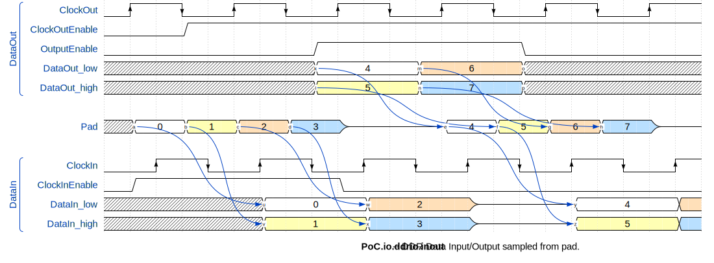

# Entity: ddrio_inout

## Diagram

## Description

EMACS settings: -*-  tab-width: 2; indent-tabs-mode: t -*-
vim: tabstop=2:shiftwidth=2:noexpandtab
kate: tab-width 2; replace-tabs off; indent-width 2;
=============================================================================
Authors:					Martin Zabel
Entity:					Chip-Specific DDR Input and Output Registers
Description:
-------------------------------------
Instantiates chip-specific :abbr:`DDR (Double Data Rate)` input and output
registers.
Both data ``DataOut_high/low`` as well as ``OutputEnable`` are sampled with
the ``rising_edge(Clock)`` from the on-chip logic. ``DataOut_high`` is brought
out with this rising edge. ``DataOut_low`` is brought out with the falling
edge.
``OutputEnable`` (Tri-State) is high-active. It is automatically inverted if
necessary. Output is disabled after power-up.
Both data ``DataIn_high/low`` are synchronously outputted to the on-chip logic
with the rising edge of ``Clock``. ``DataIn_high`` is the value at the ``Pad``
sampled with the same rising edge. ``DataIn_low`` is the value sampled with
the falling edge directly before this rising edge. Thus sampling starts with
the falling edge of the clock as depicted in the following waveform.
.. wavedrom::
   
 

``Pad`` must be connected to a PAD because FPGAs only have these registers in
IOBs.
License:
=============================================================================
Copyright 2007-2016 Technische Universitaet Dresden - Germany,
Licensed under the Apache License, Version 2.0 (the "License");
you may not use this file except in compliance with the License.
You may obtain a copy of the License at
Unless required by applicable law or agreed to in writing, software
distributed under the License is distributed on an "AS IS" BASIS,
WITHOUT WARRANTIES OR CONDITIONS OF ANY KIND, either express or implied.
See the License for the specific language governing permissions and
limitations under the License.
=============================================================================
## Generics

| Generic name | Type     | Value | Description |
| ------------ | -------- | ----- | ----------- |
| BITS         | positive |       |             |
## Ports

| Port name      | Direction | Type                                | Description |
| -------------- | --------- | ----------------------------------- | ----------- |
| ClockOut       | in        | std_logic                           |             |
| ClockOutEnable | in        | std_logic                           |             |
| OutputEnable   | in        | std_logic                           |             |
| DataOut_high   | in        | std_logic_vector(BITS - 1 downto 0) |             |
| DataOut_low    | in        | std_logic_vector(BITS - 1 downto 0) |             |
| ClockIn        | in        | std_logic                           |             |
| ClockInEnable  | in        | std_logic                           |             |
| DataIn_high    | out       | std_logic_vector(BITS - 1 downto 0) |             |
| DataIn_low     | out       | std_logic_vector(BITS - 1 downto 0) |             |
| Pad            | inout     | std_logic_vector(BITS - 1 downto 0) |             |
