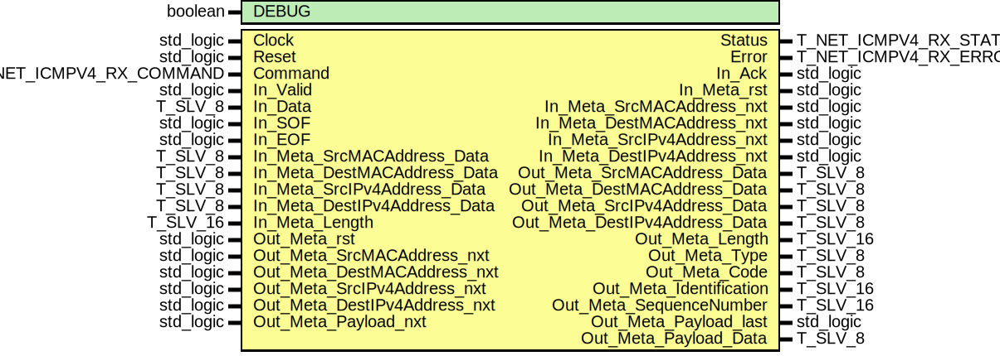

# Entity: icmpv4_RX

## Diagram

## Description

EMACS settings: -*-  tab-width: 2; indent-tabs-mode: t -*-
vim: tabstop=2:shiftwidth=2:noexpandtab
kate: tab-width 2; replace-tabs off; indent-width 2;
=============================================================================
Authors:				 	Patrick Lehmann
Entity:				 	TODO
Description:
-------------------------------------
.. TODO:: No documentation available.
License:
=============================================================================
Copyright 2007-2015 Technische Universitaet Dresden - Germany
Licensed under the Apache License, Version 2.0 (the "License");
you may not use this file except in compliance with the License.
You may obtain a copy of the License at
Unless required by applicable law or agreed to in writing, software
distributed under the License is distributed on an "AS IS" BASIS,
WITHOUT WARRANTIES OR CONDITIONS OF ANY KIND, either express or implied.
See the License for the specific language governing permissions and
limitations under the License.
=============================================================================
## Generics

| Generic name | Type    | Value | Description |
| ------------ | ------- | ----- | ----------- |
| DEBUG        | boolean | FALSE |             |
## Ports

| Port name                     | Direction | Type                    | Description   |
| ----------------------------- | --------- | ----------------------- | ------------- |
| Clock                         | in        | std_logic               |               |
| Reset                         | in        | std_logic               |               |
| Command                       | in        | T_NET_ICMPV4_RX_COMMAND | CSE interface |
| Status                        | out       | T_NET_ICMPV4_RX_STATUS  |               |
| Error                         | out       | T_NET_ICMPV4_RX_ERROR   |               |
| In_Valid                      | in        | std_logic               | IN port       |
| In_Data                       | in        | T_SLV_8                 |               |
| In_SOF                        | in        | std_logic               |               |
| In_EOF                        | in        | std_logic               |               |
| In_Ack                        | out       | std_logic               |               |
| In_Meta_rst                   | out       | std_logic               |               |
| In_Meta_SrcMACAddress_nxt     | out       | std_logic               |               |
| In_Meta_SrcMACAddress_Data    | in        | T_SLV_8                 |               |
| In_Meta_DestMACAddress_nxt    | out       | std_logic               |               |
| In_Meta_DestMACAddress_Data   | in        | T_SLV_8                 |               |
| In_Meta_SrcIPv4Address_nxt    | out       | std_logic               |               |
| In_Meta_SrcIPv4Address_Data   | in        | T_SLV_8                 |               |
| In_Meta_DestIPv4Address_nxt   | out       | std_logic               |               |
| In_Meta_DestIPv4Address_Data  | in        | T_SLV_8                 |               |
| In_Meta_Length                | in        | T_SLV_16                |               |
| Out_Meta_rst                  | in        | std_logic               | OUT Port      |
| Out_Meta_SrcMACAddress_nxt    | in        | std_logic               |               |
| Out_Meta_SrcMACAddress_Data   | out       | T_SLV_8                 |               |
| Out_Meta_DestMACAddress_nxt   | in        | std_logic               |               |
| Out_Meta_DestMACAddress_Data  | out       | T_SLV_8                 |               |
| Out_Meta_SrcIPv4Address_nxt   | in        | std_logic               |               |
| Out_Meta_SrcIPv4Address_Data  | out       | T_SLV_8                 |               |
| Out_Meta_DestIPv4Address_nxt  | in        | std_logic               |               |
| Out_Meta_DestIPv4Address_Data | out       | T_SLV_8                 |               |
| Out_Meta_Length               | out       | T_SLV_16                |               |
| Out_Meta_Type                 | out       | T_SLV_8                 |               |
| Out_Meta_Code                 | out       | T_SLV_8                 |               |
| Out_Meta_Identification       | out       | T_SLV_16                |               |
| Out_Meta_SequenceNumber       | out       | T_SLV_16                |               |
| Out_Meta_Payload_nxt          | in        | std_logic               |               |
| Out_Meta_Payload_last         | out       | std_logic               |               |
| Out_Meta_Payload_Data         | out       | T_SLV_8                 |               |
## Signals

| Name               | Type                         | Description       |
| ------------------ | ---------------------------- | ----------------- |
| State              | T_STATE                      |                   |
| NextState          | T_STATE                      |                   |
| Register_rst       | std_logic                    |                   |
| Type_en            | std_logic                    | UDP header fields |
| Code_en            | std_logic                    |                   |
| Checksum_en0       | std_logic                    |                   |
| Checksum_en1       | std_logic                    |                   |
| Identification_en0 | std_logic                    |                   |
| Identification_en1 | std_logic                    |                   |
| SequenceNumber_en0 | std_logic                    |                   |
| SequenceNumber_en1 | std_logic                    |                   |
| Type_d             | T_SLV_8                      |                   |
| Code_d             | T_SLV_8                      |                   |
| Checksum_d         | T_SLV_16                     |                   |
| Identification_d   | T_SLV_16                     |                   |
| SequenceNumber_d   | T_SLV_16                     |                   |
| MetaFIFO_put       | std_logic                    |                   |
| MetaFIFO_DataIn    | std_logic_vector(8 downto 0) |                   |
| MetaFIFO_Full      | std_logic                    |                   |
| MetaFIFO_Commit    | std_logic                    |                   |
| MetaFIFO_Rollback  | std_logic                    |                   |
| MetaFIFO_DataOut   | std_logic_vector(8 downto 0) |                   |
| MetaFIFO_got       | std_logic                    |                   |
## Types

| Name    | Type                                                                                                                                                                                                                                                                                                                                                                                                                                                                                                                                                                                                                                                                                                       | Description |
| ------- | ---------------------------------------------------------------------------------------------------------------------------------------------------------------------------------------------------------------------------------------------------------------------------------------------------------------------------------------------------------------------------------------------------------------------------------------------------------------------------------------------------------------------------------------------------------------------------------------------------------------------------------------------------------------------------------------------------------- | ----------- |
| T_STATE | ( ST_IDLE,  ST_RECEIVE_ECHO_CODE,  ST_RECEIVE_ECHO_CHECKSUM_0,  ST_RECEIVE_ECHO_CHECKSUM_1,  ST_RECEIVE_ECHO_IDENTIFIER_0,  ST_RECEIVE_ECHO_IDENTIFIER_1,  ST_RECEIVE_ECHO_SEQ_NUMBER_0,  ST_RECEIVE_ECHO_SEQ_NUMBER_1,  ST_RECEIVE_ECHO_DATA,  ST_RECEIVE_ECHO_COMPLETE,  ST_DISCARD_FRAME,  ST_ERROR )  |             |
## Processes
- unnamed: ( Clock )
- unnamed: ( State, Command, In_Valid, In_Data, In_SOF, In_EOF, Out_Meta_rst, Out_Meta_Payload_nxt )
- unnamed: ( Clock )
## Instantiations

- PayloadFIFO: PoC.fifo_cc_got_tempgot
**Description**
FIXME: monitor MetaFIFO_Full signal

