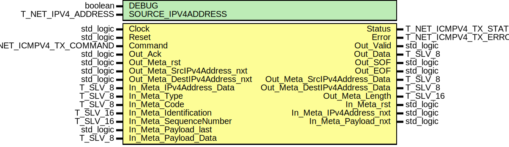

# Entity: icmpv4_TX

- **File**: icmpv4_TX.vhdl
## Diagram

## Description

 EMACS settings: -*-  tab-width: 2; indent-tabs-mode: t -*-
 vim: tabstop=2:shiftwidth=2:noexpandtab
 kate: tab-width 2; replace-tabs off; indent-width 2;
 =============================================================================
 Authors:				 	Patrick Lehmann

 Entity:				 	TODO

 Description:
 -------------------------------------
 .. TODO:: No documentation available.

 License:
 =============================================================================
 Copyright 2007-2015 Technische Universitaet Dresden - Germany
										 Chair of VLSI-Design, Diagnostics and Architecture

 Licensed under the Apache License, Version 2.0 (the "License");
 you may not use this file except in compliance with the License.
 You may obtain a copy of the License at

		http://www.apache.org/licenses/LICENSE-2.0

 Unless required by applicable law or agreed to in writing, software
 distributed under the License is distributed on an "AS IS" BASIS,
 WITHOUT WARRANTIES OR CONDITIONS OF ANY KIND, either express or implied.
 See the License for the specific language governing permissions and
 limitations under the License.
 =============================================================================
## Generics

| Generic name       | Type               | Value                    | Description |
| ------------------ | ------------------ | ------------------------ | ----------- |
| DEBUG              | boolean            | FALSE                    |             |
| SOURCE_IPV4ADDRESS | T_NET_IPV4_ADDRESS | C_NET_IPV4_ADDRESS_EMPTY |             |
## Ports

| Port name                     | Direction | Type                    | Description   |
| ----------------------------- | --------- | ----------------------- | ------------- |
| Clock                         | in        | std_logic               |               |
| Reset                         | in        | std_logic               |               |
| Command                       | in        | T_NET_ICMPV4_TX_COMMAND | CSE interface |
| Status                        | out       | T_NET_ICMPV4_TX_STATUS  |               |
| Error                         | out       | T_NET_ICMPV4_TX_ERROR   |               |
| Out_Valid                     | out       | std_logic               | OUT port      |
| Out_Data                      | out       | T_SLV_8                 |               |
| Out_SOF                       | out       | std_logic               |               |
| Out_EOF                       | out       | std_logic               |               |
| Out_Ack                       | in        | std_logic               |               |
| Out_Meta_rst                  | in        | std_logic               |               |
| Out_Meta_SrcIPv4Address_nxt   | in        | std_logic               |               |
| Out_Meta_SrcIPv4Address_Data  | out       | T_SLV_8                 |               |
| Out_Meta_DestIPv4Address_nxt  | in        | std_logic               |               |
| Out_Meta_DestIPv4Address_Data | out       | T_SLV_8                 |               |
| Out_Meta_Length               | out       | T_SLV_16                |               |
| In_Meta_rst                   | out       | std_logic               | IN port       |
| In_Meta_IPv4Address_nxt       | out       | std_logic               |               |
| In_Meta_IPv4Address_Data      | in        | T_SLV_8                 |               |
| In_Meta_Type                  | in        | T_SLV_8                 |               |
| In_Meta_Code                  | in        | T_SLV_8                 |               |
| In_Meta_Identification        | in        | T_SLV_16                |               |
| In_Meta_SequenceNumber        | in        | T_SLV_16                |               |
| In_Meta_Payload_nxt           | out       | std_logic               |               |
| In_Meta_Payload_last          | in        | std_logic               |               |
| In_Meta_Payload_Data          | in        | T_SLV_8                 |               |
## Signals

| Name                  | Type                                                  | Description |
| --------------------- | ----------------------------------------------------- | ----------- |
| State                 | T_STATE                                               |             |
| NextState             | T_STATE                                               |             |
| Checksum              | T_SLV_16                                              |             |
| PayloadROM_Reader_nxt | std_logic                                             |             |
| PayloadROM_Reader_ov  | std_logic                                             |             |
| PayloadROM_Reader_us  | unsigned(log2ceilnz(PAYLOAD_ROM'length) - 1 downto 0) |             |
| PayloadROM_Data       | T_SLV_8                                               |             |
## Constants

| Name        | Type                           | Value                                                                                                          | Description |
| ----------- | ------------------------------ | -------------------------------------------------------------------------------------------------------------- | ----------- |
| PAYLOAD     | std_logic_vector(255 downto 0) |  x"00010203" & x"04050607" & x"08090A0B" & x"0C0D0E0F" & x"10111213" & x"14151617" & x"18191A1B" & x"1C1D1E1F" |             |
| PAYLOAD_ROM | T_SLVV_8                       |  to_slvv_8(PAYLOAD)                                                                                            |             |
## Types

| Name    | Type                                                                                                                                                                                                                                                                                                                                                                                                                                                                                                                                                                                                                                                                                                                                          | Description |
| ------- | --------------------------------------------------------------------------------------------------------------------------------------------------------------------------------------------------------------------------------------------------------------------------------------------------------------------------------------------------------------------------------------------------------------------------------------------------------------------------------------------------------------------------------------------------------------------------------------------------------------------------------------------------------------------------------------------------------------------------------------------- | ----------- |
| T_STATE | ( ST_IDLE,  ST_SEND_ECHO_type,  ST_SEND_ECHO_CODE,  ST_SEND_ECHOREQUEST_CHECKSUM_0,  ST_SEND_ECHOREQUEST_CHECKSUM_1,  ST_SEND_ECHOREQUEST_IDENTIFIER_0,  ST_SEND_ECHOREQUEST_IDENTIFIER_1,  ST_SEND_ECHOREQUEST_SEQUENCENUMBER_0,  ST_SEND_ECHOREQUEST_SEQUENCENUMBER_1,  ST_SEND_ECHOREQUEST_DATA,  ST_SEND_ECHOREPLY_DATA,  ST_COMPLETE )  |             |
## Processes
- unnamed: ( Clock )
- unnamed: ( State, Command, Out_Ack, PayloadROM_Reader_ov, PayloadROM_Data )
- unnamed: ( Clock )
## Instantiations

- SourceIPv4Seq: PoC.misc_Sequencer
