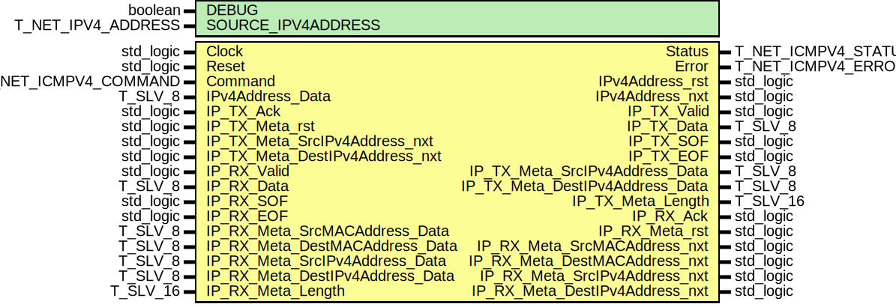

# Entity: icmpv4_Wrapper

## Diagram

## Description

EMACS settings: -*-  tab-width: 2; indent-tabs-mode: t -*-
vim: tabstop=2:shiftwidth=2:noexpandtab
kate: tab-width 2; replace-tabs off; indent-width 2;
=============================================================================
Authors:				 	Patrick Lehmann
Entity:				 	TODO
Description:
-------------------------------------
.. TODO:: No documentation available.
License:
=============================================================================
Copyright 2007-2015 Technische Universitaet Dresden - Germany
Licensed under the Apache License, Version 2.0 (the "License");
you may not use this file except in compliance with the License.
You may obtain a copy of the License at
Unless required by applicable law or agreed to in writing, software
distributed under the License is distributed on an "AS IS" BASIS,
WITHOUT WARRANTIES OR CONDITIONS OF ANY KIND, either express or implied.
See the License for the specific language governing permissions and
limitations under the License.
=============================================================================
## Generics

| Generic name       | Type               | Value                    | Description |
| ------------------ | ------------------ | ------------------------ | ----------- |
| DEBUG              | boolean            | FALSE                    |             |
| SOURCE_IPV4ADDRESS | T_NET_IPV4_ADDRESS | C_NET_IPV4_ADDRESS_EMPTY |             |
## Ports

| Port name                       | Direction | Type                 | Description                      |
| ------------------------------- | --------- | -------------------- | -------------------------------- |
| Clock                           | in        | std_logic            |                                  |
| Reset                           | in        | std_logic            |                                  |
| Command                         | in        | T_NET_ICMPV4_COMMAND | CSE interface                    |
| Status                          | out       | T_NET_ICMPV4_STATUS  |                                  |
| Error                           | out       | T_NET_ICMPV4_ERROR   |                                  |
| IPv4Address_rst                 | out       | std_logic            | Echo-Request destination address |
| IPv4Address_nxt                 | out       | std_logic            |                                  |
| IPv4Address_Data                | in        | T_SLV_8              |                                  |
| IP_TX_Valid                     | out       | std_logic            | to IPv4 layer                    |
| IP_TX_Data                      | out       | T_SLV_8              |                                  |
| IP_TX_SOF                       | out       | std_logic            |                                  |
| IP_TX_EOF                       | out       | std_logic            |                                  |
| IP_TX_Ack                       | in        | std_logic            |                                  |
| IP_TX_Meta_rst                  | in        | std_logic            |                                  |
| IP_TX_Meta_SrcIPv4Address_nxt   | in        | std_logic            |                                  |
| IP_TX_Meta_SrcIPv4Address_Data  | out       | T_SLV_8              |                                  |
| IP_TX_Meta_DestIPv4Address_nxt  | in        | std_logic            |                                  |
| IP_TX_Meta_DestIPv4Address_Data | out       | T_SLV_8              |                                  |
| IP_TX_Meta_Length               | out       | T_SLV_16             |                                  |
| IP_RX_Valid                     | in        | std_logic            | from IPv4 layer                  |
| IP_RX_Data                      | in        | T_SLV_8              |                                  |
| IP_RX_SOF                       | in        | std_logic            |                                  |
| IP_RX_EOF                       | in        | std_logic            |                                  |
| IP_RX_Ack                       | out       | std_logic            |                                  |
| IP_RX_Meta_rst                  | out       | std_logic            |                                  |
| IP_RX_Meta_SrcMACAddress_nxt    | out       | std_logic            |                                  |
| IP_RX_Meta_SrcMACAddress_Data   | in        | T_SLV_8              |                                  |
| IP_RX_Meta_DestMACAddress_nxt   | out       | std_logic            |                                  |
| IP_RX_Meta_DestMACAddress_Data  | in        | T_SLV_8              |                                  |
| IP_RX_Meta_SrcIPv4Address_nxt   | out       | std_logic            |                                  |
| IP_RX_Meta_SrcIPv4Address_Data  | in        | T_SLV_8              |                                  |
| IP_RX_Meta_DestIPv4Address_nxt  | out       | std_logic            |                                  |
| IP_RX_Meta_DestIPv4Address_Data | in        | T_SLV_8              |                                  |
| IP_RX_Meta_Length               | in        | T_SLV_16             |                                  |
## Signals

| Name                            | Type                    | Description |
| ------------------------------- | ----------------------- | ----------- |
| FSM_State                       | T_STATE                 |             |
| FSM_NextState                   | T_STATE                 |             |
| FSM_TX_Command                  | T_NET_ICMPV4_TX_COMMAND |             |
| TX_Status                       | T_NET_ICMPV4_TX_STATUS  |             |
| TX_Error                        | T_NET_ICMPV4_TX_ERROR   |             |
| FSM_RX_Command                  | T_NET_ICMPV4_RX_COMMAND |             |
| RX_Status                       | T_NET_ICMPV4_RX_STATUS  |             |
| RX_Error                        | T_NET_ICMPV4_RX_ERROR   |             |
| TX_Meta_rst                     | std_logic               |             |
| TX_Meta_IPv4Address_nxt         | std_logic               |             |
| FSM_TX_Meta_IPv4Address_Data    | T_SLV_8                 |             |
| FSM_TX_Meta_Type                | T_SLV_8                 |             |
| FSM_TX_Meta_Code                | T_SLV_8                 |             |
| FSM_TX_Meta_Identification      | T_SLV_16                |             |
| FSM_TX_Meta_SequenceNumber      | T_SLV_16                |             |
| TX_Meta_Payload_nxt             | std_logic               |             |
| FSM_TX_Meta_Payload_last        | std_logic               |             |
| FSM_TX_Meta_Payload_Data        | T_SLV_8                 |             |
| RX_Meta_rst                     | std_logic               |             |
| FSM_RX_Meta_rst                 | std_logic               |             |
| FSM_RX_Meta_SrcMACAddress_nxt   | std_logic               |             |
| RX_Meta_SrcMACAddress_Data      | T_SLV_8                 |             |
| FSM_RX_Meta_DestMACAddress_nxt  | std_logic               |             |
| RX_Meta_DestMACAddress_Data     | T_SLV_8                 |             |
| FSM_RX_Meta_SrcIPv4Address_nxt  | std_logic               |             |
| RX_Meta_SrcIPv4Address_Data     | T_SLV_8                 |             |
| FSM_RX_Meta_DestIPv4Address_nxt | std_logic               |             |
| RX_Meta_DestIPv4Address_Data    | T_SLV_8                 |             |
| RX_Meta_Length                  | T_SLV_16                |             |
| RX_Meta_Type                    | T_SLV_8                 |             |
| RX_Meta_Code                    | T_SLV_8                 |             |
| RX_Meta_Identification          | T_SLV_16                |             |
| RX_Meta_SequenceNumber          | T_SLV_16                |             |
| FSM_RX_Meta_Payload_nxt         | std_logic               |             |
| RX_Meta_Payload_last            | std_logic               |             |
| RX_Meta_Payload_Data            | T_SLV_8                 |             |
## Types

| Name    | Type                                                                                                                                                                                          | Description |
| ------- | --------------------------------------------------------------------------------------------------------------------------------------------------------------------------------------------- | ----------- |
| T_STATE | ( ST_IDLE, ST_SEND_ECHO_REQUEST, ST_SEND_ECHO_REQUEST_WAIT, ST_WAIT_FOR_ECHO_REPLY, ST_EVAL_ECHO_REPLY, ST_SEND_ECHO_REPLY, ST_SEND_ECHO_REPLY_WAIT, ST_SEND_ECHO_REPLY_FINISHED, ST_ERROR )  |             |
## Processes
- unnamed: ( Clock )
- unnamed: ( FSM_State,
					Command,
					TX_Status, TX_Error, TX_Meta_Payload_nxt,
					RX_Status, RX_Error, RX_Meta_Identification, RX_Meta_SequenceNumber, RX_Meta_Payload_Data, RX_Meta_Payload_last )
## Instantiations

- TX: PoC.icmpv4_TX
**Description**
=============================================================================
TX Path
=============================================================================

- RX: PoC.icmpv4_RX
**Description**
=============================================================================
RX Path
=============================================================================

