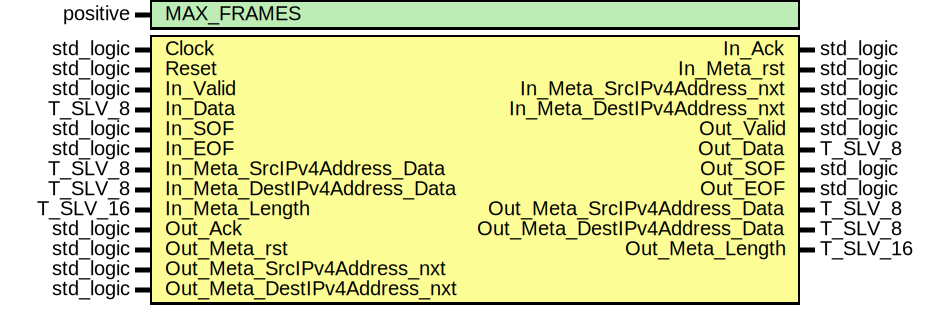

# Entity: ipv4_FrameLoopback

- **File**: ipv4_FrameLoopback.vhdl
## Diagram

## Description

 EMACS settings: -*-  tab-width: 2; indent-tabs-mode: t -*-
 vim: tabstop=2:shiftwidth=2:noexpandtab
 kate: tab-width 2; replace-tabs off; indent-width 2;
 =============================================================================
 Authors:				 	Patrick Lehmann

 Entity:				 	TODO

 Description:
 -------------------------------------
 .. TODO:: No documentation available.

 License:
 =============================================================================
 Copyright 2007-2015 Technische Universitaet Dresden - Germany
										 Chair of VLSI-Design, Diagnostics and Architecture

 Licensed under the Apache License, Version 2.0 (the "License");
 you may not use this file except in compliance with the License.
 You may obtain a copy of the License at

		http://www.apache.org/licenses/LICENSE-2.0

 Unless required by applicable law or agreed to in writing, software
 distributed under the License is distributed on an "AS IS" BASIS,
 WITHOUT WARRANTIES OR CONDITIONS OF ANY KIND, either express or implied.
 See the License for the specific language governing permissions and
 limitations under the License.
 =============================================================================
## Generics

| Generic name | Type     | Value | Description |
| ------------ | -------- | ----- | ----------- |
| MAX_FRAMES   | positive | 4     |             |
## Ports

| Port name                     | Direction | Type      | Description |
| ----------------------------- | --------- | --------- | ----------- |
| Clock                         | in        | std_logic |             |
| Reset                         | in        | std_logic |             |
| In_Valid                      | in        | std_logic | IN port     |
| In_Data                       | in        | T_SLV_8   |             |
| In_SOF                        | in        | std_logic |             |
| In_EOF                        | in        | std_logic |             |
| In_Ack                        | out       | std_logic |             |
| In_Meta_rst                   | out       | std_logic |             |
| In_Meta_SrcIPv4Address_nxt    | out       | std_logic |             |
| In_Meta_SrcIPv4Address_Data   | in        | T_SLV_8   |             |
| In_Meta_DestIPv4Address_nxt   | out       | std_logic |             |
| In_Meta_DestIPv4Address_Data  | in        | T_SLV_8   |             |
| In_Meta_Length                | in        | T_SLV_16  |             |
| Out_Valid                     | out       | std_logic | OUT port    |
| Out_Data                      | out       | T_SLV_8   |             |
| Out_SOF                       | out       | std_logic |             |
| Out_EOF                       | out       | std_logic |             |
| Out_Ack                       | in        | std_logic |             |
| Out_Meta_rst                  | in        | std_logic |             |
| Out_Meta_SrcIPv4Address_nxt   | in        | std_logic |             |
| Out_Meta_SrcIPv4Address_Data  | out       | T_SLV_8   |             |
| Out_Meta_DestIPv4Address_nxt  | in        | std_logic |             |
| Out_Meta_DestIPv4Address_Data | out       | T_SLV_8   |             |
| Out_Meta_Length               | out       | T_SLV_16  |             |
## Signals

| Name                | Type                                            | Description |
| ------------------- | ----------------------------------------------- | ----------- |
| StmBuf_MetaIn_nxt   | std_logic_vector(META_BITS'length - 1 downto 0) |             |
| StmBuf_MetaIn_Data  | std_logic_vector(isum(META_BITS) - 1 downto 0)  |             |
| StmBuf_MetaOut_nxt  | std_logic_vector(META_BITS'length - 1 downto 0) |             |
| StmBuf_MetaOut_Data | std_logic_vector(isum(META_BITS) - 1 downto 0)  |             |
## Constants

| Name                   | Type     | Value                                                                                                                                                                        | Description |
| ---------------------- | -------- | ---------------------------------------------------------------------------------------------------------------------------------------------------------------------------- | ----------- |
| META_STREAMID_SRCADDR  | natural  |  0                                                                                                                                                                           |             |
| META_STREAMID_DESTADDR | natural  |  1                                                                                                                                                                           |             |
| META_STREAMID_LENGTH   | natural  |  2                                                                                                                                                                           |             |
| META_BITS              | T_POSVEC |  ( 		META_STREAMID_SRCADDR			=> 8,  		META_STREAMID_DESTADDR		=> 8,  		META_STREAMID_LENGTH			=> 16 	) |             |
| META_FIFO_DEPTHS       | T_POSVEC |  ( 		META_STREAMID_SRCADDR			=> 4,  		META_STREAMID_DESTADDR		=> 4,  		META_STREAMID_LENGTH			=> 1 	)  |             |
## Instantiations

- StmBuf: PoC.stream_Buffer
