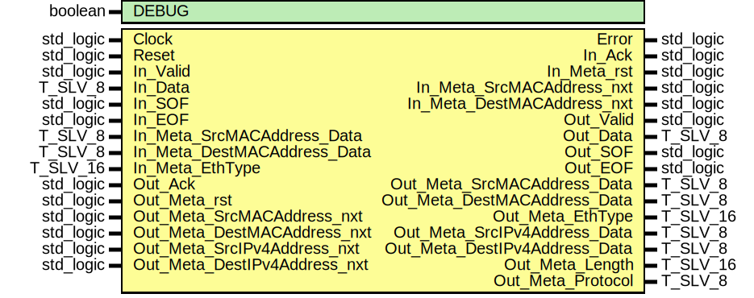

# Entity: ipv4_RX

## Diagram

## Description

EMACS settings: -*-  tab-width: 2; indent-tabs-mode: t -*-
vim: tabstop=2:shiftwidth=2:noexpandtab
kate: tab-width 2; replace-tabs off; indent-width 2;
=============================================================================
Authors:				 	Patrick Lehmann
Entity:				 	TODO
Description:
-------------------------------------
.. TODO:: No documentation available.
License:
=============================================================================
Copyright 2007-2015 Technische Universitaet Dresden - Germany
Licensed under the Apache License, Version 2.0 (the "License");
you may not use this file except in compliance with the License.
You may obtain a copy of the License at
Unless required by applicable law or agreed to in writing, software
distributed under the License is distributed on an "AS IS" BASIS,
WITHOUT WARRANTIES OR CONDITIONS OF ANY KIND, either express or implied.
See the License for the specific language governing permissions and
limitations under the License.
=============================================================================
## Generics

| Generic name | Type    | Value | Description |
| ------------ | ------- | ----- | ----------- |
| DEBUG        | boolean | FALSE |             |
## Ports

| Port name                     | Direction | Type      | Description |
| ----------------------------- | --------- | --------- | ----------- |
| Clock                         | in        | std_logic |             |
| Reset                         | in        | std_logic |             |
| Error                         | out       | std_logic | STATUS port |
| In_Valid                      | in        | std_logic | IN port     |
| In_Data                       | in        | T_SLV_8   |             |
| In_SOF                        | in        | std_logic |             |
| In_EOF                        | in        | std_logic |             |
| In_Ack                        | out       | std_logic |             |
| In_Meta_rst                   | out       | std_logic |             |
| In_Meta_SrcMACAddress_nxt     | out       | std_logic |             |
| In_Meta_SrcMACAddress_Data    | in        | T_SLV_8   |             |
| In_Meta_DestMACAddress_nxt    | out       | std_logic |             |
| In_Meta_DestMACAddress_Data   | in        | T_SLV_8   |             |
| In_Meta_EthType               | in        | T_SLV_16  |             |
| Out_Valid                     | out       | std_logic | OUT port    |
| Out_Data                      | out       | T_SLV_8   |             |
| Out_SOF                       | out       | std_logic |             |
| Out_EOF                       | out       | std_logic |             |
| Out_Ack                       | in        | std_logic |             |
| Out_Meta_rst                  | in        | std_logic |             |
| Out_Meta_SrcMACAddress_nxt    | in        | std_logic |             |
| Out_Meta_SrcMACAddress_Data   | out       | T_SLV_8   |             |
| Out_Meta_DestMACAddress_nxt   | in        | std_logic |             |
| Out_Meta_DestMACAddress_Data  | out       | T_SLV_8   |             |
| Out_Meta_EthType              | out       | T_SLV_16  |             |
| Out_Meta_SrcIPv4Address_nxt   | in        | std_logic |             |
| Out_Meta_SrcIPv4Address_Data  | out       | T_SLV_8   |             |
| Out_Meta_DestIPv4Address_nxt  | in        | std_logic |             |
| Out_Meta_DestIPv4Address_Data | out       | T_SLV_8   |             |
| Out_Meta_Length               | out       | T_SLV_16  |             |
| Out_Meta_Protocol             | out       | T_SLV_8   |             |
## Signals

| Name                       | Type                                            | Description       |
| -------------------------- | ----------------------------------------------- | ----------------- |
| State                      | T_STATE                                         |                   |
| NextState                  | T_STATE                                         |                   |
| In_Ack_i                   | std_logic                                       |                   |
| Is_DataFlow                | std_logic                                       |                   |
| Is_SOF                     | std_logic                                       |                   |
| Is_EOF                     | std_logic                                       |                   |
| Out_Valid_i                | std_logic                                       |                   |
| Out_SOF_i                  | std_logic                                       |                   |
| Out_EOF_i                  | std_logic                                       |                   |
| IP_ByteIndex               | T_IPV4_BYTEINDEX                                |                   |
| Register_rst               | std_logic                                       |                   |
| HeaderLength_en            | std_logic                                       | IPv4 Basic Header |
| TypeOfService_en           | std_logic                                       |                   |
| TotalLength_en0            | std_logic                                       |                   |
| TotalLength_en1            | std_logic                                       |                   |
| Flags_en                   | std_logic                                       |                   |
| TimeToLive_en              | std_logic                                       |                   |
| Protocol_en                | std_logic                                       |                   |
| HeaderChecksum_en0         | std_logic                                       |                   |
| HeaderChecksum_en1         | std_logic                                       |                   |
| SourceIPv4Address_en       | std_logic                                       |                   |
| DestIPv4Address_en         | std_logic                                       |                   |
| HeaderLength_d             | T_SLV_4                                         |                   |
| TypeOfService_d            | T_SLV_8                                         |                   |
| TotalLength_d              | T_SLV_16                                        |                   |
| Flag_DontFragment_d        | std_logic                                       |                   |
| Flag_MoreFragmenta_d       | std_logic                                       |                   |
| TimeToLive_d               | T_SLV_8                                         |                   |
| Protocol_d                 | T_SLV_8                                         |                   |
| HeaderChecksum_d           | T_SLV_16                                        |                   |
| SourceIPv4Address_d        | T_NET_IPV4_ADDRESS                              |                   |
| DestIPv4Address_d          | T_NET_IPV4_ADDRESS                              |                   |
| IPv4SeqCounter_rst         | std_logic                                       |                   |
| IPv4SeqCounter_en          | std_logic                                       |                   |
| IPv4SeqCounter_us          | unsigned(IPV4_ADDRESS_READER_BITS - 1 downto 0) |                   |
| SrcIPv4Address_Reader_rst  | std_logic                                       |                   |
| SrcIPv4Address_Reader_en   | std_logic                                       |                   |
| SrcIPv4Address_Reader_us   | unsigned(IPV4_ADDRESS_READER_BITS - 1 downto 0) |                   |
| DestIPv4Address_Reader_rst | std_logic                                       |                   |
| DestIPv4Address_Reader_en  | std_logic                                       |                   |
| DestIPv4Address_Reader_us  | unsigned(IPV4_ADDRESS_READER_BITS - 1 downto 0) |                   |
## Constants

| Name                     | Type     | Value                            | Description     |
| ------------------------ | -------- | -------------------------------- | --------------- |
| IPV4_ADDRESS_LENGTH      | positive |  4                               | IPv4 -> 4 bytes |
| IPV4_ADDRESS_READER_BITS | positive |  log2ceilnz(IPV4_ADDRESS_LENGTH) |                 |
## Types

| Name    | Type                                                                                                                                                                                                                                                                                                                                                                                                                                                                                                                                                                                                                                                                                                                                                                                                                                                                                                                                                                                                                                                                                                   | Description |
| ------- | ------------------------------------------------------------------------------------------------------------------------------------------------------------------------------------------------------------------------------------------------------------------------------------------------------------------------------------------------------------------------------------------------------------------------------------------------------------------------------------------------------------------------------------------------------------------------------------------------------------------------------------------------------------------------------------------------------------------------------------------------------------------------------------------------------------------------------------------------------------------------------------------------------------------------------------------------------------------------------------------------------------------------------------------------------------------------------------------------------ | ----------- |
| T_STATE | ( ST_IDLE,  ST_RECEIVE_TYPE_OF_SERVICE, 		ST_RECEIVE_TOTAL_LENGTH_0, 		ST_RECEIVE_TOTAL_LENGTH_1,  ST_RECEIVE_IDENTIFICATION_0, 	ST_RECEIVE_IDENTIFICATION_1, 	ST_RECEIVE_FLAGS, 							ST_RECEIVE_FRAGMENT_OFFSET_1,  ST_RECEIVE_TIME_TO_LIVE, 			ST_RECEIVE_PROTOCOL, 					ST_RECEIVE_HEADER_CHECKSUM_0, 	ST_RECEIVE_HEADER_CHECKSUM_1,  ST_RECEIVE_SOURCE_ADDRESS,  ST_RECEIVE_DESTINATION_ADDRESS,  ST_RECEIVE_DATA_1, 						ST_RECEIVE_DATA_N,  ST_DISCARD_FRAME,  ST_ERROR )  |             |
## Processes
- unnamed: ( Clock )
- unnamed: ( State, Is_DataFlow, Is_SOF, Is_EOF, In_Valid, In_Data, In_EOF, IPv4SeqCounter_us, Out_Ack )
- unnamed: ( Clock )
- unnamed: ( Clock )
- unnamed: ( Clock )
- unnamed: ( Clock )
