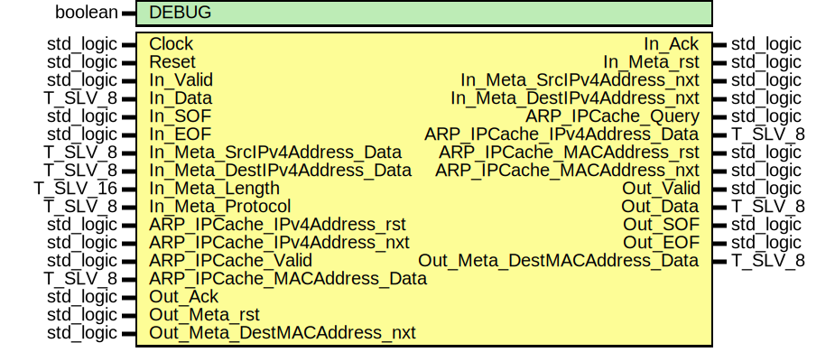

# Entity: ipv4_TX
## Diagram

## Generics
| Generic name | Type    | Value | Description |
| ------------ | ------- | ----- | ----------- |
| DEBUG        | boolean | FALSE |             |
## Ports
| Port name                    | Direction | Type      | Description |
| ---------------------------- | --------- | --------- | ----------- |
| Clock                        | in        | std_logic |             |
| Reset                        | in        | std_logic |             |
| In_Valid                     | in        | std_logic |             |
| In_Data                      | in        | T_SLV_8   |             |
| In_SOF                       | in        | std_logic |             |
| In_EOF                       | in        | std_logic |             |
| In_Ack                       | out       | std_logic |             |
| In_Meta_rst                  | out       | std_logic |             |
| In_Meta_SrcIPv4Address_nxt   | out       | std_logic |             |
| In_Meta_SrcIPv4Address_Data  | in        | T_SLV_8   |             |
| In_Meta_DestIPv4Address_nxt  | out       | std_logic |             |
| In_Meta_DestIPv4Address_Data | in        | T_SLV_8   |             |
| In_Meta_Length               | in        | T_SLV_16  |             |
| In_Meta_Protocol             | in        | T_SLV_8   |             |
| ARP_IPCache_Query            | out       | std_logic |             |
| ARP_IPCache_IPv4Address_rst  | in        | std_logic |             |
| ARP_IPCache_IPv4Address_nxt  | in        | std_logic |             |
| ARP_IPCache_IPv4Address_Data | out       | T_SLV_8   |             |
| ARP_IPCache_Valid            | in        | std_logic |             |
| ARP_IPCache_MACAddress_rst   | out       | std_logic |             |
| ARP_IPCache_MACAddress_nxt   | out       | std_logic |             |
| ARP_IPCache_MACAddress_Data  | in        | T_SLV_8   |             |
| Out_Valid                    | out       | std_logic |             |
| Out_Data                     | out       | T_SLV_8   |             |
| Out_SOF                      | out       | std_logic |             |
| Out_EOF                      | out       | std_logic |             |
| Out_Ack                      | in        | std_logic |             |
| Out_Meta_rst                 | in        | std_logic |             |
| Out_Meta_DestMACAddress_nxt  | in        | std_logic |             |
| Out_Meta_DestMACAddress_Data | out       | T_SLV_8   |             |
## Signals
| Name                   | Type                                | Description |
| ---------------------- | ----------------------------------- | ----------- |
| State                  | T_STATE                             |             |
| NextState              | T_STATE                             |             |
| In_Ack_i               | std_logic                           |             |
| UpperLayerPacketLength | std_logic_vector(15 downto 0)       |             |
| InternetHeaderLength   | T_SLV_4                             |             |
| TypeOfService          | T_NET_IPV4_TYPE_OF_SERVICE          |             |
| TotalLength            | T_SLV_16                            |             |
| Identification         | T_SLV_16                            |             |
| Flag_DontFragment      | std_logic                           |             |
| Flag_MoreFragments     | std_logic                           |             |
| FragmentOffset         | std_logic_vector(12 downto 0)       |             |
| TimeToLive             | T_SLV_8                             |             |
| Protocol               | T_SLV_8                             |             |
| HeaderChecksum         | T_SLV_16                            |             |
| IPv4SeqCounter_rst     | std_logic                           |             |
| IPv4SeqCounter_en      | std_logic                           |             |
| IPv4SeqCounter_us      | unsigned(1 downto 0)                |             |
| Checksum_rst           | std_logic                           |             |
| Checksum_en            | std_logic                           |             |
| Checksum_Addend0_us    | unsigned(T_SLV_8'range)             |             |
| Checksum_Addend1_us    | unsigned(T_SLV_8'range)             |             |
| Checksum0_nxt0_us      | unsigned(T_SLV_8'high + 1 downto 0) |             |
| Checksum0_nxt1_us      | unsigned(T_SLV_8'high + 1 downto 0) |             |
| Checksum0_d_us         | unsigned(T_SLV_8'high downto 0)     |             |
| Checksum0_cy           | unsigned(T_SLV_2'range)             |             |
| Checksum1_nxt_us       | unsigned(T_SLV_8'range)             |             |
| Checksum1_d_us         | unsigned(T_SLV_8'range)             |             |
| Checksum0_cy0          | std_logic                           |             |
| Checksum0_cy0_d        | std_logic                           |             |
| Checksum0_cy1          | std_logic                           |             |
| Checksum0_cy1_d        | std_logic                           |             |
| Checksum_i             | T_SLV_16                            |             |
| Checksum               | T_SLV_16                            |             |
| Checksum_mux_rst       | std_logic                           |             |
| Checksum_mux_set       | std_logic                           |             |
| Checksum_mux_r         | std_logic                           |             |
## Types
| Name    | Type                                                                                                                                                                                                                                                                                                                                                                                                                                                                                                                                                                                                                                                                                                                                                                                                                                                                              | Description |
| ------- | --------------------------------------------------------------------------------------------------------------------------------------------------------------------------------------------------------------------------------------------------------------------------------------------------------------------------------------------------------------------------------------------------------------------------------------------------------------------------------------------------------------------------------------------------------------------------------------------------------------------------------------------------------------------------------------------------------------------------------------------------------------------------------------------------------------------------------------------------------------------------------- | ----------- |
| T_STATE | ( 		ST_IDLE, 			ST_ARP_QUERY,									ST_ARP_QUERY_WAIT, 			ST_CHECKSUM_IPV4_ADDRESSES, 				ST_CHECKSUM_IPVERSION_LENGTH_0,							ST_CHECKSUM_TYPE_OF_SERVICE_LENGTH_1, 				ST_CHECKSUM_IDENTIFICAION_FRAGMENTOFFSET_0,	ST_CHECKSUM_IDENTIFICAION_FRAGMENTOFFSET_1, 				ST_CHECKSUM_TIME_TO_LIVE,				ST_CHECKSUM_PROTOCOL, 			ST_CARRY_0, ST_CARRY_1, 			ST_SEND_VERSION,							ST_SEND_TYPE_OF_SERVICE,	ST_SEND_TOTAL_LENGTH_0,			ST_SEND_TOTAL_LENGTH_1, 			ST_SEND_IDENTIFICATION_0,			ST_SEND_IDENTIFICATION_1,	ST_SEND_FLAGS,							ST_SEND_FRAGMENT_OFFSET, 			ST_SEND_TIME_TO_LIVE,					ST_SEND_PROTOCOL,					ST_SEND_HEADER_CHECKSUM_0,	ST_SEND_HEADER_CHECKSUM_1, 			ST_SEND_SOURCE_ADDRESS, 			ST_SEND_DESTINATION_ADDRESS, 			ST_SEND_OPTIONS_0,						ST_SEND_OPTIONS_1,				ST_SEND_OPTIONS_2,					ST_SEND_PADDING, 			ST_SEND_DATA, 		ST_DISCARD_FRAME, 		ST_ERROR 	) |             |
## Processes
- unnamed: _( Clock )_

- unnamed: _( State, In_Valid, In_SOF, In_EOF, In_Data,
					In_Meta_Length,
					Out_Ack, Out_Meta_rst, Out_Meta_DestMACAddress_nxt,
					ARP_IPCache_Valid, ARP_IPCache_IPv4Address_rst, ARP_IPCache_IPv4Address_nxt, ARP_IPCache_MACAddress_Data,
					In_Meta_DestIPv4Address_Data, In_Meta_SrcIPv4Address_Data, In_Meta_Protocol,
					InternetHeaderLength, UpperLayerPacketLength, TypeOfService, Flag_DontFragment, Flag_MoreFragments,
					Identification, FragmentOffset, TimeToLive, Protocol,
					IPv4SeqCounter_us, Checksum0_cy, Checksum )_

- unnamed: _( Clock )_

- unnamed: _( Clock )_

- unnamed: _( Clock )_

