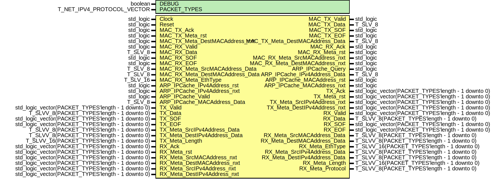

# Entity: ipv4_Wrapper

- **File**: ipv4_Wrapper.vhdl
## Diagram

## Description

EMACS settings: -*-  tab-width: 2; indent-tabs-mode: t -*-
vim: tabstop=2:shiftwidth=2:noexpandtab
kate: tab-width 2; replace-tabs off; indent-width 2;
=============================================================================
Authors:				 	Patrick Lehmann
Entity:				 	TODO
Description:
-------------------------------------
.. TODO:: No documentation available.
License:
=============================================================================
Copyright 2007-2015 Technische Universitaet Dresden - Germany
Licensed under the Apache License, Version 2.0 (the "License");
you may not use this file except in compliance with the License.
You may obtain a copy of the License at
Unless required by applicable law or agreed to in writing, software
distributed under the License is distributed on an "AS IS" BASIS,
WITHOUT WARRANTIES OR CONDITIONS OF ANY KIND, either express or implied.
See the License for the specific language governing permissions and
limitations under the License.
=============================================================================
## Generics

| Generic name | Type                       | Value        | Description |
| ------------ | -------------------------- | ------------ | ----------- |
| DEBUG        | boolean                    | FALSE        |             |
| PACKET_TYPES | T_NET_IPV4_PROTOCOL_VECTOR | (0 => x"00") |             |
## Ports

| Port name                       | Direction | Type                                               | Description      |
| ------------------------------- | --------- | -------------------------------------------------- | ---------------- |
| Clock                           | in        | std_logic                                          |                  |
| Reset                           | in        | std_logic                                          |                  |
| MAC_TX_Valid                    | out       | std_logic                                          | to MAC layer     |
| MAC_TX_Data                     | out       | T_SLV_8                                            |                  |
| MAC_TX_SOF                      | out       | std_logic                                          |                  |
| MAC_TX_EOF                      | out       | std_logic                                          |                  |
| MAC_TX_Ack                      | in        | std_logic                                          |                  |
| MAC_TX_Meta_rst                 | in        | std_logic                                          |                  |
| MAC_TX_Meta_DestMACAddress_nxt  | in        | std_logic                                          |                  |
| MAC_TX_Meta_DestMACAddress_Data | out       | T_SLV_8                                            |                  |
| MAC_RX_Valid                    | in        | std_logic                                          | from MAC layer   |
| MAC_RX_Data                     | in        | T_SLV_8                                            |                  |
| MAC_RX_SOF                      | in        | std_logic                                          |                  |
| MAC_RX_EOF                      | in        | std_logic                                          |                  |
| MAC_RX_Ack                      | out       | std_logic                                          |                  |
| MAC_RX_Meta_rst                 | out       | std_logic                                          |                  |
| MAC_RX_Meta_SrcMACAddress_nxt   | out       | std_logic                                          |                  |
| MAC_RX_Meta_SrcMACAddress_Data  | in        | T_SLV_8                                            |                  |
| MAC_RX_Meta_DestMACAddress_nxt  | out       | std_logic                                          |                  |
| MAC_RX_Meta_DestMACAddress_Data | in        | T_SLV_8                                            |                  |
| MAC_RX_Meta_EthType             | in        | T_SLV_16                                           |                  |
| ARP_IPCache_Query               | out       | std_logic                                          | to ARP           |
| ARP_IPCache_IPv4Address_rst     | in        | std_logic                                          |                  |
| ARP_IPCache_IPv4Address_nxt     | in        | std_logic                                          |                  |
| ARP_IPCache_IPv4Address_Data    | out       | T_SLV_8                                            |                  |
| ARP_IPCache_Valid               | in        | std_logic                                          | from ARP         |
| ARP_IPCache_MACAddress_rst      | out       | std_logic                                          |                  |
| ARP_IPCache_MACAddress_nxt      | out       | std_logic                                          |                  |
| ARP_IPCache_MACAddress_Data     | in        | T_SLV_8                                            |                  |
| TX_Valid                        | in        | std_logic_vector(PACKET_TYPES'length - 1 downto 0) | from upper layer |
| TX_Data                         | in        | T_SLVV_8(PACKET_TYPES'length - 1 downto 0)         |                  |
| TX_SOF                          | in        | std_logic_vector(PACKET_TYPES'length - 1 downto 0) |                  |
| TX_EOF                          | in        | std_logic_vector(PACKET_TYPES'length - 1 downto 0) |                  |
| TX_Ack                          | out       | std_logic_vector(PACKET_TYPES'length - 1 downto 0) |                  |
| TX_Meta_rst                     | out       | std_logic_vector(PACKET_TYPES'length - 1 downto 0) |                  |
| TX_Meta_SrcIPv4Address_nxt      | out       | std_logic_vector(PACKET_TYPES'length - 1 downto 0) |                  |
| TX_Meta_SrcIPv4Address_Data     | in        | T_SLVV_8(PACKET_TYPES'length - 1 downto 0)         |                  |
| TX_Meta_DestIPv4Address_nxt     | out       | std_logic_vector(PACKET_TYPES'length - 1 downto 0) |                  |
| TX_Meta_DestIPv4Address_Data    | in        | T_SLVV_8(PACKET_TYPES'length - 1 downto 0)         |                  |
| TX_Meta_Length                  | in        | T_SLVV_16(PACKET_TYPES'length - 1 downto 0)        |                  |
| RX_Valid                        | out       | std_logic_vector(PACKET_TYPES'length - 1 downto 0) | to upper layer   |
| RX_Data                         | out       | T_SLVV_8(PACKET_TYPES'length - 1 downto 0)         |                  |
| RX_SOF                          | out       | std_logic_vector(PACKET_TYPES'length - 1 downto 0) |                  |
| RX_EOF                          | out       | std_logic_vector(PACKET_TYPES'length - 1 downto 0) |                  |
| RX_Ack                          | in        | std_logic_vector(PACKET_TYPES'length - 1 downto 0) |                  |
| RX_Meta_rst                     | in        | std_logic_vector(PACKET_TYPES'length - 1 downto 0) |                  |
| RX_Meta_SrcMACAddress_nxt       | in        | std_logic_vector(PACKET_TYPES'length - 1 downto 0) |                  |
| RX_Meta_SrcMACAddress_Data      | out       | T_SLVV_8(PACKET_TYPES'length - 1 downto 0)         |                  |
| RX_Meta_DestMACAddress_nxt      | in        | std_logic_vector(PACKET_TYPES'length - 1 downto 0) |                  |
| RX_Meta_DestMACAddress_Data     | out       | T_SLVV_8(PACKET_TYPES'length - 1 downto 0)         |                  |
| RX_Meta_EthType                 | out       | T_SLVV_16(PACKET_TYPES'length - 1 downto 0)        |                  |
| RX_Meta_SrcIPv4Address_nxt      | in        | std_logic_vector(PACKET_TYPES'length - 1 downto 0) |                  |
| RX_Meta_SrcIPv4Address_Data     | out       | T_SLVV_8(PACKET_TYPES'length - 1 downto 0)         |                  |
| RX_Meta_DestIPv4Address_nxt     | in        | std_logic_vector(PACKET_TYPES'length - 1 downto 0) |                  |
| RX_Meta_DestIPv4Address_Data    | out       | T_SLVV_8(PACKET_TYPES'length - 1 downto 0)         |                  |
| RX_Meta_Length                  | out       | T_SLVV_16(PACKET_TYPES'length - 1 downto 0)        |                  |
| RX_Meta_Protocol                | out       | T_SLVV_8(PACKET_TYPES'length - 1 downto 0)         |                  |
## Signals

| Name                                 | Type                                                                                                             | Description                                                                                   |
| ------------------------------------ | ---------------------------------------------------------------------------------------------------------------- | --------------------------------------------------------------------------------------------- |
| StmMux_In_Valid                      | std_logic_vector(IPV4_SWITCH_PORTS - 1 downto 0)                                                                 |                                                                                               |
| StmMux_In_Data                       | T_SLM(IPV4_SWITCH_PORTS - 1 downto 0,  T_SLV_8'range)                         | necessary default assignment 'Z' to get correct simulation results (iSIM, vSIM, ghdl/gtkwave) |
| StmMux_In_Meta                       | T_SLM(IPV4_SWITCH_PORTS - 1 downto 0,  isum(TXSTMMUX_META_BITS) - 1 downto 0) | necessary default assignment 'Z' to get correct simulation results (iSIM, vSIM, ghdl/gtkwave) |
| StmMux_In_Meta_rev                   | T_SLM(IPV4_SWITCH_PORTS - 1 downto 0,  TXSTMMUX_META_REV_BITS - 1 downto 0)   | necessary default assignment 'Z' to get correct simulation results (iSIM, vSIM, ghdl/gtkwave) |
| StmMux_In_SOF                        | std_logic_vector(IPV4_SWITCH_PORTS - 1 downto 0)                                                                 |                                                                                               |
| StmMux_In_EOF                        | std_logic_vector(IPV4_SWITCH_PORTS - 1 downto 0)                                                                 |                                                                                               |
| StmMux_In_Ack                        | std_logic_vector(IPV4_SWITCH_PORTS - 1 downto 0)                                                                 |                                                                                               |
| TX_StmMux_Valid                      | std_logic                                                                                                        |                                                                                               |
| TX_StmMux_Data                       | T_SLV_8                                                                                                          |                                                                                               |
| TX_StmMux_Meta                       | std_logic_vector(isum(TXSTMMUX_META_BITS) - 1 downto 0)                                                          |                                                                                               |
| TX_StmMux_Meta_rev                   | std_logic_vector(TXSTMMUX_META_REV_BITS - 1 downto 0)                                                            |                                                                                               |
| TX_StmMux_SOF                        | std_logic                                                                                                        |                                                                                               |
| TX_StmMux_EOF                        | std_logic                                                                                                        |                                                                                               |
| TX_StmMux_SrcIPv4Address_Data        | T_SLV_8                                                                                                          |                                                                                               |
| TX_StmMux_DestIPv4Address_Data       | T_SLV_8                                                                                                          |                                                                                               |
| TX_StmMux_Length                     | T_SLV_16                                                                                                         |                                                                                               |
| TX_StmMux_Protocol                   | T_SLV_8                                                                                                          |                                                                                               |
| IPv4_TX_Ack                          | std_logic                                                                                                        |                                                                                               |
| IPv4_TX_Meta_rst                     | std_logic                                                                                                        |                                                                                               |
| IPv4_TX_Meta_SrcIPv4Address_nxt      | std_logic                                                                                                        |                                                                                               |
| IPv4_TX_Meta_DestIPv4Address_nxt     | std_logic                                                                                                        |                                                                                               |
| IPv4_RX_Valid                        | std_logic                                                                                                        |                                                                                               |
| IPv4_RX_Data                         | T_SLV_8                                                                                                          |                                                                                               |
| IPv4_RX_SOF                          | std_logic                                                                                                        |                                                                                               |
| IPv4_RX_EOF                          | std_logic                                                                                                        |                                                                                               |
| IPv4_RX_Meta_SrcMACAddress_Data      | T_SLV_8                                                                                                          |                                                                                               |
| IPv4_RX_Meta_DestMACAddress_Data     | T_SLV_8                                                                                                          |                                                                                               |
| IPv4_RX_Meta_EthType                 | T_SLV_16                                                                                                         |                                                                                               |
| IPv4_RX_Meta_SrcIPv4Address_Data     | T_SLV_8                                                                                                          |                                                                                               |
| IPv4_RX_Meta_DestIPv4Address_Data    | T_SLV_8                                                                                                          |                                                                                               |
| IPv4_RX_Meta_Length                  | T_SLV_16                                                                                                         |                                                                                               |
| IPv4_RX_Meta_Protocol                | T_SLV_8                                                                                                          |                                                                                               |
| RX_StmDeMux_Ack                      | std_logic                                                                                                        |                                                                                               |
| RX_StmDeMux_Meta_rst                 | std_logic                                                                                                        |                                                                                               |
| RX_StmDeMux_Meta_SrcMACAddress_nxt   | std_logic                                                                                                        |                                                                                               |
| RX_StmDeMux_Meta_DestMACAddress_nxt  | std_logic                                                                                                        |                                                                                               |
| RX_StmDeMux_Meta_SrcIPv4Address_nxt  | std_logic                                                                                                        |                                                                                               |
| RX_StmDeMux_Meta_DestIPv4Address_nxt | std_logic                                                                                                        |                                                                                               |
| RX_StmDeMux_MetaIn                   | std_logic_vector(isum(STMDEMUX_META_BITS) - 1 downto 0)                                                          |                                                                                               |
| RX_StmDeMux_MetaIn_rev               | std_logic_vector(STMDEMUX_META_REV_BITS - 1 downto 0)                                                            |                                                                                               |
| RX_StmDeMux_Data                     | T_SLM(IPV4_SWITCH_PORTS - 1 downto 0,  STMDEMUX_DATA_BITS - 1 downto 0)       | necessary default assignment 'Z' to get correct simulation results (iSIM, vSIM, ghdl/gtkwave) |
| RX_StmDeMux_MetaOut                  | T_SLM(IPV4_SWITCH_PORTS - 1 downto 0,  isum(STMDEMUX_META_BITS) - 1 downto 0) | necessary default assignment 'Z' to get correct simulation results (iSIM, vSIM, ghdl/gtkwave) |
| RX_StmDeMux_MetaOut_rev              | T_SLM(IPV4_SWITCH_PORTS - 1 downto 0,  STMDEMUX_META_REV_BITS - 1 downto 0)   | necessary default assignment 'Z' to get correct simulation results (iSIM, vSIM, ghdl/gtkwave) |
| StmDeMux_Control                     | std_logic_vector(IPV4_SWITCH_PORTS - 1 downto 0)                                                                 |                                                                                               |
## Constants

| Name                            | Type     | Value                                                                                                                                                                                                                                                                                                                                                                                                                                                                                                             | Description                                         |
| ------------------------------- | -------- | ----------------------------------------------------------------------------------------------------------------------------------------------------------------------------------------------------------------------------------------------------------------------------------------------------------------------------------------------------------------------------------------------------------------------------------------------------------------------------------------------------------------- | --------------------------------------------------- |
| IPV4_SWITCH_PORTS               | positive |  PACKET_TYPES'length                                                                                                                                                                                                                                                                                                                                                                                                                                                                                              |                                                     |
| TXSTMMUX_META_STREAMID_SRCADR   | natural  |  0                                                                                                                                                                                                                                                                                                                                                                                                                                                                                                                |                                                     |
| TXSTMMUX_META_STREAMID_DESTADR  | natural  |  1                                                                                                                                                                                                                                                                                                                                                                                                                                                                                                                |                                                     |
| TXSTMMUX_META_STREAMID_LENGTH   | natural  |  2                                                                                                                                                                                                                                                                                                                                                                                                                                                                                                                |                                                     |
| TXSTMMUX_META_STREAMID_PROTOCOL | natural  |  3                                                                                                                                                                                                                                                                                                                                                                                                                                                                                                                |                                                     |
| TXSTMMUX_META_BITS              | T_POSVEC |  ( 		TXSTMMUX_META_STREAMID_SRCADR			=> 8,  		TXSTMMUX_META_STREAMID_DESTADR		=> 8,  		TXSTMMUX_META_STREAMID_LENGTH			=> 16,  		TXSTMMUX_META_STREAMID_PROTOCOL		=> 8 	)                                                                                                                                                                                                                                |                                                     |
| TXSTMMUX_META_RST_BIT           | natural  |  0                                                                                                                                                                                                                                                                                                                                                                                                                                                                                                                |                                                     |
| TXSTMMUX_META_SRC_NXT_BIT       | natural  |  1                                                                                                                                                                                                                                                                                                                                                                                                                                                                                                                |                                                     |
| TXSTMMUX_META_DEST_NXT_BIT      | natural  |  2                                                                                                                                                                                                                                                                                                                                                                                                                                                                                                                |                                                     |
| TXSTMMUX_META_REV_BITS          | natural  |  3                                                                                                                                                                                                                                                                                                                                                                                                                                                                                                                |                                                     |
| STMDEMUX_META_RST_BIT           | natural  |  0                                                                                                                                                                                                                                                                                                                                                                                                                                                                                                                |                                                     |
| STMDEMUX_META_MACSRC_NXT_BIT    | natural  |  1                                                                                                                                                                                                                                                                                                                                                                                                                                                                                                                |                                                     |
| STMDEMUX_META_MACDEST_NXT_BIT   | natural  |  2                                                                                                                                                                                                                                                                                                                                                                                                                                                                                                                |                                                     |
| STMDEMUX_META_IPV4SRC_NXT_BIT   | natural  |  3                                                                                                                                                                                                                                                                                                                                                                                                                                                                                                                |                                                     |
| STMDEMUX_META_IPV4DEST_NXT_BIT  | natural  |  4                                                                                                                                                                                                                                                                                                                                                                                                                                                                                                                |                                                     |
| STMDEMUX_META_STREAMID_SRCMAC   | natural  |  0                                                                                                                                                                                                                                                                                                                                                                                                                                                                                                                |                                                     |
| STMDEMUX_META_STREAMID_DESTMAC  | natural  |  1                                                                                                                                                                                                                                                                                                                                                                                                                                                                                                                |                                                     |
| STMDEMUX_META_STREAMID_ETHTYPE  | natural  |  2                                                                                                                                                                                                                                                                                                                                                                                                                                                                                                                |                                                     |
| STMDEMUX_META_STREAMID_SRCIP    | natural  |  3                                                                                                                                                                                                                                                                                                                                                                                                                                                                                                                |                                                     |
| STMDEMUX_META_STREAMID_DESTIP   | natural  |  4                                                                                                                                                                                                                                                                                                                                                                                                                                                                                                                |                                                     |
| STMDEMUX_META_STREAMID_LENGTH   | natural  |  5                                                                                                                                                                                                                                                                                                                                                                                                                                                                                                                |                                                     |
| STMDEMUX_META_STREAMID_PROTO    | natural  |  6                                                                                                                                                                                                                                                                                                                                                                                                                                                                                                                |                                                     |
| STMDEMUX_DATA_BITS              | natural  |  8                                                                                                                                                                                                                                                                                                                                                                                                                                                                                                                |                                                     |
| STMDEMUX_META_BITS              | T_POSVEC |  ( 		STMDEMUX_META_STREAMID_SRCMAC		=> 8,  		STMDEMUX_META_STREAMID_DESTMAC 	=> 8,  		STMDEMUX_META_STREAMID_ETHTYPE 	=> 16,  		STMDEMUX_META_STREAMID_SRCIP			=> 8,  		STMDEMUX_META_STREAMID_DESTIP		=> 8,  		STMDEMUX_META_STREAMID_LENGTH		=> 16,  		STMDEMUX_META_STREAMID_PROTO			=> 8 	) |                                                     |
| STMDEMUX_META_REV_BITS          | natural  |  5                                                                                                                                                                                                                                                                                                                                                                                                                                                                                                                | sum over all control bits (rst, nxt, nxt, nxt, nxt) |
## Instantiations

- TX_StmMux: PoC.stream_Mux
- IPv4_TX: PoC.ipv4_TX
- IPv4_RX: PoC.ipv4_RX
**Description**
=============================================================================
RX Path
=============================================================================

- RX_LLDeMux: PoC.stream_DeMux
