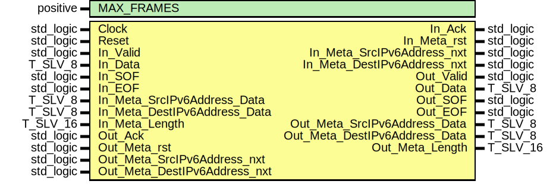

# Entity: ipv6_FrameLoopback
## Diagram

## Generics
| Generic name | Type     | Value | Description |
| ------------ | -------- | ----- | ----------- |
| MAX_FRAMES   | positive | 4     |             |
## Ports
| Port name                     | Direction | Type      | Description |
| ----------------------------- | --------- | --------- | ----------- |
| Clock                         | in        | std_logic |             |
| Reset                         | in        | std_logic |             |
| In_Valid                      | in        | std_logic |             |
| In_Data                       | in        | T_SLV_8   |             |
| In_SOF                        | in        | std_logic |             |
| In_EOF                        | in        | std_logic |             |
| In_Ack                        | out       | std_logic |             |
| In_Meta_rst                   | out       | std_logic |             |
| In_Meta_SrcIPv6Address_nxt    | out       | std_logic |             |
| In_Meta_SrcIPv6Address_Data   | in        | T_SLV_8   |             |
| In_Meta_DestIPv6Address_nxt   | out       | std_logic |             |
| In_Meta_DestIPv6Address_Data  | in        | T_SLV_8   |             |
| In_Meta_Length                | in        | T_SLV_16  |             |
| Out_Valid                     | out       | std_logic |             |
| Out_Data                      | out       | T_SLV_8   |             |
| Out_SOF                       | out       | std_logic |             |
| Out_EOF                       | out       | std_logic |             |
| Out_Ack                       | in        | std_logic |             |
| Out_Meta_rst                  | in        | std_logic |             |
| Out_Meta_SrcIPv6Address_nxt   | in        | std_logic |             |
| Out_Meta_SrcIPv6Address_Data  | out       | T_SLV_8   |             |
| Out_Meta_DestIPv6Address_nxt  | in        | std_logic |             |
| Out_Meta_DestIPv6Address_Data | out       | T_SLV_8   |             |
| Out_Meta_Length               | out       | T_SLV_16  |             |
## Signals
| Name                | Type                                            | Description |
| ------------------- | ----------------------------------------------- | ----------- |
| StmBuf_MetaIn_nxt   | std_logic_vector(META_BITS'length - 1 downto 0) |             |
| StmBuf_MetaIn_Data  | std_logic_vector(isum(META_BITS) - 1 downto 0)  |             |
| StmBuf_MetaOut_nxt  | std_logic_vector(META_BITS'length - 1 downto 0) |             |
| StmBuf_MetaOut_Data | std_logic_vector(isum(META_BITS) - 1 downto 0)  |             |
## Constants
| Name                   | Type     | Value                                                                                                 | Description |
| ---------------------- | -------- | ----------------------------------------------------------------------------------------------------- | ----------- |
| META_STREAMID_SRCADDR  | natural  |  0                                                                                                    |             |
| META_STREAMID_DESTADDR | natural  |  1                                                                                                    |             |
| META_STREAMID_LENGTH   | natural  |  2                                                                                                    |             |
| META_BITS              | T_POSVEC |  ( 		META_STREAMID_SRCADDR			=> 8, 		META_STREAMID_DESTADDR		=> 8, 		META_STREAMID_LENGTH			=> 16 	)  |             |
| META_FIFO_DEPTHS       | T_POSVEC |  ( 		META_STREAMID_SRCADDR			=> 16, 		META_STREAMID_DESTADDR		=> 16, 		META_STREAMID_LENGTH			=> 1 	) |             |
## Instantiations
- StmBuf: PoC.stream_Buffer
