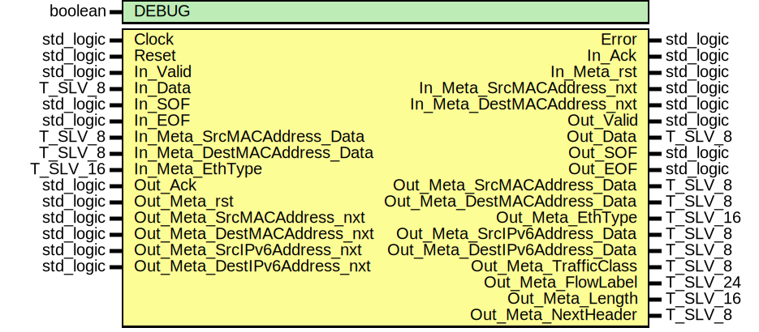

# Entity: ipv6_RX
## Diagram

## Generics
| Generic name | Type    | Value | Description |
| ------------ | ------- | ----- | ----------- |
| DEBUG        | boolean | FALSE |             |
## Ports
| Port name                     | Direction | Type      | Description |
| ----------------------------- | --------- | --------- | ----------- |
| Clock                         | in        | std_logic |             |
| Reset                         | in        | std_logic |             |
| Error                         | out       | std_logic |             |
| In_Valid                      | in        | std_logic |             |
| In_Data                       | in        | T_SLV_8   |             |
| In_SOF                        | in        | std_logic |             |
| In_EOF                        | in        | std_logic |             |
| In_Ack                        | out       | std_logic |             |
| In_Meta_rst                   | out       | std_logic |             |
| In_Meta_SrcMACAddress_nxt     | out       | std_logic |             |
| In_Meta_SrcMACAddress_Data    | in        | T_SLV_8   |             |
| In_Meta_DestMACAddress_nxt    | out       | std_logic |             |
| In_Meta_DestMACAddress_Data   | in        | T_SLV_8   |             |
| In_Meta_EthType               | in        | T_SLV_16  |             |
| Out_Valid                     | out       | std_logic |             |
| Out_Data                      | out       | T_SLV_8   |             |
| Out_SOF                       | out       | std_logic |             |
| Out_EOF                       | out       | std_logic |             |
| Out_Ack                       | in        | std_logic |             |
| Out_Meta_rst                  | in        | std_logic |             |
| Out_Meta_SrcMACAddress_nxt    | in        | std_logic |             |
| Out_Meta_SrcMACAddress_Data   | out       | T_SLV_8   |             |
| Out_Meta_DestMACAddress_nxt   | in        | std_logic |             |
| Out_Meta_DestMACAddress_Data  | out       | T_SLV_8   |             |
| Out_Meta_EthType              | out       | T_SLV_16  |             |
| Out_Meta_SrcIPv6Address_nxt   | in        | std_logic |             |
| Out_Meta_SrcIPv6Address_Data  | out       | T_SLV_8   |             |
| Out_Meta_DestIPv6Address_nxt  | in        | std_logic |             |
| Out_Meta_DestIPv6Address_Data | out       | T_SLV_8   |             |
| Out_Meta_TrafficClass         | out       | T_SLV_8   |             |
| Out_Meta_FlowLabel            | out       | T_SLV_24  |             |
| Out_Meta_Length               | out       | T_SLV_16  |             |
| Out_Meta_NextHeader           | out       | T_SLV_8   |             |
## Signals
| Name                       | Type                                            | Description |
| -------------------------- | ----------------------------------------------- | ----------- |
| State                      | T_STATE                                         |             |
| NextState                  | T_STATE                                         |             |
| In_Ack_i                   | std_logic                                       |             |
| Is_DataFlow                | std_logic                                       |             |
| Is_SOF                     | std_logic                                       |             |
| Is_EOF                     | std_logic                                       |             |
| Out_Valid_i                | std_logic                                       |             |
| Out_SOF_i                  | std_logic                                       |             |
| Out_EOF_i                  | std_logic                                       |             |
| IP_ByteIndex               | T_IP_BYTEINDEX                                  |             |
| Register_rst               | std_logic                                       |             |
| TrafficClass_en0           | std_logic                                       |             |
| TrafficClass_en1           | std_logic                                       |             |
| FlowLabel_en0              | std_logic                                       |             |
| FlowLabel_en1              | std_logic                                       |             |
| FlowLabel_en2              | std_logic                                       |             |
| Length_en0                 | std_logic                                       |             |
| Length_en1                 | std_logic                                       |             |
| NextHeader_en              | std_logic                                       |             |
| HopLimit_en                | std_logic                                       |             |
| SourceIPv6Address_en       | std_logic                                       |             |
| DestIPv6Address_en         | std_logic                                       |             |
| TrafficClass_d             | T_SLV_8                                         |             |
| FlowLabel_d                | std_logic_vector(19 downto 0)                   |             |
| Length_d                   | T_SLV_16                                        |             |
| NextHeader_d               | T_SLV_8                                         |             |
| HopLimit_d                 | T_SLV_8                                         |             |
| SourceIPv6Address_d        | T_NET_IPV6_ADDRESS                              |             |
| DestIPv6Address_d          | T_NET_IPV6_ADDRESS                              |             |
| IPv6SeqCounter_rst         | std_logic                                       |             |
| IPv6SeqCounter_en          | std_logic                                       |             |
| IPv6SeqCounter_us          | unsigned(IPV6_ADDRESS_READER_BITS - 1 downto 0) |             |
| SrcIPv6Address_Reader_rst  | std_logic                                       |             |
| SrcIPv6Address_Reader_en   | std_logic                                       |             |
| SrcIPv6Address_Reader_us   | unsigned(IPV6_ADDRESS_READER_BITS - 1 downto 0) |             |
| DestIPv6Address_Reader_rst | std_logic                                       |             |
| DestIPv6Address_Reader_en  | std_logic                                       |             |
| DestIPv6Address_Reader_us  | unsigned(IPV6_ADDRESS_READER_BITS - 1 downto 0) |             |
## Constants
| Name                     | Type     | Value                            | Description |
| ------------------------ | -------- | -------------------------------- | ----------- |
| IPV6_ADDRESS_LENGTH      | positive |  16                              |             |
| IPV6_ADDRESS_READER_BITS | positive |  log2ceilnz(IPV6_ADDRESS_LENGTH) |             |
## Types
| Name    | Type                                                                                                                                                                                                                                                                                                                                         | Description |
| ------- | -------------------------------------------------------------------------------------------------------------------------------------------------------------------------------------------------------------------------------------------------------------------------------------------------------------------------------------------- | ----------- |
| T_STATE | ( 		ST_IDLE, 			ST_RECEIVE_TRAFFIC_CLASS, 			ST_RECEIVE_FLOW_LABEL_1,	ST_RECEIVE_FLOW_LABEL_2, 			ST_RECEIVE_LENGTH_0,			ST_RECEIVE_LENGTH_1, 			ST_RECEIVE_NEXT_HEADER,		ST_RECEIVE_HOP_LIMIT, 			ST_RECEIVE_SOURCE_ADDRESS, 			ST_RECEIVE_DESTINATION_ADDRESS,  			ST_RECEIVE_DATA_1, ST_RECEIVE_DATA_N, 		ST_DISCARD_FRAME, 		ST_ERROR 	) |             |
## Processes
- unnamed: _( Clock )_

- unnamed: _( State, Is_DataFlow, Is_SOF, Is_EOF, In_Valid, In_Data, In_EOF, Out_Ack, IPv6SeqCounter_us )_

- unnamed: _( Clock )_

- unnamed: _( Clock )_

- unnamed: _( Clock )_

- unnamed: _( Clock )_

