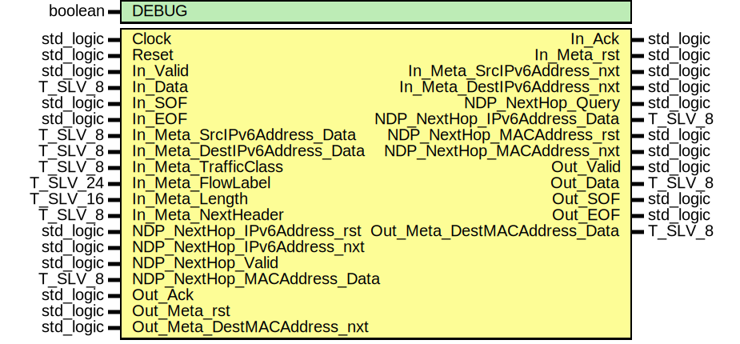

# Entity: ipv6_TX
## Diagram

## Generics
| Generic name | Type    | Value | Description |
| ------------ | ------- | ----- | ----------- |
| DEBUG        | boolean | FALSE |             |
## Ports
| Port name                    | Direction | Type      | Description |
| ---------------------------- | --------- | --------- | ----------- |
| Clock                        | in        | std_logic |             |
| Reset                        | in        | std_logic |             |
| In_Valid                     | in        | std_logic |             |
| In_Data                      | in        | T_SLV_8   |             |
| In_SOF                       | in        | std_logic |             |
| In_EOF                       | in        | std_logic |             |
| In_Ack                       | out       | std_logic |             |
| In_Meta_rst                  | out       | std_logic |             |
| In_Meta_SrcIPv6Address_nxt   | out       | std_logic |             |
| In_Meta_SrcIPv6Address_Data  | in        | T_SLV_8   |             |
| In_Meta_DestIPv6Address_nxt  | out       | std_logic |             |
| In_Meta_DestIPv6Address_Data | in        | T_SLV_8   |             |
| In_Meta_TrafficClass         | in        | T_SLV_8   |             |
| In_Meta_FlowLabel            | in        | T_SLV_24  |             |
| In_Meta_Length               | in        | T_SLV_16  |             |
| In_Meta_NextHeader           | in        | T_SLV_8   |             |
| NDP_NextHop_Query            | out       | std_logic |             |
| NDP_NextHop_IPv6Address_rst  | in        | std_logic |             |
| NDP_NextHop_IPv6Address_nxt  | in        | std_logic |             |
| NDP_NextHop_IPv6Address_Data | out       | T_SLV_8   |             |
| NDP_NextHop_Valid            | in        | std_logic |             |
| NDP_NextHop_MACAddress_rst   | out       | std_logic |             |
| NDP_NextHop_MACAddress_nxt   | out       | std_logic |             |
| NDP_NextHop_MACAddress_Data  | in        | T_SLV_8   |             |
| Out_Valid                    | out       | std_logic |             |
| Out_Data                     | out       | T_SLV_8   |             |
| Out_SOF                      | out       | std_logic |             |
| Out_EOF                      | out       | std_logic |             |
| Out_Ack                      | in        | std_logic |             |
| Out_Meta_rst                 | in        | std_logic |             |
| Out_Meta_DestMACAddress_nxt  | in        | std_logic |             |
| Out_Meta_DestMACAddress_Data | out       | T_SLV_8   |             |
## Signals
| Name               | Type                 | Description |
| ------------------ | -------------------- | ----------- |
| State              | T_STATE              |             |
| NextState          | T_STATE              |             |
| In_Ack_i           | std_logic            |             |
| IPv6SeqCounter_rst | std_logic            |             |
| IPv6SeqCounter_en  | std_logic            |             |
| IPv6SeqCounter_us  | unsigned(3 downto 0) |             |
## Types
| Name    | Type                                                                                                                                                                                                                                                                                                                                                                        | Description |
| ------- | --------------------------------------------------------------------------------------------------------------------------------------------------------------------------------------------------------------------------------------------------------------------------------------------------------------------------------------------------------------------------- | ----------- |
| T_STATE | ( 		ST_IDLE, 			ST_NDP_QUERY,								ST_NDP_QUERY_WAIT, 			ST_SEND_VERSION, 			ST_SEND_TRAFFIC_CLASS, 			ST_SEND_FLOW_LABEL_1,				ST_SEND_FLOW_LABEL_2, 			ST_SEND_In_Meta_Length_0,		ST_SEND_In_Meta_Length_1, 			ST_SEND_NEXT_HEADER,				ST_SEND_HOP_LIMIT, 			ST_SEND_SOURCE_ADDRESS, 			ST_SEND_DESTINATION_ADDRESS, 			ST_SEND_DATA, 		ST_DISCARD_FRAME, 		ST_ERROR 	) |             |
## Processes
- unnamed: _( Clock )_

- unnamed: _( State, In_Valid, In_SOF, In_EOF, In_Data,
					In_Meta_Length,
					Out_Ack, Out_Meta_rst, Out_Meta_DestMACAddress_nxt,--Out_Meta_DestMACAddress_rev,
					NDP_NextHop_Valid, NDP_NextHop_IPv6Address_rst, NDP_NextHop_IPv6Address_nxt, NDP_NextHop_MACAddress_Data,--NDP_NextHop_IPv6Address_rev,
					In_Meta_DestIPv6Address_Data, In_Meta_SrcIPv6Address_Data, In_Meta_TrafficClass, In_Meta_FlowLabel, In_Meta_NextHeader,
					IPv6SeqCounter_us )_

- unnamed: _( Clock )_

