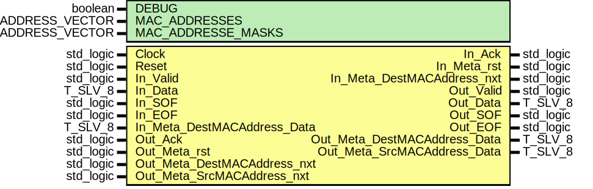

# Entity: mac_RX_SrcMAC_Filter
## Diagram

## Generics
| Generic name       | Type                     | Value                          | Description |
| ------------------ | ------------------------ | ------------------------------ | ----------- |
| DEBUG              | boolean                  | FALSE                          |             |
| MAC_ADDRESSES      | T_NET_MAC_ADDRESS_VECTOR | (0 => C_NET_MAC_ADDRESS_EMPTY) |             |
| MAC_ADDRESSE_MASKS | T_NET_MAC_ADDRESS_VECTOR | (0 => C_NET_MAC_MASK_DEFAULT)  |             |
## Ports
| Port name                    | Direction | Type      | Description |
| ---------------------------- | --------- | --------- | ----------- |
| Clock                        | in        | std_logic |             |
| Reset                        | in        | std_logic |             |
| In_Valid                     | in        | std_logic |             |
| In_Data                      | in        | T_SLV_8   |             |
| In_SOF                       | in        | std_logic |             |
| In_EOF                       | in        | std_logic |             |
| In_Ack                       | out       | std_logic |             |
| In_Meta_rst                  | out       | std_logic |             |
| In_Meta_DestMACAddress_nxt   | out       | std_logic |             |
| In_Meta_DestMACAddress_Data  | in        | T_SLV_8   |             |
| Out_Valid                    | out       | std_logic |             |
| Out_Data                     | out       | T_SLV_8   |             |
| Out_SOF                      | out       | std_logic |             |
| Out_EOF                      | out       | std_logic |             |
| Out_Ack                      | in        | std_logic |             |
| Out_Meta_rst                 | in        | std_logic |             |
| Out_Meta_DestMACAddress_nxt  | in        | std_logic |             |
| Out_Meta_DestMACAddress_Data | out       | T_SLV_8   |             |
| Out_Meta_SrcMACAddress_nxt   | in        | std_logic |             |
| Out_Meta_SrcMACAddress_Data  | out       | T_SLV_8   |             |
## Signals
| Name                         | Type                                         | Description |
| ---------------------------- | -------------------------------------------- | ----------- |
| State                        | T_STATE                                      |             |
| NextState                    | T_STATE                                      |             |
| In_Ack_i                     | std_logic                                    |             |
| Is_DataFlow                  | std_logic                                    |             |
| Is_SOF                       | std_logic                                    |             |
| Is_EOF                       | std_logic                                    |             |
| New_Valid_i                  | std_logic                                    |             |
| New_SOF_i                    | std_logic                                    |             |
| Out_Ack_i                    | std_logic                                    |             |
| MAC_ByteIndex                | T_MAC_BYTEINDEX                              |             |
| CompareRegister_rst          | std_logic                                    |             |
| CompareRegister_init         | std_logic                                    |             |
| CompareRegister_clear        | std_logic                                    |             |
| CompareRegister_en           | std_logic                                    |             |
| CompareRegister_d            | std_logic_vector(PATTERN_COUNT - 1 downto 0) |             |
| NoHits                       | std_logic                                    |             |
| SourceMACAddress_rst         | std_logic                                    |             |
| SourceMACAddress_en          | std_logic                                    |             |
| SourceMACAddress_sel         | T_MAC_BYTEINDEX                              |             |
| SourceMACAddress_d           | T_NET_MAC_ADDRESS                            |             |
| Reader_Counter_rst           | std_logic                                    |             |
| Reader_Counter_en            | std_logic                                    |             |
| Reader_Counter_us            | unsigned(READER_COUNTER_BITS - 1 downto 0)   |             |
| Out_Meta_rst_i               | std_logic                                    |             |
| Out_Meta_SrcMACAddress_nxt_i | std_logic                                    |             |
## Constants
| Name                 | Type                                             | Value                           | Description |
| -------------------- | ------------------------------------------------ | ------------------------------- | ----------- |
| PATTERN_COUNT        | positive                                         |  MAC_ADDRESSES'length           |             |
| MAC_ADDRESSES_I      | T_NET_MAC_ADDRESS_VECTOR(0 to PATTERN_COUNT - 1) |  MAC_ADDRESSES                  |             |
| MAC_ADDRESSE_MASKS_I | T_NET_MAC_ADDRESS_VECTOR(0 to PATTERN_COUNT - 1) |  MAC_ADDRESSE_MASKS             |             |
| MAC_ADDRESS_LENGTH   | positive                                         |  6                              |             |
| READER_COUNTER_BITS  | positive                                         |  log2ceilnz(MAC_ADDRESS_LENGTH) |             |
## Types
| Name    | Type                                                                                                                                                      | Description |
| ------- | --------------------------------------------------------------------------------------------------------------------------------------------------------- | ----------- |
| T_STATE | ( 		ST_IDLE, 			ST_SRC_MAC_1, 			ST_SRC_MAC_2, 			ST_SRC_MAC_3, 			ST_SRC_MAC_4, 			ST_SRC_MAC_5, 			ST_PAYLOAD_1, 			ST_PAYLOAD_N, 		ST_DISCARD_FRAME 	) |             |
## Processes
- unnamed: _( Clock )_

- unnamed: _( State, Is_DataFlow, Is_SOF, Is_EOF, In_Valid, NoHits, Out_Ack_i )_

- unnamed: _( Clock )_

- unnamed: _( Clock )_

