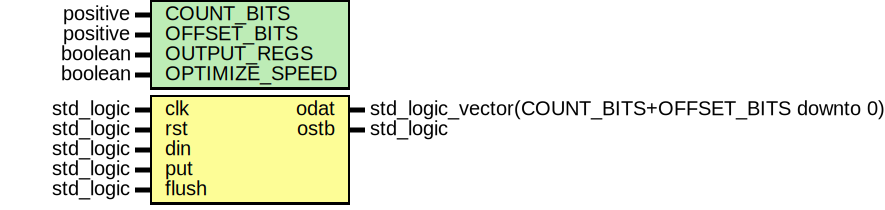

# Entity: misc_bit_lz
## Diagram

## Generics
| Generic name   | Type     | Value | Description |
| -------------- | -------- | ----- | ----------- |
| COUNT_BITS     | positive |       |             |
| OFFSET_BITS    | positive |       |             |
| OUTPUT_REGS    | boolean  | true  |             |
| OPTIMIZE_SPEED | boolean  | true  |             |
## Ports
| Port name | Direction | Type                                              | Description |
| --------- | --------- | ------------------------------------------------- | ----------- |
| clk       | in        | std_logic                                         |             |
| rst       | in        | std_logic                                         |             |
| din       | in        | std_logic                                         |             |
| put       | in        | std_logic                                         |             |
| flush     | in        | std_logic                                         |             |
| odat      | out       | std_logic_vector(COUNT_BITS+OFFSET_BITS downto 0) |             |
| ostb      | out       | std_logic                                         |             |
## Signals
| Name       | Type                                      | Description |
| ---------- | ----------------------------------------- | ----------- |
| History    | std_logic_vector(HISTORY_SIZE   downto 0) |             |
| Match      | std_logic_vector(HISTORY_SIZE-1 downto 0) |             |
| Count      | signed(COUNT_BITS downto 0)               |             |
| Offset     | unsigned(OFFSET_BITS-1 downto 0)          |             |
| Term       | std_logic                                 |             |
| Offset_nxt | unsigned(Offset'range)                    |             |
| ov         | X01                                       |             |
| valid      | X01                                       |             |
| data       | std_logic_vector(odat'range)              |             |
| push       | std_logic                                 |             |
## Constants
| Name         | Type     | Value                     | Description |
| ------------ | -------- | ------------------------- | ----------- |
| HISTORY_SIZE | positive |  2**OFFSET_BITS           |             |
| LITERAL_LEN  | positive |  COUNT_BITS + OFFSET_BITS |             |
## Processes
- unnamed: _( clk )_

