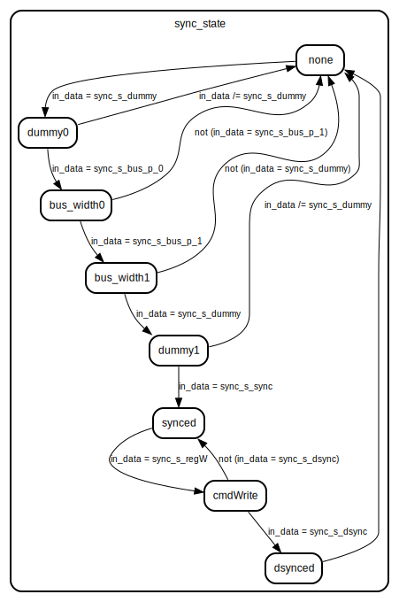

# Entity: reconfig_icap_fsm

## Diagram

## Description

EMACS settings: -*-  tab-width: 4; indent-tabs-mode: t -*-
vim: tabstop=4:shiftwidth=4:noexpandtab
kate: tab-width 4; replace-tabs off; indent-width 4;
=============================================================================
Authors:					Paul Genssler
Entity:					ICAP FSM
Description:
-------------------------------------
This module parses the data stream to the Xilinx "Internal Configuration Access Port" (ICAP)
primitives to generate control signals. Tested on:
* Virtex-6
* Virtex-7
License:
=============================================================================
Copyright 2007-2016 Technische Universitaet Dresden - Germany,
Licensed under the Apache License, Version 2.0 (the "License");
you may not use this file except in compliance with the License.
You may obtain a copy of the License at
Unless required by applicable law or agreed to in writing, software
distributed under the License is distributed on an "AS IS" BASIS,
WITHOUT WARRANTIES OR CONDITIONS OF ANY KIND, either express or implied.
See the License for the specific language governing permissions and
limitations under the License.
=============================================================================
## Ports

| Port name      | Direction | Type                          | Description                         |
| -------------- | --------- | ----------------------------- | ----------------------------------- |
| clk            | in        | std_logic                     |                                     |
| reset          | in        | std_logic                     | high-active reset                   |
| icap_in        | out       | std_logic_vector(31 downto 0) | data that will go into the icap     |
| icap_out       | in        | std_logic_vector(31 downto 0) | data from the icap                  |
| icap_csb       | out       | std_logic                     |                                     |
| icap_rw        | out       | std_logic                     |                                     |
| in_data        | in        | std_logic_vector(31 downto 0) | new configuration data              |
| in_data_valid  | in        | std_logic                     | input data is valid                 |
| in_data_rden   | out       | std_logic                     | possible to send data               |
| out_data       | out       | std_logic_vector(31 downto 0) | data read from the fifo             |
| out_data_valid | out       | std_logic                     | data from icap is valid             |
| out_data_full  | in        | std_logic                     | receiving buffer is full, halt icap |
| status         | out       | std_logic_vector(31 downto 0) | status vector                       |
## Signals

| Name              | Type                          | Description                                                   |
| ----------------- | ----------------------------- | ------------------------------------------------------------- |
| cur_state         | t_state                       |                                                               |
| nxt_state         | t_state                       |                                                               |
| sync_state        | t_sync_state                  |                                                               |
| sync_state_flag   | boolean                       | flag will be (re)set in the clocking process for the main fsm |
| icap_enable       | boolean                       |                                                               |
| icap_read         | boolean                       |                                                               |
| icap_in_r         | std_logic_vector(31 downto 0) |                                                               |
| in_data_swap      | std_logic_vector(31 downto 0) | icap bit switching                                            |
| icap_out_swap     | std_logic_vector(31 downto 0) |                                                               |
| icap_error        | std_logic                     | icap status word signals                                      |
| icap_sync         | std_logic                     |                                                               |
| icap_abort        | std_logic                     |                                                               |
| icap_status_valid | std_logic                     |                                                               |
| readback_cnt      | unsigned(26 downto 0)         |                                                               |
| readback_cnt_en   | boolean                       |                                                               |
| readback_cnt_rst  | boolean                       |                                                               |
| in_data_valid_d   | std_logic                     | delayed signals                                               |
| in_data_valid_re  | std_logic                     | rising edge on in_data_valid signal                           |
| pr_reset          | boolean                       | status word signals                                           |
| status_error      | boolean                       |                                                               |
## Constants

| Name           | Type                          | Value        | Description                   |
| -------------- | ----------------------------- | ------------ | ----------------------------- |
| sync_s_dummy   | std_logic_vector(31 downto 0) |  x"FFFFFFFF" |                               |
| sync_s_bus_p_0 | std_logic_vector(31 downto 0) |  x"000000BB" |                               |
| sync_s_bus_p_1 | std_logic_vector(31 downto 0) |  x"11220044" |                               |
| sync_s_sync    | std_logic_vector(31 downto 0) |  x"AA995566" |                               |
| sync_s_regW    | std_logic_vector(31 downto 0) |  x"30008001" |                               |
| sync_s_dsync   | std_logic_vector(31 downto 0) |  x"0000000D" |                               |
| cmd_nop        | std_logic_vector(31 downto 0) |  x"20000000" |                               |
| cmd_reg_wcfg   | std_logic_vector(4 downto 0)  |  "00001"     | write cfg data prior to write |
| reg_fdro       | std_logic_vector(4 downto 0)  |  "00011"     | read cfg data register        |
## Types

| Name         | Type                                                                                                                                                                                                                                                                                                                                                                                                                                                                                                                                                                               | Description                              |
| ------------ | ---------------------------------------------------------------------------------------------------------------------------------------------------------------------------------------------------------------------------------------------------------------------------------------------------------------------------------------------------------------------------------------------------------------------------------------------------------------------------------------------------------------------------------------------------------------------------------- | ---------------------------------------- |
| t_state      | (ready,  abort0,  abort1,  abort2,  abort3,  write,  writing,  pre_reg_read0,  pre_reg_read1,  pre_stream_read0,  read,  reading,  post_read)  |                                          |
| t_sync_state | (none,  dummy0,  bus_width0,  bus_width1,  dummy1,  synced,  cmdWrite,  dsynced)                                                                                                                                                                                                                                              | detect the status of the synchronization |
## Processes
- combi: ( reset, nxt_state, cur_state, in_data, in_data_valid, in_data_valid_re,
						sync_state, sync_state_flag, out_data_full, readback_cnt, pr_reset )
- readback_cnt_p: ( clk )
**Description**
readback counter process

- sync_p: ( clk )
**Description**
update sync status

## State machines

- update sync status
