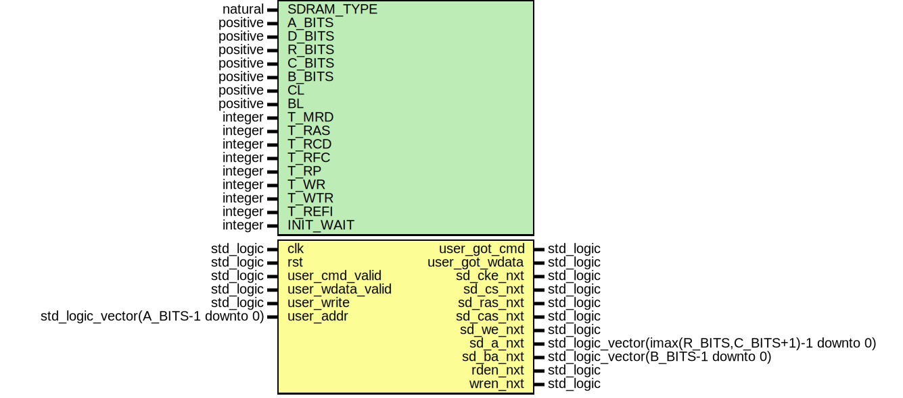

# Entity: sdram_ctrl_fsm
## Diagram

## Description
EMACS settings: -*-  tab-width: 2; indent-tabs-mode: t -*-
vim: tabstop=2:shiftwidth=2:noexpandtab
kate: tab-width 2; replace-tabs off; indent-width 2;
=============================================================================
Authors:					Martin Zabel
Entity:					Generic controller for SDRAM memory.
Description:
-------------------------------------
This file contains the FSM as well as parts of the datapath.
The board specific physical layer is defined in another file.
Configuration
*************
SDRAM_TYPE activates some special cases:
- 0 for SDR-SDRAM
- 1 for DDR-SDRAM
- 2 for DDR2-SDRAM (no special support yet like ODT)
2**A_BITS specifies the number of memory cells in the SDRAM. This is the
size of th memory in bits divided by the native data-path width of the SDRAM
(also in bits).
D_BITS is the native data-path width of the SDRAM. The width might be doubled
by the physical interface for DDR interfaces.
Furthermore, the memory array is divided into
2**R_BITS rows, 2**C_BITS columns and 2**B_BITS banks.
.. NOTE::
   For example, the MT46V32M16 has 512 Mbit = 8M x 4 banks x 16 bit =
   32M cells x 16 bit, with 8K rows and 1K columns. Thus, the configuration
   is:
   - A_BITS = :math:`\log_2(32\,\mbox{M}) = 25`
   - D_BITS = 16
   - data-path width of phy on user side: 32-bit because of DDR
   - R_BITS = :math:`\log_2(8\,\mbox{K})  = 13`
   - C_BITS = :math:`\log_2(1\,\mbox{K})  = 10`
   - B_BITS = :math:`\log_2(4)   =  2`
Set CAS latency (CL, MR_CL) and  burst length (BL, MR_BL) according to
your needs.
If you have a DDR-SDRAM then set INIT_DLL = true, otherwise false.
The definition and values of generics T_* can be calculated from the
datasheets of the specific SDRAM (e.g. MT46V). Just divide the
minimum/maximum times by clock period.
Auto refreshs are applied periodically, the datasheet either specifies the
average refresh interval (T_REFI) or the total refresh cycle time (T_REF).
In the latter case, divide the total time by the row count to get the
average refresh interval. Substract about 50 clock cycles to
account for pending read/writes.
INIT_WAIT specifies the time period to wait after the SDRAM is powered up.
It is typically 100--200 us long, see datasheet. The waiting time is
specified in number of average refresh periods (specified by T_REFI):
INIT_WAIT = ceil(wait_time / clock_period / T_REFI)
e.g. INIT_WAIT = ceil(200 us / 10 ns / 700) = 29
Operation
*********
After user_cmd_valid is asserted high, the command (user_write) and address
(user_addr) must be hold until user_got_cmd is asserted.
The FSM automatically waits for user_wdata_valid on writes. The data should
be available soon. Otherwise the auto refresh might fail. The FSM only waits
for the first word to write. All successive words of a burst must be valid
in the following cycles. (A burst can't be stalled.) ATTENTION: During
writes, user_cmd_got is asserted only if user_wdata_valid is set.
The write data must directly connected to the physical layer.
License:
=============================================================================
Copyright 2007-2015 Technische Universitaet Dresden - Germany,
Licensed under the Apache License, Version 2.0 (the "License");
you may not use this file except in compliance with the License.
You may obtain a copy of the License at
Unless required by applicable law or agreed to in writing, software
distributed under the License is distributed on an "AS IS" BASIS,
WITHOUT WARRANTIES OR CONDITIONS OF ANY KIND, either express or implied.
See the License for the specific language governing permissions and
limitations under the License.
=============================================================================
## Generics
| Generic name | Type     | Value | Description                 |
| ------------ | -------- | ----- | --------------------------- |
| SDRAM_TYPE   | natural  |       | SDRAM type                  |
| A_BITS       | positive |       | log2ceil(memory cell count) |
| D_BITS       | positive |       | native data width           |
| R_BITS       | positive |       | log2ceil(rows)              |
| C_BITS       | positive |       | log2ceil(columns)           |
| B_BITS       | positive |       | log2ceil(banks)             |
| CL           | positive |       | CAS Latency in clock cycles |
| BL           | positive |       | Burst Length                |
| T_MRD        | integer  |       | in clock cycles             |
| T_RAS        | integer  |       | in clock cycles             |
| T_RCD        | integer  |       | in clock cycles             |
| T_RFC        | integer  |       | (or T_RC) in clock cycles   |
| T_RP         | integer  |       | in clock cycles             |
| T_WR         | integer  |       | in clock cycles             |
| T_WTR        | integer  |       | in clock cycles             |
| T_REFI       | integer  |       | in clock cycles             |
| INIT_WAIT    | integer  |       |                             |
## Ports
| Port name        | Direction | Type                                               | Description |
| ---------------- | --------- | -------------------------------------------------- | ----------- |
| clk              | in        | std_logic                                          |             |
| rst              | in        | std_logic                                          |             |
| user_cmd_valid   | in        | std_logic                                          |             |
| user_wdata_valid | in        | std_logic                                          |             |
| user_write       | in        | std_logic                                          |             |
| user_addr        | in        | std_logic_vector(A_BITS-1 downto 0)                |             |
| user_got_cmd     | out       | std_logic                                          |             |
| user_got_wdata   | out       | std_logic                                          |             |
| sd_cke_nxt       | out       | std_logic                                          |             |
| sd_cs_nxt        | out       | std_logic                                          |             |
| sd_ras_nxt       | out       | std_logic                                          |             |
| sd_cas_nxt       | out       | std_logic                                          |             |
| sd_we_nxt        | out       | std_logic                                          |             |
| sd_a_nxt         | out       | std_logic_vector(imax(R_BITS,C_BITS+1)-1 downto 0) |             |
| sd_ba_nxt        | out       | std_logic_vector(B_BITS-1 downto 0)                |             |
| rden_nxt         | out       | std_logic                                          |             |
| wren_nxt         | out       | std_logic                                          |             |
## Signals
| Name               | Type                                   | Description                                                                                                                                                                                         |
| ------------------ | -------------------------------------- | --------------------------------------------------------------------------------------------------------------------------------------------------------------------------------------------------- |
| fsm_cs             | FSM_TYPE                               |                                                                                                                                                                                                     |
| fsm_ns             | FSM_TYPE                               |                                                                                                                                                                                                     |
| sd_cmd_nxt         | SD_CMD_TYPE                            |                                                                                                                                                                                                     |
| bank_addr          | std_logic_vector(B_BITS-1 downto 0)    | SDRAM address                                                                                                                                                                                       |
| row_addr           | std_logic_vector(R_BITS-1 downto 0)    |                                                                                                                                                                                                     |
| col_addr           | std_logic_vector(C_BITS-1 downto 0)    |                                                                                                                                                                                                     |
| precharge_all      | std_logic                              |                                                                                                                                                                                                     |
| reset_dll          | std_logic                              |                                                                                                                                                                                                     |
| sd_a_sel           | SD_A_SEL_TYPE                          |                                                                                                                                                                                                     |
| sd_ba_sel          | SD_BA_SEL_TYPE                         |                                                                                                                                                                                                     |
| timer_tREFI        | signed(log2ceil(T_REFI-2) downto 0)    | Timer for average periodic refresh interval.Timer counts from T_REFI-2 downto -1 for easy detection of"timer done". MSB is sign bit.                                                                |
| timer_tREFI_start  | std_logic                              |                                                                                                                                                                                                     |
| timer_tREFI_done   | std_logic                              |                                                                                                                                                                                                     |
| timer_cmd          | signed(5 downto 0)                     | Timer for SDRAM commands. To wait for n clock cycles, the timer must beinitiated to the value n-2. The minimum allowed initial value is -1. Inthis case the timer is done in the next clock cycles. |
| timer_cmd_init     | signed(5 downto 0)                     |                                                                                                                                                                                                     |
| timer_cmd_start    | std_logic                              |                                                                                                                                                                                                     |
| timer_cmd_done     | std_logic                              |                                                                                                                                                                                                     |
| timer_tRAS         | signed(log2ceil(T_RAS-2) downto 0)     | Timer for ACTIVE-to-PRECHARGE.  Timer counts from T_RAS-2 downto -1 for easy detection of  "timer done". MSB is sign bit.  Substract 1, because timer is checked one cycle before DO_PRECHARGE.     |
| timer_tRAS_start   | std_logic                              |                                                                                                                                                                                                     |
| timer_tRAS_done    | std_logic                              |                                                                                                                                                                                                     |
| downcnt            | signed(log2ceil(INIT_WAIT-2) downto 0) | Misc down counter. Counter is "done", when value == -1.Thus, if counter is inited to n, then counter is done n+2 decrementslater.                                                                   |
| downcnt_init       | signed(downcnt'range)                  |                                                                                                                                                                                                     |
| downcnt_set        | std_logic                              |                                                                                                                                                                                                     |
| downcnt_dec        | std_logic                              |                                                                                                                                                                                                     |
| downcnt_done       | std_logic                              |                                                                                                                                                                                                     |
| last_bank_addr_r   | std_logic_vector(bank_addr'range)      |                                                                                                                                                                                                     |
| last_bank_addr_nxt | std_logic_vector(bank_addr'range)      |                                                                                                                                                                                                     |
| last_row_addr_r    | std_logic_vector(row_addr'range)       |                                                                                                                                                                                                     |
| last_row_addr_nxt  | std_logic_vector(row_addr'range)       |                                                                                                                                                                                                     |
| last_write_r       | std_logic                              |                                                                                                                                                                                                     |
| last_write_nxt     | std_logic                              |                                                                                                                                                                                                     |
| save_cmd_addr      | std_logic                              |                                                                                                                                                                                                     |
| same_bank_row      | std_logic                              |                                                                                                                                                                                                     |
## Constants
| Name                   | Type                                | Value                                                                                                | Description                                                                    |
| ---------------------- | ----------------------------------- | ---------------------------------------------------------------------------------------------------- | ------------------------------------------------------------------------------ |
| BCC                    | natural                             |  burst_clock_cycles                                                                                  |                                                                                |
| SD_CMD_DESELECT        | SD_CMD_TYPE                         |  "1---"                                                                                              |                                                                                |
| SD_CMD_NOP             | SD_CMD_TYPE                         |  "0111"                                                                                              |                                                                                |
| SD_CMD_ACTIVE          | SD_CMD_TYPE                         |  "0011"                                                                                              |                                                                                |
| SD_CMD_READ            | SD_CMD_TYPE                         |  "0101"                                                                                              |                                                                                |
| SD_CMD_WRITE           | SD_CMD_TYPE                         |  "0100"                                                                                              |                                                                                |
| SD_CMD_BURST_TERMINATE | SD_CMD_TYPE                         |  "0110"                                                                                              |                                                                                |
| SD_CMD_PRECHARGE       | SD_CMD_TYPE                         |  "0010"                                                                                              |                                                                                |
| SD_CMD_AUTO_REFRESH    | SD_CMD_TYPE                         |  "0001"                                                                                              |                                                                                |
| SD_CMD_LOAD_MODE_REG   | SD_CMD_TYPE                         |  "0000"                                                                                              |                                                                                |
| EXT_MODE_REG           | std_logic_vector(1 downto 0)        |      (others => '0')                                                                                 | Value for Extended Mode Register:  bit 1--0: normal drive strength, enable DLL |
| MODE_REG               | std_logic_vector(8 downto 0)        |      "00" & std_logic_vector(to_unsigned(CL, 3)) &     "0"  & std_logic_vector(to_unsigned(BL-1, 3)) | Value for Mode Register  bit 6--0: CL, sequential burst, BL  bit 8: reset DLL  |
| TIMER_TREFI_INIT       | signed(log2ceil(T_REFI-2) downto 0) |  to_signed(T_REFI-2, timer_tREFI'length)                                                             |                                                                                |
| TIMER_TRAS_INIT        | signed(log2ceil(T_RAS-2) downto 0)  |  to_signed(T_RAS-1 -2, timer_tRAS'length)                                                            |                                                                                |
## Types
| Name           | Type                                                                                                                                                                                                                                                                                                    | Description |
| -------------- | ------------------------------------------------------------------------------------------------------------------------------------------------------------------------------------------------------------------------------------------------------------------------------------------------------- | ----------- |
| FSM_TYPE       | (INIT1, INIT2, INIT3, INIT4, INIT5, INIT6, INIT7, INIT8,                     INIT9, INIT10, INIT11,                     DO_ACTIVATE,                     DO_READ1, DO_READ2,                     DO_WRITE1, DO_WRITE2,                     CHECKNXT,                     DO_PRECHARGE, DO_AUTO_REFRESH) | FSM         |
| SD_A_SEL_TYPE  | (SD_A_SEL_EXT_MODE_REG,                          SD_A_SEL_MODE_REG,                          SD_A_SEL_ROW_ADDR,                          SD_A_SEL_COL_ADDR)                                                                                                                                             |             |
| SD_BA_SEL_TYPE | (SD_BA_SEL_EXT_MODE_REG,                          SD_BA_SEL_MODE_REG,                          SD_BA_SEL_ADDR)                                                                                                                                                                                          |             |
## Functions
- burst_clock_cycles () return positive
## Processes
- unnamed: _( fsm_cs,
           timer_tREFI_done, timer_cmd_done, timer_tRAS_done,
           downcnt_done,
           same_bank_row, last_write_r,
           user_cmd_valid, user_write, user_wdata_valid )_
FSM

**Description**
FSM

- unnamed: _( sd_a_sel, reset_dll, row_addr, col_addr, precharge_all )_

- unnamed: _( clk )_
SD_BA_SEL_ADDR
Registers

**Description**
SD_BA_SEL_ADDR
Registers

