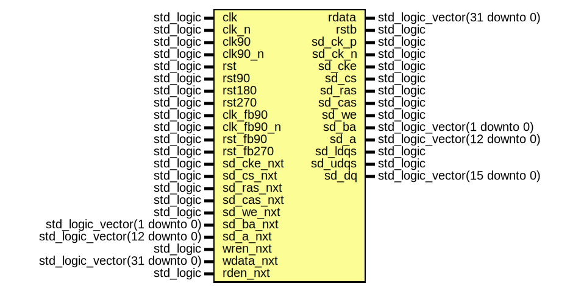

# Entity: sdram_ctrl_phy_s3esk

## Diagram

## Description

EMACS settings: -*-  tab-width: 2; indent-tabs-mode: t -*-
vim: tabstop=2:shiftwidth=2:noexpandtab
kate: tab-width 2; replace-tabs off; indent-width 2;
=============================================================================
Authors:					Martin Zabel
Entity:					Physical layer of SDRAM-Controller for Spartan-3E Starter Kit
Description:
-------------------------------------
Physical layer used by module :ref:`sdram_ctrl_s3esk <IP:sdram_ctrl_s3esk>`.
Instantiates input and output buffer components and adjusts the timing for
the Spartan-3E Starter Kit Board.
Clock and Reset Signals
***********************
+-----------+-----------------------------------------------------------+
| Port      | Description                                               |
+===========+===========================================================+
|clk        | Base clock for command and write data path.               |
+-----------+-----------------------------------------------------------+
|clk_n      | ``clk`` phase shifted by 180 degrees.                     |
+-----------+-----------------------------------------------------------+
|clk90      | ``clk`` phase shifted by  90 degrees.                     |
+-----------+-----------------------------------------------------------+
|clk90_n    | ``clk`` phase shifted by 270 degrees.                     |
+-----------+-----------------------------------------------------------+
|clk_fb     | Driven by external feedback (sd_ck_fb) of DDR-SDRAM clock |
|(on PCB)   | (sd_ck_p). Actually unused, just referenced below.        |
+-----------+-----------------------------------------------------------+
|clk_fb90   | ``clk_fb`` phase shifted by 90 degrees.                   |
+-----------+-----------------------------------------------------------+
|clk_fb90_n | ``clk_fb`` phase shifted by 270 degrees.                  |
+-----------+-----------------------------------------------------------+
|rst        | Reset for ``clk``.                                        |
+-----------+-----------------------------------------------------------+
|rst180     | Reset for ``clk_n``                                       |
+-----------+-----------------------------------------------------------+
|rst90      | Reset for ``clk90``.                                      |
+-----------+-----------------------------------------------------------+
|rst270     | Reset for ``clk270``.                                     |
+-----------+-----------------------------------------------------------+
|rst_fb90   | Reset for ``clk_fb90``.                                   |
+-----------+-----------------------------------------------------------+
|rst_fb90_n | Reset for ``clk_fb90_n``.                                 |
+-----------+-----------------------------------------------------------+
Operation
*********
Command signals and write data are sampled with the rising edge of ``clk``.
Read data is aligned with ``clk_fb90_n``. Either process data in this clock
domain, or connect a FIFO to transfer data into another clock domain of your
choice.  This FIFO should capable of storing at least one burst (size BL/2)
+ start of next burst (size 1).
Write and read enable (``wren_nxt``, ``rden_nxt``) must be hold for:
* 1 clock cycle  if BL = 2,
* 2 clock cycles if BL = 4, or
* 4 clock cycles if BL = 8.
They must be first asserted with the read and write command. Proper delay is
included in this unit.
The first word to write must be asserted with the write command. Proper
delay is included in this unit.
The SDRAM clock is regenerated in this module. The following timing is
chosen for minimum latency (should work up to 100 MHz):
* ``rising_edge(clk90)``   triggers ``rising_edge(sd_ck_p)``,
* ``rising_edge(clk90_n)`` triggers ``falling_edge(sd_ck_p)``.
XST options: Disable equivalent register removal.
Synchronous resets are used. Reset must be hold for at least two cycles.
License:
=============================================================================
Copyright 2007-2016 Technische Universitaet Dresden - Germany,
Licensed under the Apache License, Version 2.0 (the "License");
you may not use this file except in compliance with the License.
You may obtain a copy of the License at
Unless required by applicable law or agreed to in writing, software
distributed under the License is distributed on an "AS IS" BASIS,
WITHOUT WARRANTIES OR CONDITIONS OF ANY KIND, either express or implied.
See the License for the specific language governing permissions and
limitations under the License.
=============================================================================
## Ports

| Port name  | Direction | Type                          | Description |
| ---------- | --------- | ----------------------------- | ----------- |
| clk        | in        | std_logic                     |             |
| clk_n      | in        | std_logic                     |             |
| clk90      | in        | std_logic                     |             |
| clk90_n    | in        | std_logic                     |             |
| rst        | in        | std_logic                     |             |
| rst90      | in        | std_logic                     |             |
| rst180     | in        | std_logic                     |             |
| rst270     | in        | std_logic                     |             |
| clk_fb90   | in        | std_logic                     |             |
| clk_fb90_n | in        | std_logic                     |             |
| rst_fb90   | in        | std_logic                     |             |
| rst_fb270  | in        | std_logic                     |             |
| sd_cke_nxt | in        | std_logic                     |             |
| sd_cs_nxt  | in        | std_logic                     |             |
| sd_ras_nxt | in        | std_logic                     |             |
| sd_cas_nxt | in        | std_logic                     |             |
| sd_we_nxt  | in        | std_logic                     |             |
| sd_ba_nxt  | in        | std_logic_vector(1 downto 0)  |             |
| sd_a_nxt   | in        | std_logic_vector(12 downto 0) |             |
| wren_nxt   | in        | std_logic                     |             |
| wdata_nxt  | in        | std_logic_vector(31 downto 0) |             |
| rden_nxt   | in        | std_logic                     |             |
| rdata      | out       | std_logic_vector(31 downto 0) |             |
| rstb       | out       | std_logic                     |             |
| sd_ck_p    | out       | std_logic                     |             |
| sd_ck_n    | out       | std_logic                     |             |
| sd_cke     | out       | std_logic                     |             |
| sd_cs      | out       | std_logic                     |             |
| sd_ras     | out       | std_logic                     |             |
| sd_cas     | out       | std_logic                     |             |
| sd_we      | out       | std_logic                     |             |
| sd_ba      | out       | std_logic_vector(1 downto 0)  |             |
| sd_a       | out       | std_logic_vector(12 downto 0) |             |
| sd_ldqs    | out       | std_logic                     |             |
| sd_udqs    | out       | std_logic                     |             |
| sd_dq      | inout     | std_logic_vector(15 downto 0) |             |
## Signals

| Name          | Type                          | Description                      |
| ------------- | ----------------------------- | -------------------------------- |
| sd_cke_r      | std_logic                     |                                  |
| sd_cs_r       | std_logic                     |                                  |
| sd_ras_r      | std_logic                     |                                  |
| sd_cas_r      | std_logic                     |                                  |
| sd_we_r       | std_logic                     |                                  |
| sd_ba_r       | std_logic_vector(1 downto 0)  |                                  |
| sd_a_r        | std_logic_vector(12 downto 0) |                                  |
| wren_r_n      | std_logic                     | control / data signals for write |
| dqs_en0_nxt_n | std_logic                     |                                  |
| dqs_en0_r_n   | std_logic_vector(1 downto 0)  |                                  |
| dqs_en1_r_n   | std_logic_vector(1 downto 0)  | inited below                     |
| dqs_o_r       | std_logic_vector(1 downto 0)  |                                  |
| dq_en0_n      | std_logic                     |                                  |
| dq_en1_r_n    | std_logic_vector(15 downto 0) | inited below                     |
| dq_o_r        | std_logic_vector(15 downto 0) |                                  |
| dq_i          | std_logic_vector(15 downto 0) |                                  |
| wdata_r       | std_logic_vector(31 downto 0) |                                  |
| wdata_fal_r   | std_logic_vector(15 downto 0) |                                  |
| rden_r        | std_logic                     | control / data signals for read  |
| rden1_r       | std_logic                     |                                  |
| rden2_r       | std_logic                     |                                  |
| rden3_r       | std_logic                     |                                  |
| rstb_r        | std_logic                     |                                  |
| rdata_ris_r   | std_logic_vector(15 downto 0) |                                  |
| rdata_r       | std_logic_vector(31 downto 0) |                                  |
## Processes
- unnamed: ( clk )
**Description**
SDRAM command & address

- unnamed: ( clk )
- unnamed: ( clk )
**Description**
Write Data

- unnamed: ( clk_n )
- unnamed: ( clk )
**Description**
Read data capture
Register read enable
rden1_r is a separate signal for simple identification in constraints.
This signal must be kept.

- unnamed: ( clk_fb90_n )
**Description**
Register read enable with clk_fb90_n which equals sd_ck_p + 270 degrees
delayed by external feedback.
NOTE: Timing constraints must ensure, that read enable is captured with
the rising edge of clk_fb90_n directly following rising edge of clk.

- unnamed: ( clk_fb90_n )
**Description**
Delay once more
If timing is critical, then rden3_r should be duplicated before it used as
clock enable for input FFs.

- unnamed: ( clk_fb90_n )
## Instantiations

- sd_ck_p_off: ODDR2
- sd_ck_n_off: ODDR2
- ldqs_obuf: OBUFT
**Description**
Explicit instantiation of I/O buffers. Required if entity is part of a
netlist, which is used in another design.

- udqs_obuf: OBUFT
