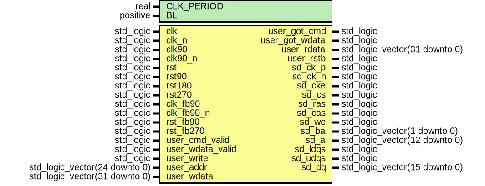

# Entity: sdram_ctrl_s3esk

- **File**: sdram_ctrl_s3esk.vhdl
## Diagram

## Description

 EMACS settings: -*-  tab-width: 2; indent-tabs-mode: t -*-
 vim: tabstop=2:shiftwidth=2:noexpandtab
 kate: tab-width 2; replace-tabs off; indent-width 2;
 =============================================================================
 Authors:					Martin Zabel

 Entity:					Controller for Micron DDR-SDRAM on Spartan-3E Starter Kit Board.

 Description:
 -------------------------------------
 Controller for Micron DDR-SDRAM on Spartan-3E Starter Kit Board.

 SDRAM Device: MT46V32M16-6T

 Configuration
 *************

 +------------+----------------------------------------------------+
 | Parameter  | Description                                        |
 +============+====================================================+
 | CLK_PERIOD | Clock period in nano seconds. All SDRAM timings are|
 |            | calculated for the device stated above.            |
 +------------+----------------------------------------------------+
 | CL         | CAS latency, choose according to clock frequency.  |
 +------------+----------------------------------------------------+
 | BL         | Burst length. Choose BL=2 for single cycle memory  |
 |            | transactions as required for the PoC.Mem interface.|
 +------------+----------------------------------------------------+

 Tested with: CLK_PERIOD = 10.0, CL=2, BL=2.

 Operation
 *********

 Command, address and write data are sampled with the rising edge of ``clk``.

 Read data is aligned with ``clk_fb90_n``. Either process data in this clock
 domain, or connect a FIFO to transfer data into another clock domain of your
 choice.  This FIFO should capable of storing at least one burst (size BL/2)
 + start of next burst (size 1).

 Synchronous resets are used.

 License:
 =============================================================================
 Copyright 2007-2016 Technische Universitaet Dresden - Germany,
										 Chair of VLSI-Design, Diagnostics and Architecture

 Licensed under the Apache License, Version 2.0 (the "License");
 you may not use this file except in compliance with the License.
 You may obtain a copy of the License at

		http://www.apache.org/licenses/LICENSE-2.0

 Unless required by applicable law or agreed to in writing, software
 distributed under the License is distributed on an "AS IS" BASIS,
 WITHOUT WARRANTIES OR CONDITIONS OF ANY KIND, either express or implied.
 See the License for the specific language governing permissions and
 limitations under the License.
 =============================================================================

## Generics

| Generic name | Type     | Value | Description |
| ------------ | -------- | ----- | ----------- |
| CLK_PERIOD   | real     |       |             |
| BL           | positive |       |             |
## Ports

| Port name        | Direction | Type                          | Description |
| ---------------- | --------- | ----------------------------- | ----------- |
| clk              | in        | std_logic                     |             |
| clk_n            | in        | std_logic                     |             |
| clk90            | in        | std_logic                     |             |
| clk90_n          | in        | std_logic                     |             |
| rst              | in        | std_logic                     |             |
| rst90            | in        | std_logic                     |             |
| rst180           | in        | std_logic                     |             |
| rst270           | in        | std_logic                     |             |
| clk_fb90         | in        | std_logic                     |             |
| clk_fb90_n       | in        | std_logic                     |             |
| rst_fb90         | in        | std_logic                     |             |
| rst_fb270        | in        | std_logic                     |             |
| user_cmd_valid   | in        | std_logic                     |             |
| user_wdata_valid | in        | std_logic                     |             |
| user_write       | in        | std_logic                     |             |
| user_addr        | in        | std_logic_vector(24 downto 0) |             |
| user_wdata       | in        | std_logic_vector(31 downto 0) |             |
| user_got_cmd     | out       | std_logic                     |             |
| user_got_wdata   | out       | std_logic                     |             |
| user_rdata       | out       | std_logic_vector(31 downto 0) |             |
| user_rstb        | out       | std_logic                     |             |
| sd_ck_p          | out       | std_logic                     |             |
| sd_ck_n          | out       | std_logic                     |             |
| sd_cke           | out       | std_logic                     |             |
| sd_cs            | out       | std_logic                     |             |
| sd_ras           | out       | std_logic                     |             |
| sd_cas           | out       | std_logic                     |             |
| sd_we            | out       | std_logic                     |             |
| sd_ba            | out       | std_logic_vector(1 downto 0)  |             |
| sd_a             | out       | std_logic_vector(12 downto 0) |             |
| sd_ldqs          | out       | std_logic                     |             |
| sd_udqs          | out       | std_logic                     |             |
| sd_dq            | inout     | std_logic_vector(15 downto 0) |             |
## Signals

| Name       | Type                          | Description    |
| ---------- | ----------------------------- | -------------- |
| sd_cke_nxt | std_logic                     |   Signals   |
| sd_cs_nxt  | std_logic                     |                |
| sd_ras_nxt | std_logic                     |                |
| sd_cas_nxt | std_logic                     |                |
| sd_we_nxt  | std_logic                     |                |
| sd_a_nxt   | std_logic_vector(12 downto 0) |                |
| sd_ba_nxt  | std_logic_vector(1 downto 0)  |                |
| rden_nxt   | std_logic                     |                |
| wren_nxt   | std_logic                     |                |
## Constants

| Name      | Type     | Value                                                                                                         | Description                                                                   |
| --------- | -------- | ------------------------------------------------------------------------------------------------------------- | ----------------------------------------------------------------------------- |
| A_BITS    | positive |  25                                                                                                           |  32M                                                                          |
| D_BITS    | positive |  16                                                                                                           |  x16                                                                          |
| R_BITS    | positive |  13                                                                                                           |  8192 rows                                                                    |
| C_BITS    | positive |  10                                                                                                           |  1024 columns                                                                 |
| B_BITS    | positive |  2                                                                                                            |  4 banks                                                                      |
| CL        | positive |  2                                                                                                            |  CAS latency (req. by PHY)                                                    |
| T_MRD     | integer  |  integer(ceil(12.0/CLK_PERIOD))                                                                               |  Divide timings from datasheet by clock period.  SDRAM device: MT46V32M16-6T  |
| T_RAS     | integer  |  integer(ceil(42.0/CLK_PERIOD))                                                                               |                                                                               |
| T_RCD     | integer  |  integer(ceil(15.0/CLK_PERIOD))                                                                               |                                                                               |
| T_RFC     | integer  |  integer(ceil(72.0/CLK_PERIOD))                                                                               |                                                                               |
| T_RP      | integer  |  integer(ceil(15.0/CLK_PERIOD))                                                                               |                                                                               |
| T_WR      | integer  |  integer(ceil(15.0/CLK_PERIOD))                                                                               |                                                                               |
| T_WTR     | integer  |  1                                                                                                            |                                                                               |
| T_REFI    | integer  |  integer(ceil((7800.0)/CLK_PERIOD))-50                                                                        |                                                                               |
| INIT_WAIT | integer  |  integer(ceil(200000.0/  -- 200 us                                                (real(T_REFI)*CLK_PERIOD))) |                                                                               |
## Instantiations

- fsm: poc.sdram_ctrl_fsm
- phy: poc.sdram_ctrl_phy_s3esk
