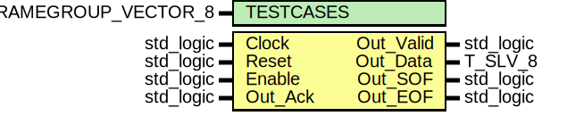

# Entity: stream_Source
## Diagram

## Generics
| Generic name | Type                             | Value | Description |
| ------------ | -------------------------------- | ----- | ----------- |
| TESTCASES    | T_SIM_STREAM_FRAMEGROUP_VECTOR_8 |       |             |
## Ports
| Port name | Direction | Type      | Description |
| --------- | --------- | --------- | ----------- |
| Clock     | in        | std_logic |             |
| Reset     | in        | std_logic |             |
| Enable    | in        | std_logic |             |
| Out_Valid | out       | std_logic |             |
| Out_Data  | out       | T_SLV_8   |             |
| Out_SOF   | out       | std_logic |             |
| Out_EOF   | out       | std_logic |             |
| Out_Ack   | in        | std_logic |             |
## Signals
| Name                | Type                                                | Description |
| ------------------- | --------------------------------------------------- | ----------- |
| FrameGroupNumber_us | unsigned(log2ceilnz(TESTCASES'length) - 1 downto 0) |             |
## Constants
| Name       | Type    | Value      | Description |
| ---------- | ------- | ---------- | ----------- |
| MAX_CYCLES | natural |  10 * 1000 |             |
| MAX_ERRORS | natural | 				50     |             |
## Processes
- unnamed: _(  )_

