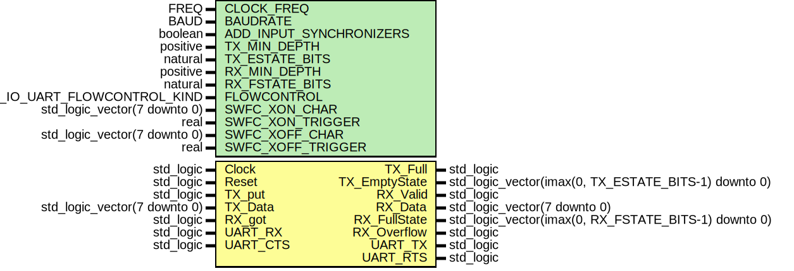

# Entity: uart_fifo

- **File**: uart_fifo.vhdl
## Diagram

## Description

 EMACS settings: -*-  tab-width: 2; indent-tabs-mode: t -*-
 vim: tabstop=2:shiftwidth=2:noexpandtab
 kate: tab-width 2; replace-tabs off; indent-width 2;
 =============================================================================
 Authors:				 	Martin Zabel
									Patrick Lehmann

 Entity:				 	UART Wrapper with Embedded FIFOs and Optional Flow Control

 Description:
 -------------------------------------
 Small :abbr:`FIFO (first-in, first-out)` s are included in this module, if
 larger or asynchronous transmit / receive FIFOs are required, then they must
 be connected externally.

 old comments:
   :abbr:`UART (Universal Asynchronous Receiver Transmitter)` BAUD rate generator
   bclk	    = bit clock is rising
   bclk_x8		= bit clock times 8 is rising

 License:
 =============================================================================
 Copyright 2008-2015 Technische Universitaet Dresden - Germany
										 Chair of VLSI-Design, Diagnostics and Architecture

 Licensed under the Apache License, Version 2.0 (the "License");
 you may not use this file except in compliance with the License.
 You may obtain a copy of the License at

		http://www.apache.org/licenses/LICENSE-2.0

 Unless required by applicable law or agreed to in writing, software
 distributed under the License is distributed on an "AS IS" BASIS,
 WITHOUT WARRANTIES OR CONDITIONS OF ANY KIND, either express or implied.
 See the License for the specific language governing permissions and
 limitations under the License.
 =============================================================================
## Generics

| Generic name            | Type                         | Value                 | Description               |
| ----------------------- | ---------------------------- | --------------------- | ------------------------- |
| CLOCK_FREQ              | FREQ                         |                       | Communication Parameters  |
| BAUDRATE                | BAUD                         |                       |                           |
| ADD_INPUT_SYNCHRONIZERS | boolean                      | TRUE                  |                           |
| TX_MIN_DEPTH            | positive                     | 16                    | Buffer Dimensioning       |
| TX_ESTATE_BITS          | natural                      | 0                     |                           |
| RX_MIN_DEPTH            | positive                     | 16                    |                           |
| RX_FSTATE_BITS          | natural                      | 0                     |                           |
| FLOWCONTROL             | T_IO_UART_FLOWCONTROL_KIND   | UART_FLOWCONTROL_NONE | Flow Control              |
| SWFC_XON_CHAR           | std_logic_vector(7 downto 0) | x"11"                 |  ^Q                       |
| SWFC_XON_TRIGGER        | real                         | 0.0625                |                           |
| SWFC_XOFF_CHAR          | std_logic_vector(7 downto 0) | x"13"                 |  ^S                       |
| SWFC_XOFF_TRIGGER       | real                         | 0.75                  |                           |
## Ports

| Port name     | Direction | Type                                                 | Description    |
| ------------- | --------- | ---------------------------------------------------- | -------------- |
| Clock         | in        | std_logic                                            |                |
| Reset         | in        | std_logic                                            |                |
| TX_put        | in        | std_logic                                            | FIFO interface |
| TX_Data       | in        | std_logic_vector(7 downto 0)                         |                |
| TX_Full       | out       | std_logic                                            |                |
| TX_EmptyState | out       | std_logic_vector(imax(0, TX_ESTATE_BITS-1) downto 0) |                |
| RX_Valid      | out       | std_logic                                            |                |
| RX_Data       | out       | std_logic_vector(7 downto 0)                         |                |
| RX_got        | in        | std_logic                                            |                |
| RX_FullState  | out       | std_logic_vector(imax(0, RX_FSTATE_BITS-1) downto 0) |                |
| RX_Overflow   | out       | std_logic                                            |                |
| UART_TX       | out       | std_logic                                            | External pins  |
| UART_RX       | in        | std_logic                                            |                |
| UART_RTS      | out       | std_logic                                            |                |
| UART_CTS      | in        | std_logic                                            |                |
## Signals

| Name          | Type      | Description |
| ------------- | --------- | ----------- |
| FC_TX_Strobe  | std_logic |             |
| FC_TX_Data    | T_SLV_8   |             |
| FC_TX_got     | std_logic |             |
| FC_RX_put     | std_logic |             |
| FC_RX_Data    | T_SLV_8   |             |
| TXFIFO_Valid  | std_logic |             |
| TXFIFO_Data   | T_SLV_8   |             |
| RXFIFO_Full   | std_logic |             |
| TXUART_Full   | std_logic |             |
| RXUART_Strobe | std_logic |             |
| RXUART_Data   | T_SLV_8   |             |
| BitClock      | std_logic |             |
| BitClock_x8   | std_logic |             |
| UART_RX_sync  | std_logic |             |
## Instantiations

- TXFIFO: PoC.fifo_cc_got
**Description**
 ===========================================================================
 Transmit and Receive FIFOs
 ===========================================================================

- RXFIFO: PoC.fifo_cc_got
- bclk: PoC.uart_bclk
**Description**
 ===========================================================================
 BitClock, Transmitter, Receiver
 ===========================================================================

- TX: PoC.uart_tx
- RX: PoC.uart_rx
