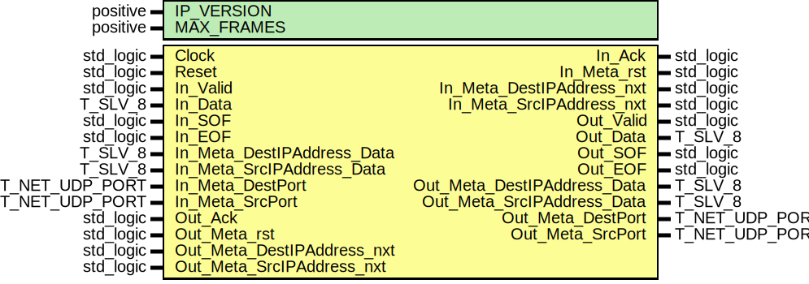

# Entity: udp_FrameLoopback
## Diagram

## Generics
| Generic name | Type     | Value | Description |
| ------------ | -------- | ----- | ----------- |
| IP_VERSION   | positive | 6     |             |
| MAX_FRAMES   | positive | 4     |             |
## Ports
| Port name                   | Direction | Type           | Description |
| --------------------------- | --------- | -------------- | ----------- |
| Clock                       | in        | std_logic      |             |
| Reset                       | in        | std_logic      |             |
| In_Valid                    | in        | std_logic      |             |
| In_Data                     | in        | T_SLV_8        |             |
| In_SOF                      | in        | std_logic      |             |
| In_EOF                      | in        | std_logic      |             |
| In_Ack                      | out       | std_logic      |             |
| In_Meta_rst                 | out       | std_logic      |             |
| In_Meta_DestIPAddress_nxt   | out       | std_logic      |             |
| In_Meta_DestIPAddress_Data  | in        | T_SLV_8        |             |
| In_Meta_SrcIPAddress_nxt    | out       | std_logic      |             |
| In_Meta_SrcIPAddress_Data   | in        | T_SLV_8        |             |
| In_Meta_DestPort            | in        | T_NET_UDP_PORT |             |
| In_Meta_SrcPort             | in        | T_NET_UDP_PORT |             |
| Out_Valid                   | out       | std_logic      |             |
| Out_Data                    | out       | T_SLV_8        |             |
| Out_SOF                     | out       | std_logic      |             |
| Out_EOF                     | out       | std_logic      |             |
| Out_Ack                     | in        | std_logic      |             |
| Out_Meta_rst                | in        | std_logic      |             |
| Out_Meta_DestIPAddress_nxt  | in        | std_logic      |             |
| Out_Meta_DestIPAddress_Data | out       | T_SLV_8        |             |
| Out_Meta_SrcIPAddress_nxt   | in        | std_logic      |             |
| Out_Meta_SrcIPAddress_Data  | out       | T_SLV_8        |             |
| Out_Meta_DestPort           | out       | T_NET_UDP_PORT |             |
| Out_Meta_SrcPort            | out       | T_NET_UDP_PORT |             |
## Signals
| Name                | Type                                            | Description |
| ------------------- | ----------------------------------------------- | ----------- |
| StmBuf_MetaIn_nxt   | std_logic_vector(META_BITS'length - 1 downto 0) |             |
| StmBuf_MetaIn_Data  | std_logic_vector(isum(META_BITS) - 1 downto 0)  |             |
| StmBuf_MetaOut_nxt  | std_logic_vector(META_BITS'length - 1 downto 0) |             |
| StmBuf_MetaOut_Data | std_logic_vector(isum(META_BITS) - 1 downto 0)  |             |
## Constants
| Name                   | Type     | Value                                                                                                                                                              | Description |
| ---------------------- | -------- | ------------------------------------------------------------------------------------------------------------------------------------------------------------------ | ----------- |
| IPADDRESS_LENGTH       | positive |  ite((IP_VERSION = 4), 4, 16)                                                                                                                                      |             |
| META_STREAMID_SRCADDR  | natural  |  0                                                                                                                                                                 |             |
| META_STREAMID_DESTADDR | natural  |  1                                                                                                                                                                 |             |
| META_STREAMID_SRCPORT  | natural  |  2                                                                                                                                                                 |             |
| META_STREAMID_DESTPORT | natural  |  3                                                                                                                                                                 |             |
| META_BITS              | T_POSVEC |  ( 		META_STREAMID_SRCADDR			=> 8, 		META_STREAMID_DESTADDR		=> 8, 		META_STREAMID_SRCPORT			=> 16, 		META_STREAMID_DESTPORT		=> 16 	)                             |             |
| META_FIFO_DEPTHS       | T_POSVEC |  ( 		META_STREAMID_SRCADDR			=> IPADDRESS_LENGTH, 		META_STREAMID_DESTADDR		=> IPADDRESS_LENGTH, 		META_STREAMID_SRCPORT			=> 1, 		META_STREAMID_DESTPORT		=> 1 	) |             |
## Instantiations
- StmBuf: PoC.stream_Buffer
