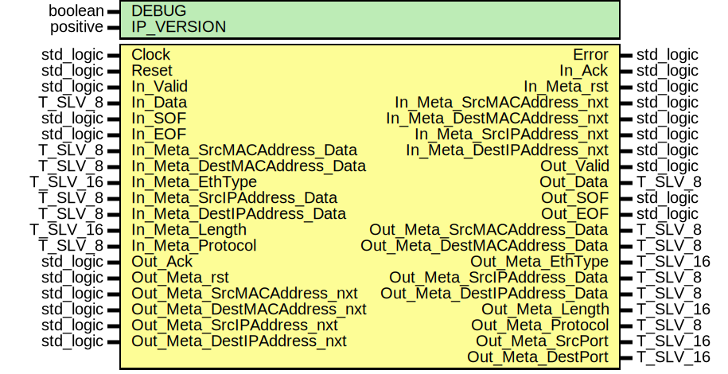

# Entity: udp_RX
## Diagram

## Generics
| Generic name | Type     | Value | Description |
| ------------ | -------- | ----- | ----------- |
| DEBUG        | boolean  | FALSE |             |
| IP_VERSION   | positive | 6     |             |
## Ports
| Port name                    | Direction | Type      | Description |
| ---------------------------- | --------- | --------- | ----------- |
| Clock                        | in        | std_logic |             |
| Reset                        | in        | std_logic |             |
| Error                        | out       | std_logic |             |
| In_Valid                     | in        | std_logic |             |
| In_Data                      | in        | T_SLV_8   |             |
| In_SOF                       | in        | std_logic |             |
| In_EOF                       | in        | std_logic |             |
| In_Ack                       | out       | std_logic |             |
| In_Meta_rst                  | out       | std_logic |             |
| In_Meta_SrcMACAddress_nxt    | out       | std_logic |             |
| In_Meta_SrcMACAddress_Data   | in        | T_SLV_8   |             |
| In_Meta_DestMACAddress_nxt   | out       | std_logic |             |
| In_Meta_DestMACAddress_Data  | in        | T_SLV_8   |             |
| In_Meta_EthType              | in        | T_SLV_16  |             |
| In_Meta_SrcIPAddress_nxt     | out       | std_logic |             |
| In_Meta_SrcIPAddress_Data    | in        | T_SLV_8   |             |
| In_Meta_DestIPAddress_nxt    | out       | std_logic |             |
| In_Meta_DestIPAddress_Data   | in        | T_SLV_8   |             |
| In_Meta_Length               | in        | T_SLV_16  |             |
| In_Meta_Protocol             | in        | T_SLV_8   |             |
| Out_Valid                    | out       | std_logic |             |
| Out_Data                     | out       | T_SLV_8   |             |
| Out_SOF                      | out       | std_logic |             |
| Out_EOF                      | out       | std_logic |             |
| Out_Ack                      | in        | std_logic |             |
| Out_Meta_rst                 | in        | std_logic |             |
| Out_Meta_SrcMACAddress_nxt   | in        | std_logic |             |
| Out_Meta_SrcMACAddress_Data  | out       | T_SLV_8   |             |
| Out_Meta_DestMACAddress_nxt  | in        | std_logic |             |
| Out_Meta_DestMACAddress_Data | out       | T_SLV_8   |             |
| Out_Meta_EthType             | out       | T_SLV_16  |             |
| Out_Meta_SrcIPAddress_nxt    | in        | std_logic |             |
| Out_Meta_SrcIPAddress_Data   | out       | T_SLV_8   |             |
| Out_Meta_DestIPAddress_nxt   | in        | std_logic |             |
| Out_Meta_DestIPAddress_Data  | out       | T_SLV_8   |             |
| Out_Meta_Length              | out       | T_SLV_16  |             |
| Out_Meta_Protocol            | out       | T_SLV_8   |             |
| Out_Meta_SrcPort             | out       | T_SLV_16  |             |
| Out_Meta_DestPort            | out       | T_SLV_16  |             |
## Signals
| Name                | Type      | Description |
| ------------------- | --------- | ----------- |
| State               | T_STATE   |             |
| NextState           | T_STATE   |             |
| In_Ack_i            | std_logic |             |
| Is_DataFlow         | std_logic |             |
| Is_SOF              | std_logic |             |
| Is_EOF              | std_logic |             |
| Out_Valid_i         | std_logic |             |
| Out_SOF_i           | std_logic |             |
| Out_EOF_i           | std_logic |             |
| Register_rst        | std_logic |             |
| SourcePort_en0      | std_logic |             |
| SourcePort_en1      | std_logic |             |
| DestinationPort_en0 | std_logic |             |
| DestinationPort_en1 | std_logic |             |
| Length_en0          | std_logic |             |
| Length_en1          | std_logic |             |
| SourcePort_d        | T_SLV_16  |             |
| DestinationPort_d   | T_SLV_16  |             |
| Length_d            | T_SLV_16  |             |
## Types
| Name    | Type                                                                                                                                                                                                                                                                         | Description |
| ------- | ---------------------------------------------------------------------------------------------------------------------------------------------------------------------------------------------------------------------------------------------------------------------------- | ----------- |
| T_STATE | ( 		ST_IDLE, 			ST_RECEIVE_SOURCE_PORT_1, 			ST_RECEIVE_DEST_PORT_0,		ST_RECEIVE_DEST_PORT_1, 			ST_RECEIVE_LENGTH_0,			ST_RECEIVE_LENGTH_1, 			ST_RECEIVE_CHECKSUM_0,		ST_RECEIVE_CHECKSUM_1, 			ST_RECEIVE_DATA_1,				ST_RECEIVE_DATA_N, 		ST_DISCARD_FRAME, 		ST_ERROR 	) |             |
## Processes
- unnamed: _( Clock )_

- unnamed: _( State, Is_DataFlow, Is_SOF, Is_EOF, In_Valid, In_Data, In_EOF, Out_Ack )_

- unnamed: _( Clock )_

